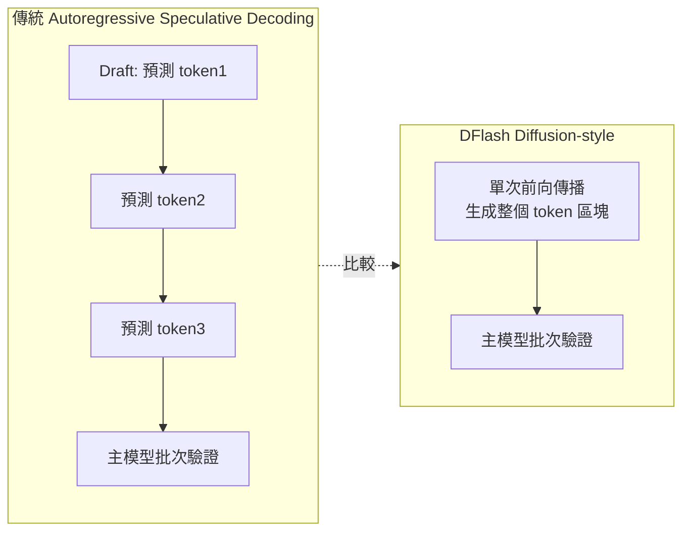
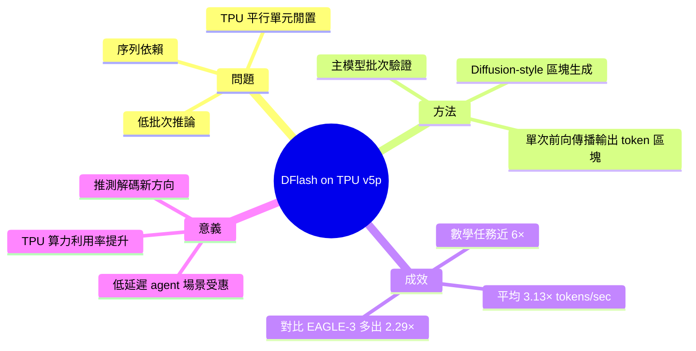

## Supercharging LLM inference on Google TPUs: Achieving 3X speedups with diffusion-style speculative decoding- Google Developers Blog

Google 在 TPU v5p 上支援 UCSD 團隊實現 DFlash（區塊擴散推測解碼）。相比傳統的逐步自迴歸預測，DFlash 在單次前向傳播中生成整個候選 token 塊，實現平均 3.13 倍 token/秒提升、數學任務達近 6 倍。對比 EAGLE-3（1.30 倍），DFlash 端到端提升達 2.29 倍。架構突破了 AI 加速器在低批次下的並行利用瓶頸。

### 重點
- DFlash 區塊擴散解碼在 TPU v5p 上達 3.13 倍平均加速，峰值 6 倍（數學任務）
- 克服自迴歸逐步預測瓶頸：一次前向傳播生成全塊候選，vs EAGLE-3 的 1.30 倍提升
- UCSD（Hao Zhang 團隊）開源實現，整合至 vLLM TPU 推論生態

**原文：** [reddit-localllama](https://www.reddit.com/r/LocalLLaMA/comments/1t4jehc/supercharging_llm_inference_on_google_tpus/)

---

<!-- deep-analysis:begin -->
## 📌 摘要 (TL;DR)

- Google Developers Blog 發表與 UCSD 團隊合作的成果：在 TPU v5p 上實現 **DFlash**（diffusion-style speculative decoding，擴散風格推測解碼）
- DFlash 在單次前向傳播中生成整個候選 token 區塊，平均達到 **3.13×** tokens/sec 提升
- **數學類任務**加速幅度最顯著，逼近 **6×**
- 對比另一推測解碼方法 **EAGLE-3**（1.30× 基線），DFlash 端到端再多出 **2.29×** 加速
- 核心價值：突破 AI 加速器在**低批次**（low-batch）推論下因序列依賴而無法填滿平行單元的瓶頸

## 🎯 核心概念

- **推測解碼**（speculative decoding）：用較小的 draft model 一次猜多個 token，再由主模型批次驗證，省去逐 token 等待
- **擴散風格區塊生成**（diffusion-style block generation）：不再逐步自迴歸（autoregressive）預測下一個 token，而是一次「擴散」出整個候選 token 區塊
- **DFlash**：UCSD 與 Google 合作、針對 TPU v5p 優化的 diffusion-style speculative decoding 實作
- **EAGLE-3**：當前主流的推測解碼基線方法，DFlash 用以對比

## 📖 整理分析

### 1. 為何 LLM 推論在低批次下卡瓶頸

大型 TPU/GPU 的設計假設是大量平行運算，但 LLM 自迴歸生成本質是**序列依賴**——每次只能算出下一個 token。當 batch size 很低（例如單一使用者 agent 場景），加速器的矩陣運算單元大量閒置，算力被嚴重浪費。

### 2. DFlash 的核心做法

傳統推測解碼仍然是「draft model 一個一個猜」。DFlash 改成 **diffusion-style**：把候選 token 區塊（block）視為一個可被同時生成的整體，**單次前向傳播輸出一整塊 draft tokens**，再交由主模型一次性驗證。這把原本 N 步序列工作壓進一個大 batch，正好對到 TPU 擅長的平行運算型態。

### 3. 實測效能數據

| 指標 | 數值 |
| --- | --- |
| 平均 tokens/sec 提升 | 3.13× |
| 數學類任務提升 | 近 6× |
| EAGLE-3 基線加速 | 1.30× |
| DFlash 對比 EAGLE-3 端到端額外加速 | 2.29× |

（以上數據來自原文摘要；此分析未涵蓋具體模型、序列長度與 batch 配置——細節需回原文確認。）

### 4. 對開發者與部署面的意義

低批次推論的加速直接打中**單使用者 agent、coding assistant、即時對話**這類最貴、最延遲敏感的場景。對 Google Cloud TPU 客戶而言，這代表同一張 TPU v5p 在不擴容的前提下能多服務 3 倍流量；對研究社群而言，diffusion-style 與傳統 speculative decoding 結合的設計也指出未來 draft model 設計的新方向。

## 🧭 概念對比圖

## 🧠 Mindmap

<!-- deep-analysis:end -->
### 📄 原文內容

點此展開 / 收合

<table> <tr><td>  </td><td> &#32; submitted by &#32; <a href="https://www.reddit.com/user/eternviking"> /u/eternviking </a>   <a href="https://developers.googleblog.com/supercharging-llm-inference-on-google-tpus-achieving-3x-speedups-with-diffusion-style-speculative-decoding/">[link]</a> &#32; <a href="https://www.reddit.com/r/LocalLLaMA/comments/1t4jehc/supercharging_llm_inference_on_google_tpus/">[comments]</a> </td></tr></table>

