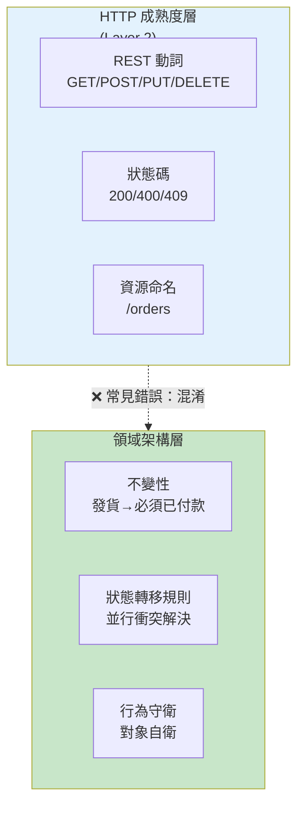

## CRUD Is Not Backend Architecture

文章核心論證：CRUD 端點覆蓋完整不等於後端架構設計。作者區分兩個獨立層次——HTTP 成熟度（interface bookkeeping：REST 動詞、狀態碼、資源命名）與業務域設計（決定何謂合法、不變性、並行衝突解決）。真正的架構應在程式碼中明確編碼業務規則（如「發貨前必須付款」），而非散落在 Service 層的臨時邏輯。指出 anemic domain model 的危害——對象具備 getter/setter 但行為遠離數據，導致不變性無人守衛，非法狀態直到報表失敗才顯露。建議要麼採用明確的領域模型，要麼誠實地使用 transaction script，而非以虛假物件掩飾程序式邏輯。服務層應保持薄薄一層（協調應用操作），讓域對象持有和保衛不變性。

### 重點
- HTTP Level 2（REST 整潔）只是傳輸層的誠實性，不代表業務邏輯清晰；API 結構與資料庫耦合導致每次遷移都變成 breaking change
- Anemic Domain Model 陷阱：Order 物件只有 getter/setter，業務規則（能否發貨）散在 OrderService.updateStatus()，資料庫樂意接受非法狀態直到報表爆炸
- 架構分工：Application 層（transaction/auth）vs Domain 層（「絕不能發生什麼」）；混淆兩者導致測試依賴案例而非原則，重構破壞隱形耦合

**原文：** [medium-stackademic](https://blog.stackademic.com/crud-is-not-backend-architecture-8dd35c88ec25?source=rss----d1baaa8417a4---4)

---

### 📄 原文內容

點此展開 / 收合

<h4>From clutter to clarity</h4><h4><em>Your REST surface can look textbook-clean while the system still has no stable notion of what’s legal.</em></h4>
Here’s the uncomfortable truth teams whisper but rarely put in an architecture doc: <strong>you can ship perfect CRUD coverage on every table and still own zero architecture.</strong> The failure isn’t choosing REST-ish verbs — it’s confusing <strong>interface bookkeeping</strong> with <strong>deciding where rules live.</strong> Customers don’t experience “Level 2 HTTP”; they experience wrong charges, illegal state transitions, and APIs that lie about what’s safe to do next.

Once endpoints become a skin over migrations, you aren’t modeling the business — you’re streaming schema through JSON.

Tooling makes the confusion worse. ORMs, codegen, and “resource per table” tutorials collapse the distance between CREATE TABLE and router.post. That velocity is real; the trap is mistaking <strong>fast mapping</strong> for <strong>deliberate boundaries</strong>.

Someone still has to own invariants — who wins when two requests disagree about whether an invoice is closed? If your answer is “whichever write lands last,” you picked a concurrency strategy, not avoided one.

That decision belongs in code someone can grep — not in tribal knowledge hanging off DBA office hours.
<figure><figcaption><em>Backend architecture is where invariants live — not the verb diagram.</em></figcaption></figure><h3>CRUD names rows — architecture names responsibilities</h3>
People say “REST” and mean “we exposed GET/POST/PUT/DELETE for each entity.” That maps cleanly onto <a href="https://martinfowler.com/articles/richardsonMaturityModel.html">Leonard Richardson’s maturity staircase</a> — resources, verbs, status codes — which Fowler explains as a way to learn integration mechanics, <strong>not</strong> a scorecard you paste onto governance slides. Hitting Level 2 means you stopped treating HTTP like accidental tunneling; it does <strong>not</strong> award you a domain language.

Enterprise guides <a href="https://github.com/microsoft/api-guidelines/blob/vNext/Guidelines.md">standardize resource naming for consistency</a>. That discipline matters for operators and client authors — version headers, error shapes, predictable collections — but it still leaves <strong>semantic</strong> questions open: what transitions exist, who may invoke them, and what happens when two writers race.

<a href="https://google.aip.dev/general">Google’s AIPs</a> describe CRUD-like patterns <em>and</em> carve space for long-running operations when workflows refuse to stay row-shaped.

Richardson’s staircase is a ladder out of RPC-shaped darkness — not a certificate that your <strong>business</strong> is modeled. Teams celebrate Level 2 because it’s teachable: nouns, verbs, status codes you can lint. That’s worth celebrating. Just don’t confuse the lesson with the job of naming failure modes, authorization scopes, and compensating actions when money moves.

Level 2 scrubs transport sins — it doesn’t install domain judgment.
<h3>Tables aren’t the contract — behaviors are</h3>
Public URLs don’t have to mirror physical tables. When they do anyway, every migration becomes an accidental breaking API discussion — clients inferred nouns on the wire were the same nouns in storage.

None of that tells you where refunds become legal, how partial failures compose, or what invariants survive cache misses.

The coupling shows up in reviews that sound architectural but aren’t: debates about pluralization, pagination defaults, and whether PATCH is “more RESTful” than PUT. Those are hygiene fights. They rarely surface the question that matters — <strong>which commands your system is willing to replay</strong> under retries, partial outages, and hostile timing.

The gap matters because HTTP maturity measures <strong>how honestly you use the protocol</strong>, while backend architecture answers <strong>what your system permits and forbids</strong> across time. Mixing them up is how teams earn praise for “clean routing” while production burns on duplicate submits and illegal status hops.

HTTP maturity answers wire questions — architecture answers blame questions.
<h3>The anemic shell offloads blame into services</h3>
Martin Fowler’s diagnosis still lands: <a href="https://martinfowler.com/bliki/AnemicDomainModel.html">anemic models</a> <strong>look</strong> like domain graphs until you read behavior — then you find getters, setters, and rules squirreled away in services. That matches the CRUD-as-architecture smell perfectly: controllers mirror tables; DTOs mirror rows; “business logic” migrates to ThingService.updateThing() where nobody notices until every edge case becomes another branch.

Pair that with Fowler’s <a href="https://martinfowler.com/eaaCatalog/transactionScript.html"><strong>Transaction Script</strong></a> pattern — procedural steps per action — and you get the honest description of what many CRUD-first stacks actually run. Transaction scripts aren’t shameful for tiny scopes. <strong>The lie is calling them a domain model because classes exist.</strong>

Concrete beat: an Order row toggles status through PUT while OrderService encodes “can’t ship before paid” as nested ifs nobody trusts to stay synchronized with the UI.

The database happily accepts illegal histories until reporting proves you shipped air — <strong>the row never vetoed the fiction.</strong>

Fold in inventory holds or partial refunds and the script grows tentacles — still readable day one, still a liability day three hundred because nothing <strong>named</strong> enforces the story the business tells finance.
<h3>Where a real domain model earns rent</h3>
Fowler’s <a href="https://martinfowler.com/eaaCatalog/domainModel.html"><strong>Domain Model</strong></a> pattern — behavior and data woven into objects that express the problem — exists because some logic refuses to stay linear. You don’t owe enterprise DDD posters on day one; you owe clarity about whether rules belong to types or scripts. CRUD controllers pretending to be strategic design skip that fork.

When rules scatter, “fix it in the service” becomes the junk drawer — convenient until nobody can list invariants without reading five files.

Cosplay objects rent complexity without paying behavior back.

If that honesty stings, lean into it: <strong>transaction scripts with explicit names</strong> often beat fake objects — the failure mode is cosplay, not <a href="https://martinfowler.com/eaaCatalog/transactionScript.html">transaction-script-shaped procedure</a>. Architecture is the explicit fork, not the pattern logo on the slide.
<h3>Application coordinates — domain decides</h3>
There <em>should</em> be a service-shaped layer at the boundary — Fowler’s <a href="https://martinfowler.com/eaaCatalog/serviceLayer.html"><strong>Service Layer</strong></a> defines application operations that coordinate work.

<a href="https://martinfowler.com/bliki/AnemicDomainModel.html">Evans’s framing</a> (quoted on the same anemia page) keeps that layer <strong>thin</strong>: it directs expressive domain objects instead of swallowing every rule.

When coordination collapses into “the service <em>is</em> the domain,” you’ve centralized readability and decentralized truth. Tests pin behavior to examples instead of invariants; refactors fear breaking invisible coupling between controllers.

The boundary isn’t ceremonial. Application code owns transactions, messaging fan-out, authorization checks at the edge of a use case — <strong>domain code owns “what must never happen.”</strong> Smear those together and you get hero methods that are easy to demo and impossible to reason about under concurrency.

Healthy stacks say the quiet part aloud: either behavior sits on meaningful domain boundaries (rich model or explicit aggregate scripts), or you admit procedural scripts with clear names — <strong>both beat pretending CRUD endpoints discharged your design duty.</strong>

Endpoints aren’t a hiding place for judgment you refused to name.
<h3>Tests tell on you</h3>
When exercising behavior requires orchestrating five mocks across “nice thin controllers,” your architecture diagram lied — thin HTTP edges bought nothing if domain truth stayed procedural mush behind them.

Integration tests that replay realistic timelines — pay, ship, return — tend to embarrass CRUD façades faster than unit suites that bless each layer in isolation. If “the system allows it” only emerges when someone wires the whole path, your nouns were theater.

Contract tests against consumers help, but they’re downstream signal — <strong>upstream</strong>, someone must decide what “allowed” means when the database would happily store nonsense.
<h3>When CRUD-first is honest — and when it’s avoidance</h3>
CRUD-first wins when the problem really <strong>is</strong> tuple maintenance: internal admin CRUD, catalogs with trivial validation, prototypes where you’re buying learning speed. It loses when workflows carry identity, money, or irreversible side effects — shipping here isn’t “update row,” it’s <strong>a protocol nested inside commercial reality.</strong>

Those workflows leak custom verbs (capture, void, approve), idempotency keys, sagas, or at minimum explicit state machines — all signs your architecture disagrees with “one row, four verbs.” Vendor patterns <a href="https://google.aip.dev/general">acknowledge long-running operations alongside CRUD surfaces</a>; ignoring that split is how REST labels become wallpaper.

Writes also demand observability that row dumps won’t give you: correlation IDs across side effects, dedupe keys surfaced to callers, explicit failure domains when half the saga succeeded.

Schema-shaped URLs make versioning politically painful — you freeze table names into client folklore, then argue whether /v2/users is a rewrite or a facelift. Behavior-shaped APIs version <strong>protocols</strong> (“what transitions exist”), not just column layouts.

Table-shaped versioning freezes nouns — protocol-shaped versioning argues about allowed moves.

Read-heavy projections can stay boring GET surfaces forever — <strong>writes</strong> are where CRUD cosplay collapses.
<h3>REST literacy still owes hypertext-shaped thinking</h3>
Even if you never ship pure HATEOAS, Fielding’s constraint bites teams whose APIs advertise nouns without advertising <a href="https://roy.gbiv.com/untangled/2008/rest-apis-must-be-hypertext-driven"><strong>what may happen next</strong></a>. CRUD templates rarely encode that responsibility — OpenAPI paths list shapes while clients guess sequencing.

Better architectures publish transitions someone can audit: state diagrams in code, hypermedia hints, or ruthless docs generated from enforced transitions — pick one, but pick deliberately.

<a href="https://github.com/microsoft/api-guidelines/blob/vNext/Guidelines.md">Uniform HTTP conventions</a> buy interoperability; they don’t replace a story about allowed transitions. Without that story, integrators read payloads like tea leaves — and your server becomes the oracle they spam with retries.

Conflict semantics matter more than verb purity: returning 200 OK on a write that silently dropped an invariant teaches clients to trust optimism — returning a precise error with a stable code teaches them to <strong>model</strong> your rules.

Hypermedia purism isn’t the ask — <strong>honesty</strong> about state is — the same honesty <a href="https://martinfowler.com/articles/richardsonMaturityModel.html">Richardson’s maturity model</a> points toward when it separates “good HTTP citizenship” from “finished design.”

Clients shouldn’t reverse-engineer legality from payload shape alone — that job belongs to explicit protocols, not optimism.

Resources are how clients reach your system.

Rules are why the system means anything.

<a href="https://blog.stackademic.com/crud-is-not-backend-architecture-8dd35c88ec25">CRUD Is Not Backend Architecture</a> was originally published in <a href="https://blog.stackademic.com">Stackademic</a> on Medium, where people are continuing the conversation by highlighting and responding to this story.

