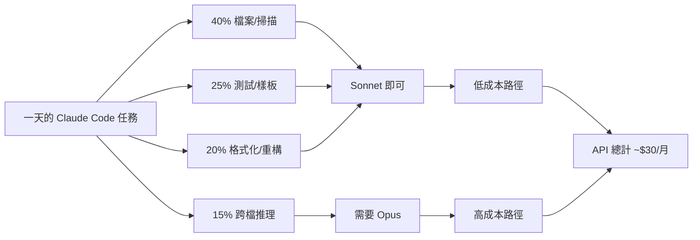
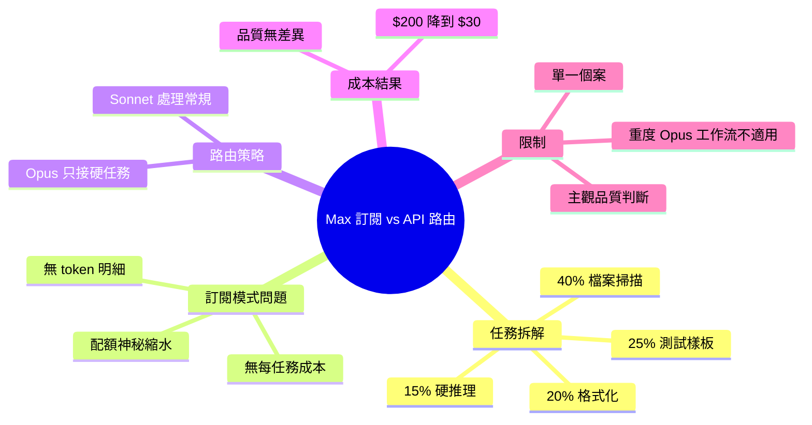

## I got $200 of direct API usage to perform equal to my $200 Max subscription after I started model routing

用戶詳細分析了 Claude Max 訂閱成本結構，發現 85% 的 token 被浪費在不需要高階模型的任務上：40% 檔案讀取/掃描、25% 測試生成/樣板、20% 格式化/重構只需 Sonnet，僅 15% 複雜推理需要 Opus。改用 API 智能路由（Sonnet 處理常規任務、Opus 處理複雜推理）後，月成本從 $200 下降至 $30，輸出品質無差異。核心洞察是訂閱模式隱藏了真實 token 成本與任務複雜度的對應關係。

### 重點
- 任務複雜度分布：40% 檔案讀取、25% 測試生成、20% 格式化、15% 複雜推理，只有後者需要 Opus
- 成本優化成效：$200 Max 月費 → $30 API 用量，輸出品質等同
- 核心模式：根據任務複雜度動態路由到 Sonnet（$0.28/MTok）或 Opus，避免低效率的高端模型投資

**原文：** [reddit-claudeai](https://www.reddit.com/r/ClaudeAI/comments/1t3zi9i/i_got_200_of_direct_api_usage_to_perform_equal_to/)

---

<!-- deep-analysis:begin -->
## 📌 摘要 (TL;DR)

- Reddit 用戶 `/u/spencer_kw` 在使用 Claude Max 訂閱兩個月後，實際追蹤 token 流向，發現只有 15% 的任務真的需要 Opus 等級的推理能力。
- 改用 API 並做模型路由（model routing）後，月費從 $200 降到約 $30，輸出品質沒有差異。
- 作者主張訂閱模式刻意隱藏 token 用量明細，讓使用者無法看清「任務複雜度 vs. 模型成本」的對應關係。
- 對於 Claude Code 重度使用者來說，這是一個關於「是否該從 Max 訂閱改回 API + 路由」的成本決策參考。

## 🎯 核心概念

- **模型路由（model routing）**：根據任務類型自動分派給不同等級模型——簡單任務交給 Sonnet，需要跨檔推理的硬任務才呼叫 Opus。
- **MTok**：百萬 token（million tokens），API 計價單位。原文提到 Sonnet 約 `$0.28/MTok`（依作者說法，實際 Anthropic 官方定價以官網為準）。
- **Claude Max**：Anthropic 提供的 $200/月訂閱方案，內含一定額度的 Opus / Sonnet 使用配額。

## 📖 整理分析

### 1. 一天的 token 用量拆解

作者實際統計自己在 Claude Code 上一天的 token 分布，得到四個區塊：

- **40% 檔案讀取、git status、專案掃描**：純粹是把上下文塞進模型，根本不需要 Opus。
- **25% 測試生成、scaffolding、樣板碼**：Sonnet 產出與 Opus 幾乎一致。
- **20% 格式化、重新命名、簡單重構**：任何模型都能做。
- **15% 跨檔架構推理、複雜邏輯**：唯一真正需要 Opus 的部分。

換算後等於用 $200/月在養那 15%，其餘 85% 是在「拿頂級模型做雜事」。

### 2. 為什麼訂閱方案會「燒錢」

訂閱模式給的是一個總配額，使用者看不到單一任務消耗多少 token、也看不到每個任務該用哪個模型。結果就是：所有任務一律走同一條管線，由系統決定模型，使用者沒有細粒度的成本可見性（cost visibility）。當大量輕量任務（讀檔、列目錄、格式化）也跑在 Opus 上，配額自然「神秘地縮水」。

### 3. 切換到 API + 路由後的結果

作者把工作流改成直接呼叫 API，並自行做路由規則：

- **Sonnet** 處理常規任務（讀檔、測試、格式化、重構）。
- **Opus** 只在需要跨多個檔案推理時才被呼叫。

結果：月成本從 **$200 → 約 $30**，下降約 85%，且作者主觀認為輸出品質無差異——因為真正硬的任務仍然交給 Opus。

### 4. 作者的核心論點

他批評訂閱模式是「設計來隱藏資訊」的：沒有 token 明細、沒有每任務成本、只有一個會慢慢消失的配額。對於想精算成本的開發者來說，API + 自定路由比 Max 訂閱划算很多——前提是你願意自己寫路由邏輯。

### 5. 解讀與限制

這是一篇單一使用者的個案分享（Reddit 自述），不是 Anthropic 官方數據：

- 百分比（40 / 25 / 20 / 15）是作者自己估算，沒附原始 log。
- 「品質一致」是作者主觀判斷，沒有 benchmark。
- 對於需要大量 Opus 推理的工作流（例如重度 agent、深度 code review），結論可能反過來——Max 反而比較划算。
- 但拆分思路本身有參考價值：**先量化自己的任務分布，再決定訂閱 vs. API**。

## 🧭 任務分布 vs. 成本對應

## 🧠 Mindmap

<!-- deep-analysis:end -->
### 📄 原文內容

點此展開 / 收合

<!-- SC_OFF -->

I've been on Max for two months and I finally sat down and tracked where my tokens actually go.
 
breakdown of a typical day:
 
- ~40% file reads, git status, project context scanning: stuff that doesn't need opus at all
 
- ~25% test generation, scaffolding, boilerplate: sonnet handles this identically
 
- ~20% formatting, renaming, simple refactors: literally any model works
 
- ~15% actual hard reasoning, cross-file architecture: the only part that needs opus
 
So i'm paying $200/month for the 15% that actually needs a frontier model. the other 85% is burning premium tokens on tasks a $0.28/MTok model does just as well.
 
Switched to API with routing. sonnet for the routine stuff, opus only when it needs to reason across multiple files. monthly cost went from $200 to about $30 in extra API usage and the output quality is identical because the hard tasks still get opus.
 
The subscription model is designed to hide this from you. no token breakdown, no per-task cost visibility, just a quota that mysteriously shrinks.
 
<!-- SC_ON --> &#32; submitted by &#32; <a href="https://www.reddit.com/user/spencer_kw"> /u/spencer_kw </a>   <a href="https://www.reddit.com/r/ClaudeAI/comments/1t3zi9i/i_got_200_of_direct_api_usage_to_perform_equal_to/">[link]</a> &#32; <a href="https://www.reddit.com/r/ClaudeAI/comments/1t3zi9i/i_got_200_of_direct_api_usage_to_perform_equal_to/">[comments]</a>

