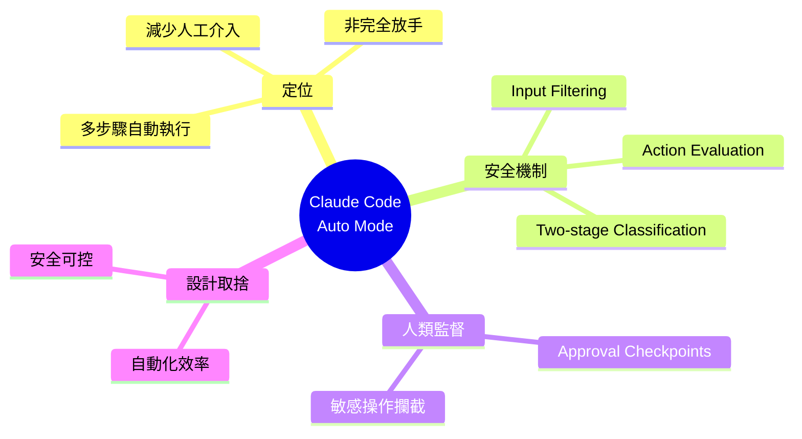

## Inside Claude Code Auto Mode: Anthropic’s Autonomous Coding System with Human Approval Gates

Anthropic 推出 Claude Code 的 auto mode，支持多步驟軟體開發工作流自動執行，顯著降低人工干預。該功能結合分層安全機制（輸入過濾、動作評估、雙階段分類）與人類批准檢查點，對敏感操作保持監督，體現自動化與安全的平衡設計。

### 重點
- Claude Code Auto Mode 支持多步驟軟體開發工作流自動執行
- 分層安全機制：輸入過濾、動作評估、雙階段分類防護敏感操作
- 敏感操作保留人類批准檢查點，避免無監督自動化

**原文：** [infoq-ai-ml](https://www.infoq.com/news/2026/05/anthropic-claude-code-auto-mode/?utm_campaign=infoq_content&utm_source=infoq&utm_medium=feed&utm_term=AI%2C+ML+%26+Data+Engineering)

---

<!-- deep-analysis:begin -->
## 📌 摘要 (TL;DR)

- Anthropic 在 Claude Code 推出 **auto mode**，讓多步驟的軟體開發工作流能在減少人工介入的情況下自動執行。
- 此模式採用**分層安全機制**：輸入過濾（input filtering）、動作評估（action evaluation）、雙階段分類（two-stage classification）。
- 對敏感操作仍保留**人類批准檢查點**（human approval checkpoints），以維持監督。
- 設計核心是「自動化效率」與「安全可控」之間的平衡，而非完全放手的全自動。

## 🎯 核心概念

- **Auto Mode**：Claude Code 中新增的自動執行模式，能串接多步驟開發任務並自主推進。
- **輸入過濾（input filtering）**：在指令進入執行前先做安全篩檢，阻擋不當輸入。
- **動作評估（action evaluation）**：執行前評估每個將要進行的動作是否安全或越權。
- **雙階段分類（two-stage classification）**：以兩個階段對請求或動作做風險分級，避免單一判斷誤判。
- **人類批准檢查點（human approval checkpoints）**：對高風險或敏感操作觸發人工確認。

## 📖 整理分析

### 1. Auto Mode 的定位
Anthropic 將 auto mode 定位為「能跑完多步開發任務的自主模式」，重點是減少使用者在每一步都要手動確認的負擔。原文強調這是 **autonomous coding system**，但仍保留 **human approval gates**——也就是說，不是放棄人類監督，而是把監督集中在重要節點。

### 2. 分層安全機制
根據原文，安全設計分成幾層：先以 **input filtering** 對進入的指令做初步把關；接著對每個將要執行的動作做 **action evaluation**；再以 **two-stage classification** 對風險做雙重判斷。這種多層結構的目的，是避免單點失誤導致系統誤跑出危險操作。

### 3. Human Approval Gates
對「敏感操作」（sensitive operations），auto mode 會中斷自動流程、要求使用者批准。原文沒有列出哪些操作算敏感，但這個設計是 auto mode 與「完全自動化」的關鍵差異——它選擇在自主性與安全之間，刻意保留人類介入點。

### 4. 設計取捨的訊號
從原文敘述可看出 Anthropic 的取捨：要讓開發者得到自動化帶來的速度，但同時不放棄監督。這呼應業界對 agent 系統的普遍擔憂——LLM 自主執行在生產環境中需要可驗證的護欄，而不是只靠模型自律。

> ⚠️ 註：本則 InfoQ 報導本文僅提供概要描述，未揭露具體的分類門檻、敏感操作清單、benchmark 數據或實作細節。以上整理嚴格依據原文段落，未補入推測內容。

## 🧠 Mindmap

<!-- deep-analysis:end -->
### 📄 原文內容

點此展開 / 收合

Anthropic has introduced auto mode in Claude Code, enabling multi-step software development workflows with reduced manual intervention. The feature combines automated execution with layered safety mechanisms, including input filtering, action evaluation, and two-stage classification, while maintaining human approval checkpoints for sensitive operations.
 <i>By Leela Kumili</i>

