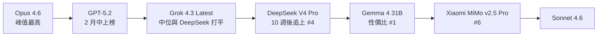
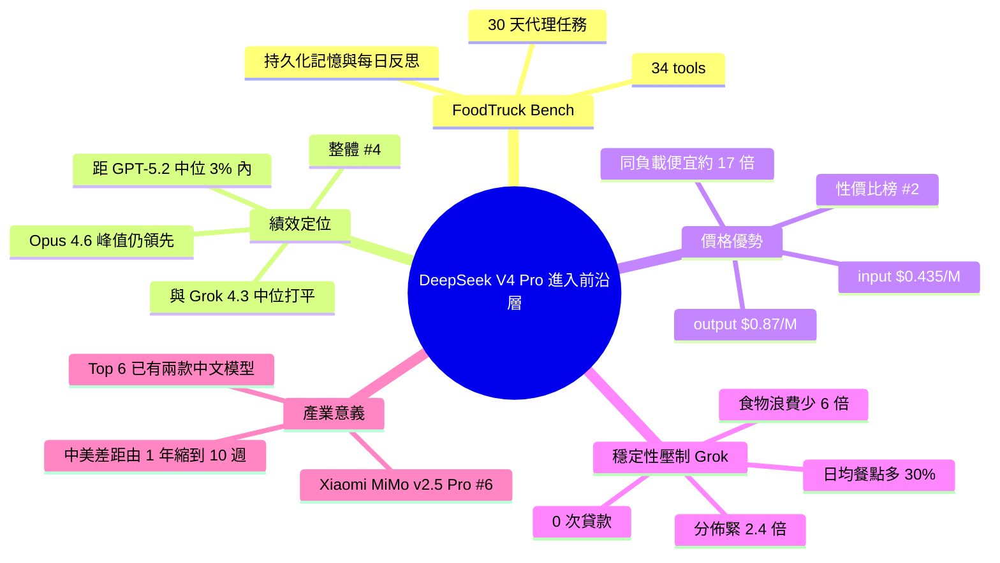

## DeepSeek V4 Pro matches GPT-5.2 on FoodTruck Bench, our agentic benchmark — 10 weeks later, ~17× cheaper

DeepSeek V4 Pro 在 FoodTruck Bench（30 天代理基準、34 工具、持久化記憶、日常反思）上性能匹敵 GPT-5.2，成為首個進入前沿層級的中文模型，整體排名第 4（Opus 4.6、GPT-5.2、Grok 4.3 之後），成本效率排名第 2（僅次 Gemma 4 31B）。價格優勢顯著：GPT-5.2 定價 $1.75/M input 與 $14/M output，DeepSeek V4 Pro 為 $0.435/M 與 $0.87/M（加 cache 折扣），同等代理工作量便宜約 17 倍。與 Grok 4.3 Latest 相比中位數相當但穩定性優：零損失、廢棄食物減 6 倍、日均餐點增 30%、結果分佈 2.4 倍更緊密。Xiaomi MiMo v2.5 Pro 亦完成測試排名第 6，標誌中美模型進度差距從『一年』縮至『十周』，成本不再是選擇中文模型的主要障礙。

### 重點
- DeepSeek V4 Pro 定價 $0.435/M input + $0.87/M output（vs GPT-5.2 $1.75 + $14），同等代理工作便宜 17×；FoodTruck Bench #4 整體、#2 成本效率排名
- vs Grok 4.3 Latest：中位數相同但穩定性更強，零損失、廢棄食物減 6 倍、日均服務增 30%、結果分佈 2.4× 更緊密；Xiaomi MiMo v2.5 Pro 並行完成排名 #6
- 進度追趕加速：中美模型性能差距從『一年級』變『十周』；現有 2 個中文模型位居前 6，皆在 $3.5/run 以下

**原文：** [reddit-localllama](https://www.reddit.com/r/LocalLLaMA/comments/1t47qbw/deepseek_v4_pro_matches_gpt52_on_foodtruck_bench/)

---

<!-- deep-analysis:begin -->
## 📌 摘要 (TL;DR)

- **DeepSeek V4 Pro** 在 FoodTruck Bench（30 天代理基準）上中位績效追平 **GPT-5.2**，相差 3% 以內，整體排名第 4（落後 Opus 4.6、GPT-5.2、Grok 4.3 Latest），成為**首個進入前沿層級的中文模型**。
- 價格落差更大：GPT-5.2 為 \$1.75/M input、\$14/M output；DeepSeek V4 Pro 為 \$0.435/M input、\$0.87/M output，加上 cache 折扣後**同樣的 agentic workload 便宜約 17 倍**。
- 與 **Grok 4.3 Latest** 同價位比較：中位數打平，但穩定性壓制——零次貸款、食物浪費少 6 倍、日均餐點多 30%、結果分佈緊縮 2.4 倍。
- **Xiaomi MiMo v2.5 Pro** 同步完成測試，5/5 存活、中位 ROI +1,019%、中位淨值 \$22,388、單跑 \$2.41，排名第 6（介於 Gemma 4 31B 與 Sonnet 4.6 之間）。
- 中美前沿模型差距由「約一年」收斂到「約十週」，且 Top 6 已有兩款中文模型、單跑成本皆在 \$3.5 以下。

## 🎯 核心概念

- **FoodTruck Bench**：作者自製的 30 天 agentic benchmark，要求模型實際營運一台餐車，跨多日做決策。
- **34 tools**：模型可呼叫的工具集合，涵蓋 locations、pricing、inventory、staff、weather、events 六類。
- **持久化記憶（persistent memory）**：跨日保留狀態，讓模型必須處理長期計畫，而非單次對話。
- **每日反思（daily reflection）**：模型每日結束需自我檢討，模擬代理人迭代學習。
- **成本效率（cost-efficiency / net worth per dollar of API spend）**：每花 1 美元 API 換到的淨值，作者用以排序「性價比」獨立排行榜。

## 📖 整理分析

### 1. 基準設計：30 天餐車營運

 FoodTruck Bench 不是單次問答測驗，而是讓模型扮演餐車老闆，連續 30 天透過 34 個工具決定地點、定價、進貨、雇用、應對天氣與活動。模型需維持持久化記憶、每日做反思，等同一個小型 agentic loop。原文以「淨值（net worth）」、「ROI」、「存活率」、「食物浪費」、「日均餐點數」等多維指標衡量結果，比起傳統 SWE-Bench 或 MMLU 更貼近真實 agent 工作負載。

### 2. 排行榜定位：DeepSeek V4 Pro 進入前沿層

根據作者敘述，DeepSeek V4 Pro 中位績效與 **Grok 4.3 Latest** 打平，距 **GPT-5.2** 中位數在 3% 內，整體排名第 4（落後 **Opus 4.6**、**GPT-5.2**、**Grok 4.3 Latest**）。Opus 4.6 的「最佳單跑」仍高於 DeepSeek V4 Pro，因此頂峰未被超越，但中位線已正式踩進前沿層。這是 FoodTruck Bench 自 2 月開測以來，第一個達到此區段的中國模型。

### 3. 價格落差：同等 agentic 負載便宜 17 倍

GPT-5.2 公定價為 input \$1.75/M tokens、output \$14/M tokens；DeepSeek V4 Pro 為 input \$0.435/M、output \$0.87/M，再加上 cache read 折扣，作者實測同樣的 agentic workload **約便宜 17 倍**。作者標註目前是 promo pricing（促銷價），但補上一句觀察：「DeepSeek 過往的 promo 通常會變成正式價格的下限。」這也讓 DeepSeek V4 Pro 在「每美元淨值」榜上排名第 2，僅輸給 Gemma 4 31B，領先所有 premium-tier 模型。

### 4. 對標 Grok 4.3 Latest：穩定性的勝利

在價格相近、中位數打平的條件下，DeepSeek V4 Pro 的優勢全部來自「穩定性」：

- **0 次貸款**：未發生資金斷鏈。
- **食物浪費**：約少 6 倍。
- **日均餐點服務量**：多 30%。
- **結果分佈**：2.4 倍更緊密（variance 更小）。

作者用一句話總結：「Grok 能追上 DeepSeek 的最佳值，但 DeepSeek 每次都能逼近自己的最佳值。」對於要部署成可預測代理人的場景，這是比中位數更關鍵的指標。

### 5. 中美節奏：差距從一年壓到十週

作者把 GPT-5.2 上榜時間（2 月中）與 DeepSeek V4 Pro 追上的時間相減，得到約 10 週的時間差。對照他開測 FoodTruck Bench 時「中美前沿差距感覺像一年」，他直白地寫：「現在大約是十週。」更值得注意的是，**Xiaomi MiMo v2.5 Pro** 同期完成測試並落在第 6 位，使 Top 6 出現兩款中文模型、單跑成本皆 < \$3.5，這是 2 月時尚不存在的層級。

### 6. Xiaomi MiMo v2.5 Pro 的補充數據

作者額外更新 Xiaomi MiMo v2.5 Pro 的數據：5/5 存活、中位 ROI +1,019%、中位淨值 \$22,388、單跑 \$2.41。在外部評估上略遜 DeepSeek（最差 \$9K 對最佳 \$29K，分佈較寬），但在「中文模型 + 此價位」這個切片仍是真實成績，鞏固了第二款進入頂部的中文模型地位。

## 🧭 排行榜對比

## 🧠 Mindmap

<!-- deep-analysis:end -->
### 📄 原文內容

點此展開 / 收合

<table> <tr><td>  </td><td> <!-- SC_OFF -->

Tested DeepSeek V4 Pro on FoodTruck Bench — our 30-day agentic benchmark where models run a food truck via 34 tools (locations, pricing, inventory, staff, weather, events) with persistent memory and daily reflection.
 
First Chinese model to land in the frontier tier on our benchmark. Tied with Grok 4.3 Latest on outcome, within 3% of GPT-5.2's median, #4 overall behind Opus 4.6, GPT-5.2, and Grok 4.3.
 
The timing is the interesting part. We tested GPT-5.2 in mid-February. DeepSeek V4 Pro matches its numbers ten weeks later. The China–US frontier gap on this benchmark used to feel like a year. Right now it's about ten weeks.
 
The pricing gap is even sharper. GPT-5.2 charges $1.75/M input and $14/M output. DeepSeek V4 Pro is at $0.435/M input and $0.87/M output, with discounted cache reads on top — <strong>~17× cheaper for the same agentic workload</strong>. That's promo pricing today, but DeepSeek's track record is that promo becomes the floor.
 
On cost-efficiency (net worth per dollar of API spend) DeepSeek V4 Pro is #2 overall on the leaderboard — behind only Gemma 4 31B, ahead of every premium-tier model.
 
Against Grok 4.3 Latest specifically the medians are basically tied at the same price, but DeepSeek wins on consistency: zero loans, ~6× less food waste, 30% more meals served per day, 2.4× tighter outcome distribution. Grok matches DeepSeek's peak. DeepSeek matches its own peak every time.
 
Opus 4.6's peak run is still higher than DeepSeek's. Gemma is still cheaper. Otherwise this is a real frontier-tier competitor at a Chinese price point.
 
<strong>Update — Xiaomi MiMo v2.5 Pro just finished its run set as well:</strong> 5/5 survived, +1,019% median ROI, $22,388 median net worth at $2.41/run. Lands at #6 on the leaderboard, between Gemma 4 31B and Sonnet 4.6. Slightly behind DeepSeek on outcome and consistency (wider variance — $9K worst run vs $29K best), but a real result for a Chinese model at this price point.
 
That's now two Chinese models in our top 6, both at sub-$3.5/run. When we started this benchmark in February, neither of these tiers existed outside US labs.
 
Congrats to the DeepSeek and Xiaomi MiMo teams.
 
Full write-up: <a href="https://foodtruckbench.com/blog/deepseek-v4-pro">https://foodtruckbench.com/blog/deepseek-v4-pro</a>  Leaderboard: <a href="https://foodtruckbench.com/">https://foodtruckbench.com</a>
 
<!-- SC_ON --> &#32; submitted by &#32; <a href="https://www.reddit.com/user/Disastrous_Theme5906"> /u/Disastrous_Theme5906 </a>   <a href="https://i.redd.it/fx89f3w5n9zg1.png">[link]</a> &#32; <a href="https://www.reddit.com/r/LocalLLaMA/comments/1t47qbw/deepseek_v4_pro_matches_gpt52_on_foodtruck_bench/">[comments]</a> </td></tr></table>

