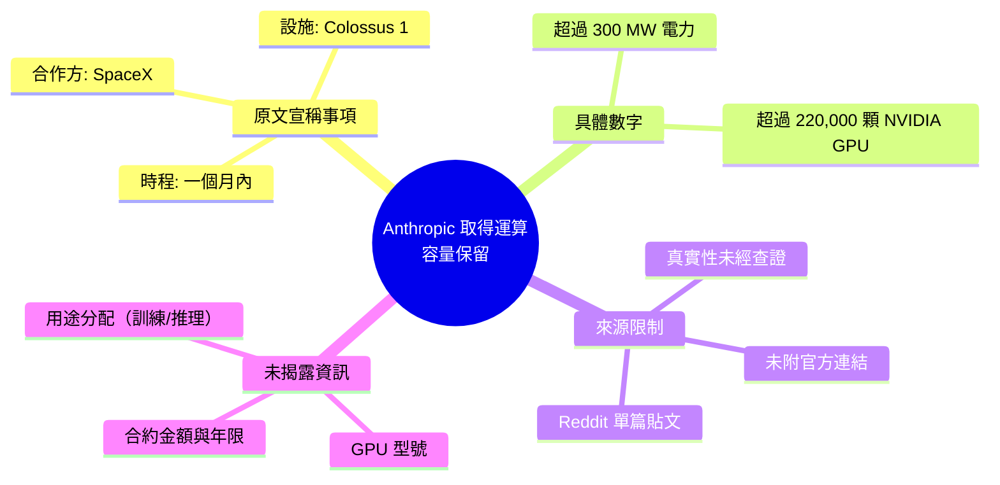

## Anthropic Just Secured a Reserve.

Anthropic 宣布與 SpaceX 達成重大合作，將完全利用 Colossus 1 數據中心的計算容量。該協議在一個月內為 Anthropic 提供超過 300 百萬瓦電力容量和超過 220,000 顆 NVIDIA GPU。此舉為 Anthropic 的計算基礎設施帶來重大擴展，直接影響 Claude 未來訓練規模、推理吞吐量與服務容量上限。

### 重點
- Anthropic-SpaceX 合作協議：Colossus 1 數據中心提供 300+ MW 電力、22 萬+ NVIDIA GPU
- 新增容量在一個月內可投入使用，大幅提升 Claude 模型訓練與部署規模
- 此類基礎設施擴展直接決定 Claude 未來版本的性能上限、推理成本、以及服務容量

**原文：** [reddit-claudeai](https://www.reddit.com/r/ClaudeAI/comments/1t5j05c/anthropic_just_secured_a_reserve/)

---

<!-- deep-analysis:begin -->
## 📌 摘要 (TL;DR)

- Reddit 用戶 `/u/DragonflyOk7139` 在 r/ClaudeAI 發文宣稱：Anthropic 與 SpaceX 達成合作，將取用 **Colossus 1** 數據中心的全部運算容量。
- 原文揭露的具體規模：**逾 300 MW（megawatt，百萬瓦）電力容量** 與 **超過 220,000 顆 NVIDIA GPU**，並聲稱「一個月內」（within the month）到位。
- 該貼文僅兩句話、未附 Anthropic 或 SpaceX 任何官方連結或新聞稿，來源屬未經查證的社群轉述。
- 若屬實，這將是 Anthropic 訓練／推理基礎設施的顯著擴張，但本文無法依現有資料確認真偽。

## 🎯 核心概念

- **Colossus 1**：原文點名的數據中心名稱，原文未說明地點或既有歸屬，本摘要不額外補充。
- **運算容量（compute capacity）**：原文以兩種度量描述——電力（MW）與 GPU 顆數，這是大型 AI 訓練設施常見的容量表示法。
- **NVIDIA GPU**：原文僅標明品牌「NVIDIA GPU」，未指明具體型號（例如 H100 / H200 / B200 / GB200）。

## 📖 整理分析

### 1. 原文揭露的數字

Reddit 貼文提供三組具體數字：合作對象為 **SpaceX**、容量為 **>300 MW**、GPU 顆數為 **>220,000**、交付時程為 **within the month（一個月內）**。除此之外沒有其他細節，例如合約年限、金額、是否為獨佔使用、訓練／推理用途分配比例等。

### 2. 來源可信度的限制

本則內容是 Reddit 子板 r/ClaudeAI 的單一使用者貼文，沒有附上 Anthropic 部落格、SpaceX 公告、彭博 / 路透等任何一手連結。依使用者來源規則，**本摘要無法判定貼文敘述是否準確、是否經 Anthropic 官方確認**。讀者若需引用，應自行查證 Anthropic 官方頻道。

### 3. 為何這個量級若屬實值得關注

以原文本身的數字來看：300 MW 的電力規模相當於一座中型城鎮等級的負載；220,000 顆 GPU 則屬於目前公開報導中的前段班 AI 叢集規模。對 Anthropic 而言，**單一筆新增容量即可大幅推高 Claude 系列模型的訓練上限與推理服務天花板**——但具體影響取決於 GPU 型號與交付時程，而原文未提供這些資訊。

### 4. 原文未說明的關鍵問題

讀者可能會想問、但**貼文沒有回答**的事項至少包括：
- GPU 具體型號與世代
- 合約年限、價格、付款結構
- Anthropic 是否獨佔該數據中心，或與其他客戶分時
- 與 Anthropic 既有 AWS Trainium / Google TPU 部署的關係
- Colossus 1 數據中心既有歸屬與此次協議的法律結構

這些都不在原文資訊範圍內，本摘要不臆測。

### 5. 留言區與社群觀察

貼文 body 不含任何留言內容；本摘要無法回報社群反應。

## 🧠 Mindmap

<!-- deep-analysis:end -->
### 📄 原文內容

點此展開 / 收合

<!-- SC_OFF -->

Anthropic announced a major partnership with SpaceX to utilize all compute capacity at the Colossus 1 data center. This agreement provides Anthropic with over 300 megawatts of additional capacity comprising more than 220,000 NVIDIA GPUs within the month.
 
<!-- SC_ON --> &#32; submitted by &#32; <a href="https://www.reddit.com/user/DragonflyOk7139"> /u/DragonflyOk7139 </a>   <a href="https://www.reddit.com/r/ClaudeAI/comments/1t5j05c/anthropic_just_secured_a_reserve/">[link]</a> &#32; <a href="https://www.reddit.com/r/ClaudeAI/comments/1t5j05c/anthropic_just_secured_a_reserve/">[comments]</a>

