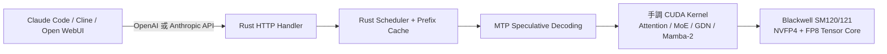
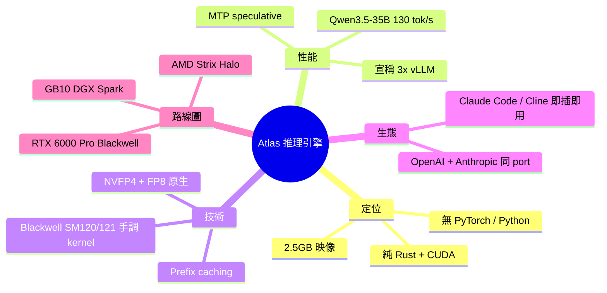

## The GB10 Solution Atlas is now open source, the inference engine made for the community with breakneck inference speeds (Qwen3.6-35B-FP8 100+ tok/s)

Atlas 推理引擎（Avarok Cybersecurity）開源發布，純 Rust + CUDA 為 NVIDIA Blackwell GPU（GB10 DGX Spark）優化。性能亮點：Qwen 3.5-35B 達 130 tok/s peak / 111 t/s sustained，比 vLLM 快 3.0-3.3 倍；支援 NVFP4、FP8 量化、手調 Blackwell SM120/121 kernel、MTP speculative decoding、prefix caching。Docker 即開即用（~2.5GB 映像、<2 分鐘冷啟），API 相容 OpenAI/Anthropic，可直接用於 Claude Code、Cline。

### 重點
- 性能突破：Qwen 3.5-35B 在 GB10 達 111 t/s sustained，較 vLLM 快 3.0-3.3 倍（手調 Blackwell kernel 核心）
- 技術棧：Rust + CUDA、無 PyTorch、手調 attention/MoE/Mamba-2 kernel、原生 NVFP4/FP8 量化支持
- 即用方案：Docker 部署、支援多模型（Qwen3.6、Gemma、Minimax）、相容 OpenAI/Anthropic API、seamless 集成 Claude Code/Cline

**原文：** [reddit-localllama](https://www.reddit.com/r/LocalLLaMA/comments/1t5p2yv/the_gb10_solution_atlas_is_now_open_source_the/)

---


<!-- deep-analysis:begin -->
## 📌 摘要 (TL;DR)

- Avarok Cybersecurity 開源 **Atlas** 推理引擎，純 Rust + CUDA 撰寫，**完全捨棄 PyTorch / Python runtime**，Docker 映像僅約 2.5 GB、冷啟動 < 2 分鐘
- 在單顆 **NVIDIA DGX Spark（GB10）** 上跑 Qwen3.5-35B（NVFP4 + MTP K=2）達 **130 tok/s 峰值、111 tok/s 穩態**，作者宣稱為 vLLM 的 **3.0–3.3 倍**
- 為 Blackwell **SM120/121** 手調 CUDA kernel，原生支援 NVFP4 與 FP8 tensor core，內建 Multi-Token Prediction（MTP）speculative decoding 與 prefix caching
- 同 port 提供 **OpenAI + Anthropic 雙協定 API**，可直接掛 Claude Code、Cline、OpenCode、Open WebUI
- 路線圖：與 Spectral Compute 合作 **AMD Strix Halo** port（AMD 提供硬體）、後續支援 **RTX 6000 Pro Blackwell**；策略是「四個晶片做好，勝過二十個做爛」

## 🎯 核心概念

- **GB10 / DGX Spark**：NVIDIA 為桌面 AI 工作站推出的 Grace Blackwell 平台，本文性能測試的目標硬體
- **NVFP4**：NVIDIA Blackwell 世代新增的 4-bit 浮點格式，於 tensor core 原生加速
- **MTP（Multi-Token Prediction）**：一次預測多個 token 的 speculative decoding 變體，作者宣稱可帶來最高 3× decode 吞吐
- **SM120/121**：Blackwell GPU 的 streaming multiprocessor 架構代號，Atlas 為其手寫 attention / MoE / GDN / Mamba-2 kernel
- **EP=2（Expert Parallelism）**：將 MoE 模型的專家層切到兩張卡並行，本文用於 Qwen3.5-122B 的部署

## 📖 整理分析

### 1. 為什麼重寫整個 stack
作者在貼文裡明講：DGX Spark 跑模型的瓶頸不在矽晶片，而是「**夾在 prompt 和 GPU 之間 20+ GB 的 Python 機械**」。Atlas 因此從 HTTP handler 一路到 kernel dispatch 全部用 Rust + CUDA 重寫，沒有 PyTorch、沒有 Python runtime。映像壓到 ~2.5 GB、冷啟動 < 2 分鐘，這對小型本地部署（單台 Spark、edge box）特別有意義。

### 2. 性能數字（單顆 GB10）
作者公開的 model matrix 摘要如下：

| 模型 | 量化 / 設定 | 吞吐 |
|---|---|---|
| Qwen3.5-35B | NVFP4 + MTP K=2 | 130 tok/s 峰值、111 tok/s 穩態 |
| Qwen3.5-122B | NVFP4 + EP=2 | ~50 tok/s decode |
| Qwen3-Next-80B-A3B | NVFP4 + MTP | ~87 tok/s |
| Nemotron-3 Nano 30B | FP8 | ~88 tok/s |

與 vLLM 的 3.0–3.3× 倍率僅針對 35B 那組，且作者標註是「測試當時」的數字。其他模型未提供同基準對照，這是推論時要保留的解讀空間。

### 3. 關鍵技術選擇
- **手調 Blackwell kernel**：attention、MoE、Gated Delta Net（GDN）、Mamba-2 都是自寫，沒有 generic fallback；對應 SM120 / SM121。
- **原生 NVFP4 + FP8**：直接落在 tensor core，不走通用反量化路徑。
- **MTP speculative decoding**：作者稱在 decode 階段可帶來最高 3× 吞吐。
- **prefix caching**：CLI flag `--enable-prefix-caching` 直接開。

### 4. 與既有生態的相容性
Atlas 把 **OpenAI 與 Anthropic 兩套 API 開在同一個 port**，意思是同一個 endpoint 既能餵 Claude Code、也能餵 Cline / OpenCode / Open WebUI，不用改 client。對於把本機推理當作開發工具後端的人（例如要用 Claude Code CLI 但跑本機模型）很關鍵。

啟動只需兩條指令：

```bash
docker pull avarok/atlas-gb10:latest
sudo docker run -d --name atlas --network host --gpus all --ipc=host \
  -v ~/.cache/huggingface:/root/.cache/huggingface \
  avarok/atlas-gb10:latest serve Qwen/Qwen3.6-35B-A3B-FP8 \
  --port 8888 --speculative --enable-prefix-caching
```

### 5. 路線圖與限制
- 目前主力支援 **GB10**；非 Spark 使用者要等。
- 與 **Spectral Compute** 合作 AMD **Strix Halo** port，AMD 已提供硬體。
- 下一步加入 **RTX 6000 Pro Blackwell**。
- 作者明示策略：「**四個晶片做好，勝過二十個做爛**」——意味著短期不會看到對 Ada / Hopper / 消費級 RTX 40 系列的優化。社群驅動路線圖（MiniMax M2.7 是 Discord 有人問才加的）。

## 🧭 架構圖



## 🧠 Mindmap


<!-- deep-analysis:end -->
### 📄 原文內容

<details>
<summary>點此展開 / 收合</summary>

<table> <tr><td> <a href="https://www.reddit.com/r/LocalLLaMA/comments/1t5p2yv/the_gb10_solution_atlas_is_now_open_source_the/">  </a> </td><td> <!-- SC_OFF --><div class="md"><p>Some of you saw our post a couple weeks back about hitting 102 tok/s stable on Qwen3.5-35B on a DGX Spark. A lot of you asked &quot;cool, where's the code?&quot; Today's the day: <a href="https://github.com/Avarok-Cybersecurity/atlas">Github</a></p> <p><strong>Atlas is open source.</strong> Pure Rust + CUDA, no PyTorch, no Python runtime, ~2.5 GB image, &lt;2 minute cold start. We rewrote the whole stack from HTTP handler to kernel dispatch because the bottleneck on Spark wasn't the silicon, it was 20+ GB of generic Python machinery sitting between your prompt and the GPU. We need community support to keep elevating Atlas <strong>for developers</strong>.</p> <p><strong>Numbers on a single DGX Spark (GB10):</strong></p> <p>Qwen3.5-35B (NVFP4, MTP K=2): 130 tok/s peak, ~111 tok/s sustained → 3.0–3.3x vLLM at testing time</p> <p>Qwen3.5-122B (NVFP4, EP=2): ~50 tok/s decode</p> <p>Qwen3-Next-80B-A3B (NVFP4, MTP): ~87 tok/s</p> <p>Nemotron-3 Nano 30B (FP8): ~88 tok/s</p> <p>Full model matrix on the site (Minimax2.7, Qwen3.6, Gemma too!)</p> <p><strong>What's actually different:</strong></p> <p>Hand-tuned CUDA kernels for Blackwell SM120/121 meaning attention, MoE, GDN, Mamba-2. No generic fallbacks.</p> <p>Native NVFP4 + FP8 on tensor cores</p> <p>MTP (Multi-Token Prediction) speculative decoding for up to 3x throughput on decode</p> <p>OpenAI + Anthropic API on the same port, works with Claude Code, Cline, OpenCode, Open WebUI out of the box</p> <p><strong>Try it (two commands):</strong></p> <pre><code>docker pull avarok/atlas-gb10:latest sudo docker run -d --name atlas --network host --gpus all --ipc=host \ -v ~/.cache/huggingface:/root/.cache/huggingface \ avarok/atlas-gb10:latest serve Qwen/Qwen3.6-35B-A3B-FP8 \ --port 8888 --speculative --enable-prefix-caching </code></pre> <p><strong>What's next especially for the non-Spark folks:</strong> we're working with Spectral Compute on a Strix Halo port, and AMD is giving us hardware to do it properly. RTX 6000 Pro Blackwell is also on the roadmap. Same kernel philosophy, adapted per chip, we'd rather do four chips well than twenty chips badly.</p> <p><a href="https://x.com/AIshaqui81766/status/2052121270506930276">X/Twitter</a><br /> <a href="http://atlasinference.io">Site</a><br /> <a href="http://discord.gg/DwF3brBMpw">Discord</a></p> <p>Will be in comments all day. Hit us with edge cases, weird models, broken configs. The roadmap is genuinely community-driven. MiniMax M2.7 landed because someone in Discord asked. </p> </div><!-- SC_ON --> &#32; submitted by &#32; <a href="https://www.reddit.com/user/Live-Possession-6726"> /u/Live-Possession-6726 </a> <br /> <span><a href="https://v.redd.it/yl2mm4ohvkzg1">[link]</a></span> &#32; <span><a href="https://www.reddit.com/r/LocalLLaMA/comments/1t5p2yv/the_gb10_solution_atlas_is_now_open_source_the/">[comments]</a></span> </td></tr></table>

</details>