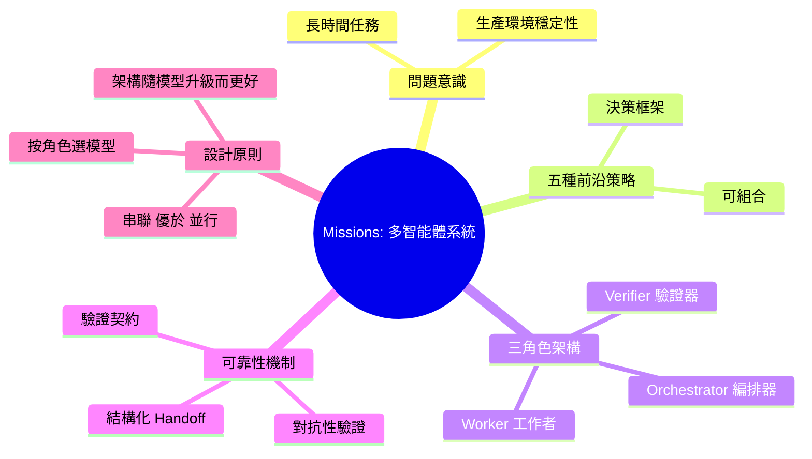

## Missions: Multi-Agent Systems That Ship for Days — Luke Alvoeiro, Factory

Factory 的 Luke Alvoeiro 提出多智能體系統的五種前沿策略分類及其組合方式。系統採用三角色架構（編排器、工作者、驗證器），使用驗證契約、結構化智能體切換和對抗性驗證。核心論點：串聯執行優於並行、按角色選擇模型產生複合優勢、良好架構隨模型迭代而改進而非被淘汰。基於 Factory 生產數據驗證，為多智能體應用設計提供可複用的決策框架。

### 重點
- 五種多智能體策略分類與組合架構（基於 Factory 生產數據）
- 三角色系統：編排器 + 工作者 + 驗證器，含驗證契約與對抗驗證
- 串聯執行優於並行；按角色選擇模型（而非全局固定）可複合放大優勢

**原文：** [youtube-ai-engineer](https://www.youtube.com/watch?v=ow1we5PzK-o)

<!-- deep-analysis:begin -->
## 📌 摘要 (TL;DR)

- **講者與背景**：Factory 的 Luke Alvoeiro 分享其在生產環境中運行多智能體系統（multi-agent systems）的設計經驗，這些系統可以「連續運行數天」（ship for days）完成複雜任務。
- **五種前沿策略分類**：將當前多智能體系統的前沿做法歸納為五大類，並說明它們可以如何組合搭配，形成可複用的設計決策框架。
- **三角色架構**：核心是「編排器（orchestrator）、工作者（worker）、驗證器（verifier）」三種角色分工，搭配驗證契約（verification contracts）、結構化智能體切換（structured agent handoffs）與對抗性驗證（adversarial verification）。
- **反直覺結論**：串聯（serial）執行往往優於並行（parallel）；按角色挑選不同模型會產生複合優勢；良好的架構會隨著基礎模型升級而變得更好，而不是被淘汰。
- **依據來源**：論點以 Factory 生產數據為基礎，而非單純的研究實驗，因此對打算把 Agent 上 production 的工程團隊較具參考價值。

## 🎯 核心概念

- **任務（Mission）**：Factory 用來描述一段需要長時間自主執行、跨多步驟的智能體工作單位。
- **編排器（Orchestrator）**：負責拆解任務、決定下一步、把工作分派給其他角色的中樞智能體。
- **工作者（Worker）**：實際執行單一明確子任務（例如改某段 code、跑某個查詢）的智能體。
- **驗證器（Verifier）**：檢查 worker 產出是否符合預期的對抗性角色，避免錯誤被一路帶下去。
- **驗證契約（Verification Contract）**：在交付前事先約定好「什麼算成功」的明確條件，讓 verifier 有客觀依據可以判定。
- **結構化智能體切換（Structured Agent Handoffs）**：智能體之間移交工作時用固定 schema 傳遞狀態，而不是讓對話自由發散。
- **對抗性驗證（Adversarial Verification）**：讓 verifier 用「找碴」的角度挑戰 worker 的產出，而不是配合它。

## 📖 整理分析

### 1. 為什麼要做能跑數天的多智能體系統
演講以「Missions：能連續運行數天的多智能體系統」為題，問題意識在於：實務上越來越多任務（大型 refactor、跨倉庫變更、長時間調查）無法用單次 prompt 解決，必須讓系統持續自我規劃、執行、驗證。Luke 將焦點放在「如何讓 Agent 在 production 真的撐得住長時間運行」，而不只是 demo 場景。

### 2. 五種前沿策略分類
依據 summary，演講把目前產業在多智能體上的常見做法整理為五大類前沿策略，並討論它們如何彼此組合。重點在於提供一個「決策框架」：哪種任務該用哪種策略、哪些可以疊加。具體五種策略的細節需以原影片為準，本摘要不擴充未明確提到的內容。

### 3. 三角色架構：Orchestrator / Worker / Verifier
Factory 的核心架構把職責分成三個角色：編排器負責規劃與分派、工作者負責執行、驗證器負責檢查。這種分工讓每個角色的提示與工具集都可以收斂，避免一個 mega-agent 同時兼顧規劃、執行與自我檢查時責任稀釋。對抗性驗證則是刻意讓 verifier 站在反方，提高發現問題的機率。

### 4. 驗證契約與結構化切換
要讓 Agent 跑數天，最大敵人是錯誤被沉默放大。Factory 的做法是：每次 handoff 都要附上驗證契約（明確的成功條件）以及結構化的狀態交接，讓下一個 Agent 接手時不需要重新理解上下文，也讓 verifier 有清楚的判定依據。這同時讓「失敗」變成可恢復事件，而不是整個 mission 崩潰。

### 5. 反直覺設計原則
演講提出三個來自 Factory 生產數據的觀察：(1) 串聯執行通常比並行執行更穩定，因為錯誤可以早期攔截；(2) 不同角色搭配不同模型（例如更強模型當編排器、較快模型當工作者）會產生複合效益；(3) 設計良好的架構不會因為底層模型升級而被淘汰，反而會直接受惠於更強的模型，因此投資在架構抽象比追逐單一模型更划算。

## 🧠 Mindmap

<!-- deep-analysis:end -->
