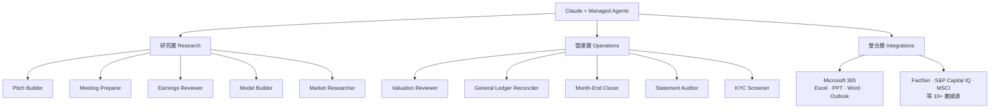
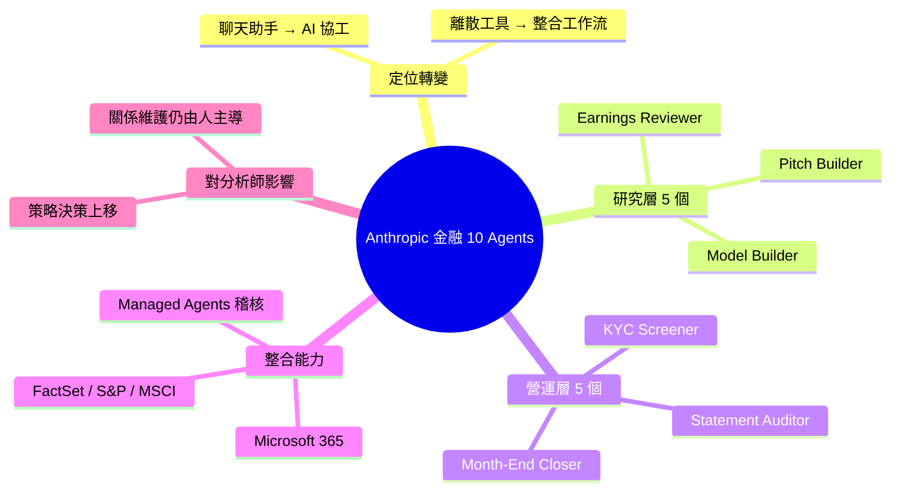

## Anthropic Introduces 10 AI Agents for Financial Services — A Major Shift in the Future of Analyst…

Anthropic 推出 10 个预构建的金融服务 AI agent 模板，标志着 AI 从「聊天助手」向「AI 协工」（AI Coworker）的战略转变。10 个 agents 分类：研究层（Pitch Builder、Meeting Preparer、Earnings Reviewer、Model Builder、Market Researcher）与运营层（Valuation Reviewer、General Ledger Reconciler、Month-End Closer、Statement Auditor、KYC Screener）。同步推出 Claude 深度集成 Microsoft 365（Excel、PowerPoint、Word、Outlook）、Claude Managed Agents（支持多小时自主工作流 + 审计日志 + 批准工作流）、与 FactSet、S&P Capital IQ、MSCI 等 10+ 财务数据源的联动。核心变化：人类分析师角色转向战略决策与关系维护，AI 接管建模、数据处理、文件整理等重复任务。这反映 2026 年企业 AI 的新范式——从离散工具向集成自主工作流的升级。

### 重點
- 10 个金融 agents：Pitch Builder（投资分析）、Meeting Preparer（会议准备）、Earnings Reviewer（财报分析）、Model Builder（财务建模）、Market Researcher（市场研究）、Valuation Reviewer（估值审查）、General Ledger Reconciler（账簿对账）、Month-End Closer（月结）、Statement Auditor（财务审计）、KYC Screener（合规筛查）
- Claude 集成整个 Microsoft 365，支持跨应用上下文保留和自动化；Claude Managed Agents 支持多小时自主执行、审计与治理，瞄准受监管行业
- 职能转变：AI 处理重复性分析与操作，人类专注战略决策、客户关系、系统监督

**原文：** [medium-tag-claude](https://medium.com/@divya.mishra1994/anthropic-introduces-10-ai-agents-for-financial-services-a-major-shift-in-the-future-of-analyst-60bb417e0a61?source=rss------claude-5)

---

<!-- deep-analysis:begin -->
## 📌 摘要 (TL;DR)

- Anthropic 推出 10 個預建金融服務 AI agent 模板，定位從「聊天助手」轉為「AI 協工」（AI Coworker），標誌 AI 進入金融工作流的核心位置
- 10 個 agents 分為兩層：研究層（Pitch Builder、Meeting Preparer、Earnings Reviewer、Model Builder、Market Researcher）與營運層（Valuation Reviewer、General Ledger Reconciler、Month-End Closer、Statement Auditor、KYC Screener）
- 深度整合 Microsoft 365（Excel、PowerPoint、Word、Outlook）與 FactSet、S&P Capital IQ、MSCI 等 10+ 財務數據源
- 同步發表 Claude Managed Agents，支援多小時自主工作流、審計日誌（audit log）與審批流程（approval workflow）
- 分析師角色被推往兩端：上移到策略決策、下沉到客戶關係維護，中段重複任務交給 agent

## 🎯 核心概念

- **AI 協工** (AI Coworker)：不再只是回應提示，而是直接承擔具體工作流任務、與人類分工的 AI 角色
- **研究層 vs 營運層** (Research vs Operations Layer)：把分析師工作拆成「對外決策支援」與「對內帳務合規」兩個維度
- **代管 Agent** (Managed Agents)：由 Anthropic 託管、可長時間自主執行、附稽核軌跡與人類審批節點的 agent 部署模式

## 📖 整理分析

### 1. 從「對話框」到「工作流」的定位轉變

這次發表的關鍵訊號，是 Claude 被重新定位為 AI 協工，而不是聊天助手。過去 LLM 主要被當作問答工具，這次則是把 10 個常見的金融分析師例行任務直接打包成 agent 模板。使用者不再是「想到什麼問什麼」，而是把整段流程交給 agent 執行，人類只在關鍵節點審批。

### 2. 研究層 5 個 Agent

研究層聚焦對外的決策支援工作：
- **Pitch Builder**：產生投資簡報（pitch deck）
- **Meeting Preparer**：客戶會議前的背景整理
- **Earnings Reviewer**：財報季的法說（earnings call）解析
- **Model Builder**：建立財務模型
- **Market Researcher**：市場與產業研究

這五項是初階分析師耗時最久、也最容易被結構化的工作內容。

### 3. 營運層 5 個 Agent

營運層處理對內的帳務與合規工作：
- **Valuation Reviewer**：估值複核
- **General Ledger Reconciler**：總帳對帳
- **Month-End Closer**：月結
- **Statement Auditor**：報表稽核
- **KYC Screener**：客戶身份審查（KYC）

這一層對「準確性」與「可追溯性」要求極高，因此呼應 Managed Agents 內建的稽核日誌與審批節點設計。

### 4. 整合面：Microsoft 365 + 財務數據源

Claude 深度整合 Excel、PowerPoint、Word、Outlook 四項分析師日常工具，同時連接 FactSet、S&P Capital IQ、MSCI 等 10+ 個財務資料來源。意義在於：agent 可以直接讀寫分析師既有的檔案與資料庫，工作不必搬到新的 AI 平台，這降低了採用阻力，也是「AI 協工」定位能成立的前提。

### 5. 對分析師角色的影響

當 agent 接手建模、對帳、文件整理等可結構化任務後，分析師的價值會被推向兩端：高層的策略判斷（哪個交易該推、估值合不合理），與低層的關係維護（客戶信任、內部協調）。這也呼應 2026 年企業 AI 的主流敘事——從離散工具升級為整合式自主工作流。

## 🧭 架構圖

## 🧠 Mindmap

<!-- deep-analysis:end -->
### 📄 原文內容

點此展開 / 收合

Artificial Intelligence is no longer just assisting professionals.
It is now becoming part of the operational workflow itself.

<a href="https://medium.com/@divya.mishra1994/anthropic-introduces-10-ai-agents-for-financial-services-a-major-shift-in-the-future-of-analyst-60bb417e0a61?source=rss------claude-5">Continue reading on Medium »</a>

