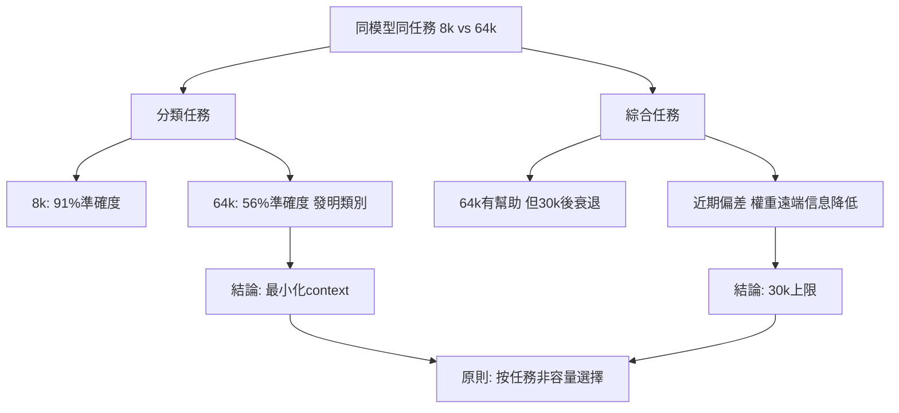

## 38% Worse on 64k Than on 8k. Same Model. Same Task.

作者實測發現同一模型在 64k context window 下性能大幅下降：分類任務準確度從 91% 跌至 56%。核心發現：（1）分類/抽取任務應用最小 context size + 少量範例，寬 context 會導致模型發明不存在的類別；（2）綜合任務受益於更大 window，但在 30k 後出現衰退，模型開始過度強調近期信息（近期偏差）；（3）關鍵原則：選擇 context 應基於「任務需求」而非「模型容量」；透過自有 eval set 驗證收益，而非盲目信任模型卡宣傳。啟示：context 是預算而非功能。

### 重點
- 量化數據：91% → 56% 準確度跌幅（分類任務 8k vs 64k）
- 框架：分類任務用最小 context + 綜合任務 30k 上限避免近期偏差
- 核心原則：context 大小應由任務驅動而非模型容量；自有 eval set 是唯一的真實信號

**原文：** [medium-tag-llm](https://medium.com/@natevoss.dev/38-worse-on-64k-than-on-8k-same-model-same-task-2ba7bac7b6bf?source=rss------large_language_models-5)

---

### 📄 原文內容

點此展開 / 收合

Stop Wasting Tokens: How to Optimize for Accuracy Over Length

<a href="https://medium.com/@natevoss.dev/38-worse-on-64k-than-on-8k-same-model-same-task-2ba7bac7b6bf?source=rss------large_language_models-5">Continue reading on Medium »</a>

