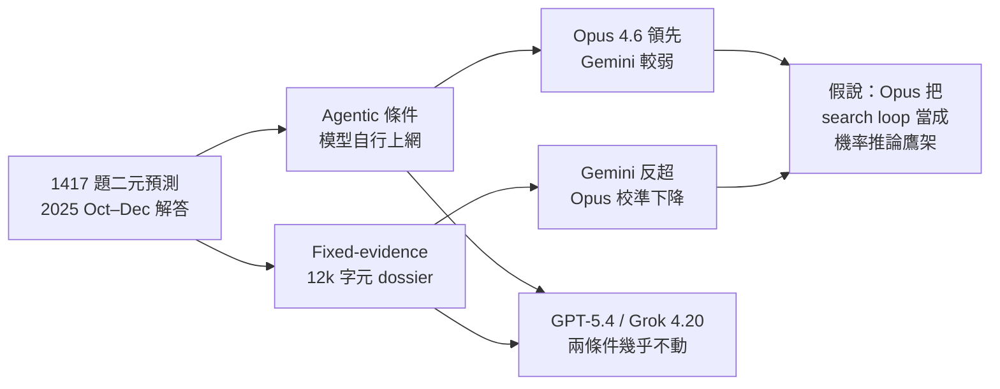
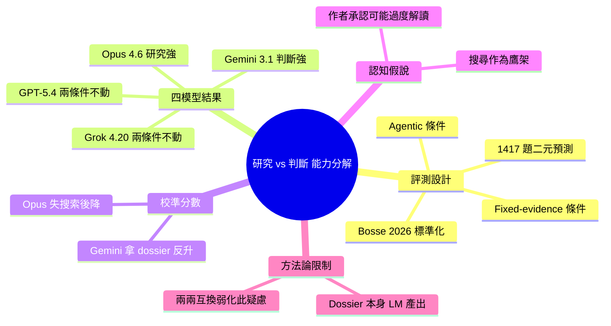

## Opus 4.6 does better research, Gemini 3.1 has better judgment

研究者在 1,417 個二元預測問題上進行首次前沿模型評估，采用雙重條件設計分離「研究能力」與「判斷能力」。評估四個模型（Claude Opus 4.6、GPT-5.4、Google Gemini 3.1 Pro、Grok 4.20），條件為：(1)主動式——每模型自行網路研究；(2)固定證據式——所有模型獲得統一編制的 12k 字符標準摘要。核心發現：Opus 4.6 在研究階段明顯優於對手（搜索決策、頁面選擇、細節提取），但研究能力消失後優勢完全喪失；Gemini 3.1 反之，固定證據條件下展現銳利的判斷力與校準準度；Opus 校準分數在移除研究後大幅下降，Gemini 反而改善。認知假說：Opus 可能利用搜索過程本身作為概率推論的 scaffolding，不僅是資訊源。此項研究為首次直接分解前沿模型核心能力的對標評估。

### 重點
- 研究能力與判斷力存在顯著分化：Opus 4.6 研究優勢明顯，Gemini 3.1 判斷力更強；四個模型在兩條件間 rank order 顛倒，排除單一評估偏差
- 1,417 問題規模、雙重評估條件設計首次直接分離兩種能力；校準分數、精細度分數均已公開（futuresearch.ai）
- 認知機制洞察：Opus 搜索軌跡本身可能充當認知 scaffolding，即搜索過程獨立於其挖掘的資訊之外，對概率分配做出貢獻

**原文：** [reddit-claudeai](https://www.reddit.com/r/ClaudeAI/comments/1t6hgsf/opus_46_does_better_research_gemini_31_has_better/)

---

<!-- deep-analysis:begin -->
## 📌 摘要 (TL;DR)

- FutureSearch 團隊用 1,417 題二元預測題（解答區間 2025 年 10–12 月）首次拆解前沿模型的「研究」與「判斷」能力，受測者為 Claude Opus 4.6、GPT-5.4、Gemini 3.1 Pro、Grok 4.20
- 評估設計兩種條件：(1) **主動式**（agentic）讓每個模型自己用工具上網查資料；(2) **固定證據式**（fixed-evidence）讓所有模型拿到同一份依 Bosse et al. 2026 標準化方法編制的 ~12k 字元研究摘要（dossier）
- Opus 4.6 在主動式模式明顯領先，但拿掉自主研究後優勢「完全消失」；Gemini 3.1 Pro 在固定證據條件下判斷力反而更銳利，兩者排名互換
- 校準分數（calibration）顯示 Opus 在搜索被拿走後大幅下降，Gemini 拿到統一摘要後反而改善——四模型中唯一往這個方向動的
- GPT-5.4 與 Grok 4.20 在兩種條件下幾乎沒移動，這個「不動」反過來支撐評測方法本身有效：若整套評測有系統偏差，四個模型應一起漂移而不是只有兩個調換排名
- 作者提出的解釋假說：Opus 可能把搜尋過程本身當成機率推論的鷹架（scaffolding），走一遍 search loop 的動作就在做部分認識論工作，而非單純資訊來源；作者自己承認這可能是「對單一 benchmark 的過度解讀」

## 🎯 核心概念

- **主動式條件**（agentic）：每個模型用自己的工具上網研究，自行決定搜尋關鍵字、選擇頁面、抽取細節
- **固定證據條件**（fixed-evidence）：所有模型拿到同一份 ~12k 字元、依 Bosse et al. 2026 標準化方法編制的研究摘要，消除研究階段差異
- **校準分數**（calibration score）：衡量模型給出的機率與實際發生率是否一致
- **精煉分數**（refinement score）：衡量模型在不同情境下能否把機率值有意義地區分開
- **搜尋鷹架假說**（search-as-scaffolding）：作者推測 Opus 走過 search loop 的動作本身就在執行部分機率指派工作，不只是收集資訊

## 📖 整理分析

### 1. 把「研究」與「判斷」拆成兩個獨立階段
以往前沿模型對標多半把「研究 + 判斷」混在一個分數裡。這項評測用 1,417 題二元預測題（皆於 2025 年 10–12 月解答），同時跑 agentic 與 fixed-evidence 兩種條件，讓「能不能找到對的證據」與「拿到證據後能不能正確判斷機率」可以分開讀。作者宣稱這是首次直接做這種能力分解的前沿模型評測。

### 2. Opus 4.6：研究階段的明顯贏家
在主動式條件下，Opus 4.6 在「決定搜什麼、選哪些頁面讀、抽取重要細節」這三件事上明顯優於其他三家。但只要把搜尋拿掉、給它一份統一摘要，這個優勢就「完全消失」（the advantage goes away），對應的是校準分數在固定證據條件下大幅下滑。

### 3. Gemini 3.1 Pro：固定證據下的判斷者
Gemini 的故事剛好反過來。主動式條件下排名落後於 Opus，但拿到同一份 dossier 後反而展現更銳利的判斷力，加權更精準。它的校準分數在標準化摘要條件下不降反升——這在四個模型中是獨一份。

### 4. GPT-5.4 與 Grok 4.20：兩種條件下幾乎不動
這兩個模型在 agentic ↔ fixed-evidence 之間「幾乎沒動」（barely moved）。作者把這個現象當成方法論的旁證：如果 fixed-evidence 的 dossier 本身有系統性偏差，四個模型應該會「一起朝同一方向漂移」；現在只看到 Opus 與 Gemini 排名互換，反而說明評測捕捉到了模型本身的差異而不是評測偏差。

### 5. 認知假說：搜尋本身是不是在做推理？
作者提出一個帶推測色彩的詮釋：Opus 把搜尋軌跡當成機率指派的鷹架——走一遍 search loop 這個動作本身就在做部分認識論工作，跟它最後撈到的資訊是分開的兩件事。原文明說這「可能是對單一 benchmark 的過度解讀」，並邀請其他人在不同領域回報是否看到同樣模式。

### 6. 評測本身的限制
作者自己點出一個重要 caveat：固定證據的 dossier 是 LM 產生的，所以可能在測「每個模型對某個特定標準化版本的詮釋能力」，而非抽象意義上的判斷力。但若真是這樣，四個模型應該一起偏移；目前看到的兩兩互換排名，作者認為弱化了這個 confound 的影響。

## 🧭 流程圖

## 🧠 Mindmap

<!-- deep-analysis:end -->
### 📄 原文內容

點此展開 / 收合

Figured this out by running 4 models: Claude Opus 4.6, GPT-5.4, Gemini 3.1 Pro, and Grok 4.20, on a benchmark of 1,417 binary forecasting questions resolving Oct–Dec 2025 with two evaluation conditions: agentic (each model does its own web research with tools) and fixed-evidence (every model receives the same ~12k-character research dossier, compiled using the Bosse et al. 2026 standardization methodology). Note, one limitation is that the fixed-evidence dossiers are themselves LM-produced, so we may be measuring how well each model interprets a particular standardized version of the evidence rather than judgement in the abstract. But that would indicate all four models drifting in the same direction. They didn't. GPT-5.4 and Grok 4.20 barely moved between conditions while Opus and Gemini swapped rank order (the opposite of what a broken or biased eval would produce.) To my knowledge this is the first direct evaluation of frontier models that decomposes performance into these research vs judgment stages. Calibration scores, refinement scores, and per-condition analysis: futuresearch.ai/opus-research-gemini-judgment Benchmark and leaderboard: evals.futuresearch.ai Our interpretation is that Opus is dramatically better at figuring out what to search for, deciding which pages to read, and pulling out the details that matter. But when you remove research tasks, that advantage goes away. When given the same information, Gemini brings sharper judgment over fixed evidence and weights more accurately on forecasting tasks. Calibration scores corroborate this in an interesting way: Opus's calibration drops sharply when search is taken away while Gemini's actually improves with the standardized dossier,. The asymmetry suggests Opus might be using its search trace as scaffolding for probability assignment (i.e., the act of going through the search loop is itself doing some of the epistemic work, separately from the information it surfaces.) This could be an over-interpretation of one benchmark, but I'd be interested if anyone's seen the same pattern in other domains. &#32; submitted by &#32; /u/ddp26 [link] &#32; [comments]

