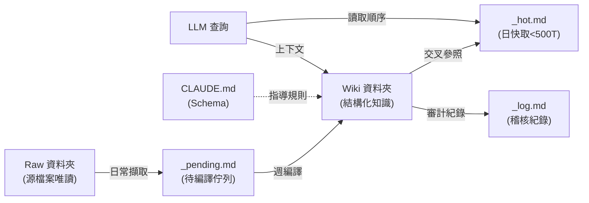

## Give Your AI Unlimited Updated Context

基於 Andrej Karpathy 2026 年初發布的「LLM Wiki」模式，闡述如何構建 LLM 的持久知識層。傳統問題：每次對話從零開始；RAG 僅於查詢時重新推導，無累積。解決方案：Raw（源檔案唯讀、append-only）+ Wiki（結構化、AI 生成）兩層架構，搭配三個控制檔案（_hot.md 日快取 <500 token、_pending.md 待編譯佇列、_log.md 稽核紀錄）與 schema 檔（CLAUDE.md）定義規則。三層自動化分離職責：日常擷取（純機械、安全）→ 週編譯（解讀+結構化+交叉參照）→ 月複查（驗證一致性）。知識一次編譯、持續更新，跨查詢累積而非消失在聊天紀錄中。

### 重點
- Karpathy LLM Wiki 架構：知識一次編譯、持續更新，優於 RAG 每次重新推導；跨查詢累積而非消失
- 雙層架構 + 三控制檔案：Raw（源）+ Wiki（結構）+ _hot.md（快取）+ _pending.md（佇列）+ _log.md（紀錄），使系統可靠可溯
- 三層自動化分工：日常擷取（安全、無 Wiki 編輯）→ 週編譯（解讀+結構+交叉參照）→ 月複查（驗證），確保長期可維護

**原文：** [medium-towards-data-science](https://towardsdatascience.com/give-your-ai-unlimited-updated-context/)

---

### 📄 原文內容

點此展開 / 收合

The architecture behind a portable knowledge layer and the automation that keeps it alive. 
 The post Give Your AI Unlimited Updated Context appeared first on Towards Data Science .

