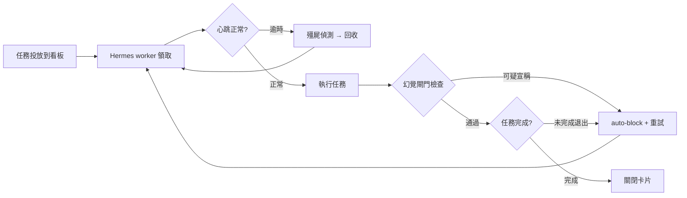
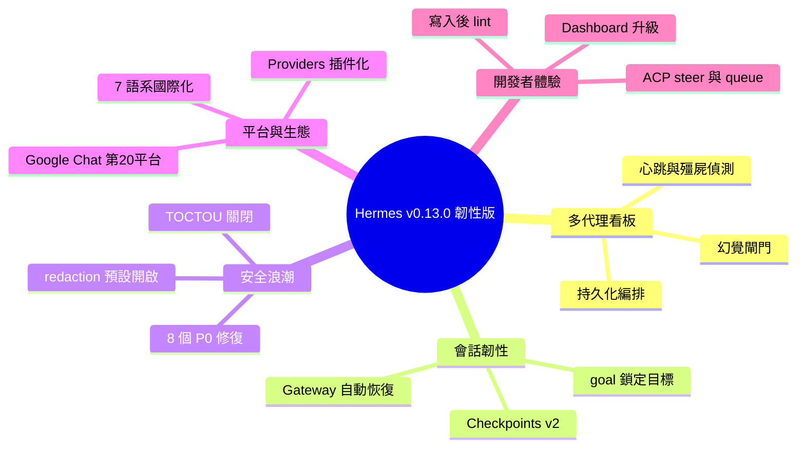

## Hermes Agent v0.13.0 (2026.5.7) — The Tenacity Release

Hermes Agent v0.13.0 The Tenacity Release（864 commits、282 closed issues 含 13 P0）核心亮點：multi-agent Kanban board 實現 durable orchestration（支援 heartbeat、zombie detection、hallucination recovery），/goal 指令鎖定 agent 目標（Ralph loop），Checkpoints v2 狀態持久化，Gateway auto-resume 恢復中斷會話。安全層 8 個 P0 修復：redaction default ON、Discord role allowlist guild-scoped、WhatsApp 陌生人拒絕、auth.json TOCTOU 關閉。新增 Google Chat 第 20 平台、Providers 可插拔化、7 種語言國際化支援。

### 重點
- Multi-agent Kanban board with durability：heartbeat/reclaim/zombie detection/hallucination gate，讓 AI team 能可靠完成任務
- /goal 指令 + Ralph loop 框架讓 agent 跨轉折保持目標聚焦
- 8 個 P0 安全修復（redaction/role-allowlist/陌生人過濾/TOCTOU）使多租戶/平台場景更安全

**原文：** [hermes-agent-releases](https://github.com/NousResearch/hermes-agent/releases/tag/v2026.5.7)

---

<!-- deep-analysis:begin -->
## 📌 摘要 (TL;DR)

- NousResearch 發布 **Hermes Agent v0.13.0（v2026.5.7）「韌性版」（The Tenacity Release）**，自 v0.12.0 以來累積 864 次提交、588 個合併 PR、829 個檔案變更、128,366 行新增、282 個 issue 關閉（含 13 個 P0、36 個 P1），295 位社群貢獻者參與。
- 核心主題是「讓 agent 把開始的事做完」：多代理看板（multi-agent Kanban）升級為持久化協作板，支援心跳、回收、殭屍偵測與幻覺閘門。
- 新增 `/goal` 指令把 agent 鎖定在目標上、跨回合不忘記，將 Ralph loop 變成一級原語；Checkpoints v2 重寫狀態持久化。
- 安全浪潮一次關閉 8 個 P0：敏感資訊遮蔽（redaction）改為預設開啟、修補 CVSS 8.1 跨伺服器私訊繞過、關閉 auth.json 與 MCP OAuth 的 TOCTOU 競態窗口。
- Google Chat 成為第 20 個訊息平台，Providers 變成可插拔介面，靜態介面與 CLI 訊息支援 7 種語系。

## 🎯 核心概念

- **持久化編排**（durable orchestration）：即使 worker 崩潰或卡住，任務仍能被偵測、回收並重試，不會中途丟失。
- **心跳與殭屍偵測**（heartbeat / zombie detection）：worker 定期回報存活，逾時未回報者被判定為殭屍並由其他 worker 接手。
- **幻覺閘門**（hallucination gate）：攔截 worker 對「自己建立卡片」等不實宣稱，避免假完成。
- **Ralph loop**：讓 agent 反覆朝同一目標推進直到達成的迴圈模式，本版以 `/goal` 指令成為內建功能。
- **TOCTOU**（time-of-check to time-of-use）：檢查與使用之間的競態窗口，攻擊者可趁隙竄改檔案；本版於 auth.json 等處關閉。

## 📖 整理分析

### 1. 多代理看板：會收尾的 AI 團隊
看板（Kanban）本版重新實作為持久化、多設定檔（multi-profile）的協作板。使用者建立看板、投放任務，多個 Hermes worker 自行領取、交接並關閉。心跳、回收、殭屍偵測、重試預算（retry budget）與幻覺閘門讓團隊「保持誠實」。支援一次安裝、多個看板與多專案板，並可跨設定檔共享板、工作區與 worker 日誌；每張任務可單獨覆寫 `max_retries`。

### 2. /goal 與會話韌性
`/goal` 把 agent 鎖定在指定目標上，跨回合不會忘記要做什麼，正式把 Ralph loop 變成一級原語。Checkpoints v2 重寫狀態持久化，加入真正的修剪（pruning）、磁碟護欄，並消除孤兒 shadow repo。Gateway 在中途重啟、`/update` 重啟或原始檔重載後，會話會在 Gateway 回來時自動恢復。Cron 另新增 `no_agent` 看門狗模式，可完全跳過 agent 只跑腳本。

### 3. 安全浪潮：一次關閉 8 個 P0
這波安全修復把 redaction 改為預設開啟；Discord 角色允許清單改為以伺服器（guild）為範圍，關閉 CVSS 8.1 的跨伺服器私訊繞過漏洞；WhatsApp 預設拒絕陌生人；auth.json 與 MCP OAuth 的 TOCTOU 窗口關閉；瀏覽器強制 cloud-metadata SSRF 底線；cron 會掃描組裝後的技能內容以防提示注入（prompt injection）；`hermes debug share` 在上傳時即遮蔽敏感資訊。各平台（Slack、Telegram、Mattermost、Matrix、DingTalk）也補上 `allowed_channels` 等允許清單。

### 4. 平台與生態擴充
Google Chat 成為第 20 個訊息平台，同時推出通用平台插件掛鉤介面，第三方轉接器無需動到核心即可接入（IRC 與 Teams 已遷移）。Providers 改為插件化，透過 `ProviderProfile` ABC 與 `plugins/model-providers/` 即可掛入第三方供應商。新增模型包含 deepseek-v4-pro、grok-4.3、免費的 owl-alpha 與 tencent hy3-preview。MCP 升級 SSE 傳輸並轉送 OAuth、加入失效管線重試與 keepalive，影像結果改以 MEDIA 標籤呈現而非被丟棄。

### 5. 開發者體驗升級
agent 在 `write_file` 與 `patch` 後會做寫入後差異 lint，立即抓出 Python、JSON、YAML、TOML 的語法錯誤。ACP 新增 `/steer` 與 `/queue`，可在 Zed、VS Code、JetBrains 中指揮進行中的 agent 或排入後續指令。Dashboard 新增插件頁與設定檔管理頁、可排序分析表格與反向代理支援。另有 video_analyze 影片理解工具、xAI 自訂語音複製、6 個新選用技能與 100 條新 CLI 啟動提示。

## 🧭 流程圖：看板持久化編排

## 🧠 Mindmap

<!-- deep-analysis:end -->
### 📄 原文內容

點此展開 / 收合

Hermes Agent v0.13.0 (v2026.5.7) 
 Release Date: May 7, 2026 
 Since v0.12.0: 864 commits · 588 merged PRs · 829 files changed · 128,366 insertions · 282 issues closed (13 P0, 36 P1) · 295 community contributors (including co-authors) 
 
 The Tenacity Release — Hermes Agent now finishes what it starts. Kanban ships as a durable multi-agent board (heartbeat, reclaim, zombie detection, auto-block on incomplete exit, per-task retries, hallucination recovery). /goal keeps the agent locked on a target across turns (Ralph loop). Checkpoints v2 rewrites state persistence with real pruning. Gateway auto-resumes interrupted sessions after restart. Cron grows a no_agent watchdog mode. A security wave closes 8 P0s — redaction is now ON by default, Discord role-allowlists are guild-scoped, WhatsApp rejects strangers by default, and TOCTOU windows close across auth.json and MCP OAuth. Google Chat becomes the 20th platform. Providers become a pluggable surface. Seven i18n locales ship. 
 
 
 ✨ Highlights 
 
 
 Multi-agent Kanban — delegate to an AI team that actually finishes — Spin up a durable board, drop tasks on it, and let multiple Hermes workers pick them up, hand off, and close them out. Heartbeats, reclaim, zombie detection, retry budgets, and a hallucination gate keep the team honest. One install, many kanbans. ( #17805 , #19653 , #20232 , #20332 , #21330 , #21183 , #21214 ) 
 
 
 /goal — the agent doesn't forget what you asked it to do — Lock the agent onto a target and it stays on task across turns. The Ralph loop as a first-class primitive. ( #18262 , #18275 , #21287 ) 
 
 
 Show it a video — new video_analyze tool for native video understanding on Gemini and compatible multimodal models. ( @alt-glitch ) ( #19301 ) 
 
 
 Clone a voice — xAI Custom Voices lands as a TTS provider with voice cloning support. ( @alt-glitch ) ( #18776 ) 
 
 
 Hermes speaks your language — static gateway + CLI messages translate to 7 locales: Chinese, Japanese, German, Spanish, French, Ukrainian, and Turkish. Docs site gains a Chinese (zh-Hans) locale. ( #20231 , #20329 , #20467 , #20474 , #20430 , #20431 ) 
 
 
 Google Chat — the 20th messaging platform — plus a generic platform-plugin hooks surface so third-party adapters drop in without touching core (IRC and Teams migrated). ( #21306 , #21331 ) 
 
 
 Sessions survive restarts — gateway bounces mid-agent, /update restarts, source-file reloads — conversations auto-resume when the gateway comes back. ( #21192 ) 
 
 
 Security wave — 8 P0 closures — redaction ON by default, Discord role-allowlists guild-scoped (CVSS 8.1 cross-guild DM bypass closed), WhatsApp rejects strangers by default, TOCTOU windows closed across auth.json and MCP OAuth, browser enforces cloud-metadata SSRF floor, cron prompt-injection scans assembled skill content, hermes debug share redacts at upload. ( #21193 , #21241 , #21291 , #21176 , #21194 , #21228 , #21350 , #19318 ) 
 
 
 Checkpoints v2 — state persistence rewritten. Real pruning, disk guardrails, no more orphan shadow repos. ( #20709 ) 
 
 
 The agent lints its own writes — post-write delta lint on write_file + patch . Python, JSON, YAML, TOML. Syntax errors surface immediately instead of shipping downstream. ( #20191 ) 
 
 
 no_agent cron mode — script-only watchdog — cron jobs can now skip the agent entirely and just run a script. Empty stdout is silent, non-empty gets delivered verbatim. ( #19709 ) 
 
 
 Platform allowlists everywhere — allowed_channels / allowed_chats / allowed_rooms config across Slack, Telegram, Mattermost, Matrix, and DingTalk. ( #21251 ) 
 
 
 Providers are now plugins — ProviderProfile ABC + plugins/model-providers/ . Drop in third-party providers without touching core. ( #20324 ) 
 
 
 API server — long-term memory per session — X-Hermes-Session-Key header gives memory providers a stable session identifier. ( #20199 ) 
 
 
 MCP levels up — SSE transport with OAuth forwarding, stale-pipe retries, image results surface as MEDIA tags instead of getting dropped, keepalive on long-lived lifecycle waits. ( #21227 , #21323 , #21289 , #21328 , #20209 ) 
 
 
 Curator grows subcommands — hermes curator archive , prune , list-archived . Manual hermes curator run is synchronous now — you see results without polling. ( #20200 , #21236 , #21216 ) 
 
 
 ACP — /steer and /queue — direct the in-flight agent or queue follow-ups from Zed, VS Code, or JetBrains. Plus atomic session persistence and reasoning-metadata preservation across restarts. ( @HenkDz ) ( #18114 , #20279 , #20296 , #20433 ) 
 
 
 TUI glow-up — /model picker matches hermes model with inline auth ( @austinpickett ), collapsible startup banner sections ( @kshitijk4poor ), context-compression counter in the status bar. ( #18117 , #20625 , #21218 ) 
 
 
 Dashboard grows up — Plugins page (manage, enable/disable, auth status) ( @austinpickett ), Profiles management page ( @vincez-hms-coder ), sortable analytics tables, reverse-proxy support via X-Forwarded-Prefix , new default-large 18px theme. ( #18095 , #16419 , #18192 , #21296 , #20820 ) 
 
 
 SearXNG + split web tools — SearXNG ships as a native search-only backend; web tools now let you pick different backends per capability (search vs extract vs browse). ( @kshitijk4poor ) ( #20823 , #20061 , #20841 ) 
 
 
 OpenRouter response caching — explicit cache control for models that expose it. ( @kshitijk4poor ) ( #19132 ) 
 
 
 [[as_document]] — skill media-routing directive — skills can force the gateway to deliver output as a document on platforms that support it. ( #21210 ) 
 
 
 transform_llm_output plugin hook — new lifecycle hook that lets plugins reshape or filter LLM output before it hits the conversation. Useful for context-window reducers and content filters. ( #21235 ) 
 
 
 Nous OAuth persists across profiles — shared token store: sign in once, every profile inherits the session. ( #19712 ) 
 
 
 QQBot — native approval keyboards — feature parity with Telegram / Discord approval UX. Chunked upload, quoted attachments. ( #21342 , #21353 ) 
 
 
 6 new optional skills — Shopify (Admin + Storefront GraphQL), here.now, shop-app personal shopping assistant, Anthropic financial-services bundle, kanban-video-orchestrator ( @SHL0MS ), searxng-search ( @kshitijk4poor ). ( #18116 , #18170 , #20702 , #21180 , #19281 , #20841 ) 
 
 
 New models — deepseek/deepseek-v4-pro , x-ai/grok-4.3 , openrouter/owl-alpha (free), tencent/hy3-preview ( @Contentment003111 ), Arcee Trinity Large Thinking temperature + compression overrides. ( #20495 , #20497 , #18071 , #21077 , #20473 ) 
 
 
 100 fresh CLI startup tips — the random tip banner gets 100 new entries covering cron, kanban, curator, plugins, and lesser-known flags. ( #20168 ) 
 
 
 
 🧩 Multi-Agent Kanban (Durable) 
 New — durable multi-profile collaboration board 
 
 feat(kanban): durable multi-profile collaboration board — post-revert reimplementation, multi-profile by design ( #17805 ) 
 Multi-project boards — one install, many kanbans ( #19653 , #19679 ) 
 Share board, workspaces, and worker logs across profiles ( #19378 ) 
 Hallucination gate + recovery UX for worker-created-card claims (closes #20017 ) ( #20232 ) 
 Generic diagnostics engine for task distress signals ( #20332 ) 
 Per-task max_retries override (supersedes #20972 ) ( #21330 ) 
 Multiline textarea for inline-create title (salvage of #20970 ) ( #21243 ) 
 
 Kanban Dashboard 
 
 Workspace kind + path inputs in inline create form ( #19679 ) 
 Per-platform home-channel notification toggles ( #19864 ) 
 Sharper home-channel toggle contrast + drop → running action ( #19916 ) 
 Fix: reject direct status transition to 'running' via dashboard API (salvage of #19554 ) ( #19705 ) 
 Fix: dashboard board pin authoritative over server current file ( #20879 ) ( #21230 ) 
 Fix: treat dashboard event-stream cancellation as normal shutdown ( #20790 ) ( #21222 ) 
 Fix: filter dashboard board by selected tenant ( #19817 ) ( #21349 ) 
 Fix: code/pre styling theme-immune across all themes ( #21086 ) ( #21247 ) 
 Fix: reset &lt;code&gt; background inside dashboard board ( #20687 ) 
 Fix: preserve dashboard completion summaries + add kanban edit (salvages #20016 ) ( #20195 ) 
 Fix: avoid fragile failure-column renames (salvage #20848 ) ( @kshitijk4poor ) ( #20855 ) 
 
 Worker lifecycle + reliability 
 
 Heartbeat + reclaim + zombie + retry-cap fixes ( #21147 , #21141 , #21169 , #20881 ) ( #21183 ) 
 Auto-block workers that exit without completing + shutdown race ( #20894 ) ( #21214 ) 
 Detect darwin zombie workers (salvages #20023 ) ( #20188 ) 
 Unify failure counter across spawn/timeout/crash outcomes ( #20410 ) 
 Enforce worker task-ownership on destructive tool calls ( #19713 ) 
 Drop worker identity claim from KANBAN_GUIDANCE ( #19427 ) 
 Fix: skip dispatch for tasks assigned to non-profile lanes (salvages #20105 , #20134 ) ( #20165 ) 
 Fix: include default profile in on-disk assignee enumeration (salvages #20123 ) ( #20170 ) 
 Fix: ignore stale current board pointers (salvages #20063 ) ( #20183 ) 
 Fix: profile discovery ignores HERMES_HOME in custom-root deployments ( @jackey8616 ) ( #19020 ) 
 Fix: allow orchestrator profiles to see kanban tools via toolsets config ( #19606 ) 
 
 Batch salvages 
 
 Tier-1 batch — metadata test, max_spawn config, run-id lifecycle guard (salvages #19522 #19556 #19829 ) ( #20440 ) 
 Tier-2 batch — doctor, started_at, parent-guard, latest_summary, selects, linked-children ( #20448 ) 
 
 Documentation 
 
 Backfill multi-board refs in reference docs ( #19704 ) 
 Document /kanban slash command ( #19584 ) 
 Document recommended handoff evidence metadata (salvage #19512 ) ( #20415 ) 
 Fix orchestrator + worker skill setup instructions ( @helix4u ) ( #20958 , #20960 ) 
 
 
 🎯 Persistent Goals, Checkpoints &amp; Session Durability 
 /goal — persistent cross-turn goals (Ralph loop) 
 
 feat: /goal — persistent cross-turn goals ( #18262 ) 
 Docs page — Persistent Goals (/goal) ( #18275 ) 
 Fix: honor configured goal turn budget (salvage #19423 ) ( #21287 ) 
 
 Checkpoints v2 
 
 Single-store rewrite with real pruning + disk guardrails ( #20709 ) 
 
 Session durability 
 
 Auto-resume interrupted sessions after gateway restart (salvage #20888 ) ( #21192 ) 
 Preserve pending update prompts across restarts ( #20160 ) 
 Preserve home-channel thread targets across restart notifications (salvage #18440 ) ( #19271 ) 
 Preserve thread routing from cached live session sources ( #21206 ) 
 Preserve assistant metadata when branching sessions ( #18222 ) 
 Preserve thread routing for /update progress and prompts ( #18193 ) 
 Preserve document type when merging queued events ( #18215 ) 
 
 
 🛡️ Security &amp; Reliability 
 Security hardening (8 P0 closures) 
 
 Enable secret redaction by default ( #17691 , #20785 ) ( #21193 ) 
 Discord — scope DISCORD_ALLOWED_ROLES to originating guild ( #12136 , CVSS 8.1) ( #21241 ) 
 WhatsApp — reject strangers by default, never respond in self-chat ( #8389 ) ( #21291 ) 
 MCP OAuth — close TOCTOU window when saving credentials ( #21176 ) 
 hermes_cli/auth.py — close TOCTOU window in credential writers ( #21194 ) 
 Browser — enforce cloud-metadata SSRF floor in hybrid routing ( #16234 ) ( #21228 ) 
 hermes debug share — redact log content at upload time ( @GodsBoy ) ( #19318 ) 
 Cron — scan assembled prompt including skill content for prompt injection ( #3968 ) ( #21350 ) 
 Restore .env/auth.json/state.db with 0600 perms ( #19699 ) 
 SRI integrity for dashboard plugin scripts (salvage #19389 ) ( #21277 ) 
 Bind Meet node server to localhost, restrict token file to owner read ( #19597 ) 
 Extend sensitive-write target to cover shell RC and credential files ( #19282 ) 
 Harden YOLO mode env parsing against quoted-bool strings ( #18214 ) 
 OSV-Scanner CI + Dependabot for github-actions only ( #20037 ) 
 
 Reliability — critical bug closures 
 
 CLI crash on startup — Invalid key 'c-S-c' (P0, prompt_toolkit doesn't support Shift modifier) ( #19895 , #19919 )

[... truncated for safety ...]

