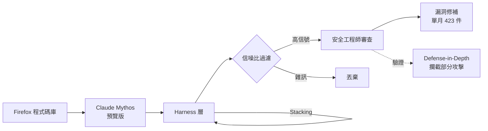
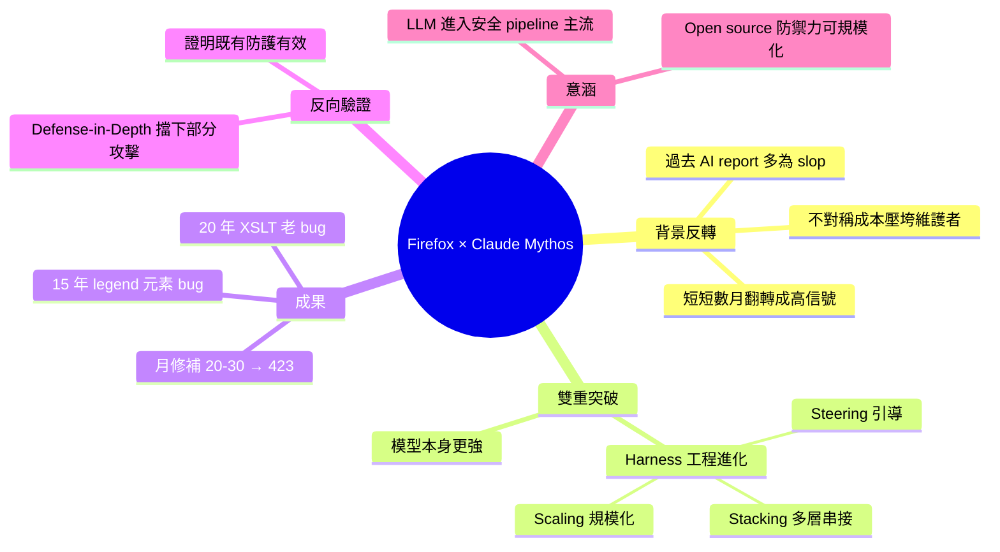

## Behind the Scenes Hardening Firefox with Claude Mythos Preview

Mozilla 利用 Claude Mythos 預覽版的能力，透過改進的提示策略與技術堆疊，在 Firefox 安全強化中取得突破性進展。2025 年 Firefox 平均每月修復 20–30 個安全漏洞，到 2026 年 4 月躍升至 423 個，包括一個 20 年前的 XSLT 漏洞與 15 年前的 HTML legend 元素漏洞。Claude 的能力提升配合改進的模型引導技術，大幅提高了信噪比，雖部分嘗試被 Firefox 既有的深度防禦機制攔截，但整體效果令人矚目。

### 重點
- 安全漏洞修復速度從 20–30/月（2025）激增至 423/月（2026 年 4 月），成長超過 10 倍
- Claude Mythos 預覽版能力提升 + 改進的模型引導與堆疊技術，成功提高了大規模信號生成與雜訊過濾的能力
- 發現並修復 20 年舊 XSLT 漏洞與 15 年舊 HTML legend 元素漏洞等深層缺陷

**原文：** [simon-willison](https://simonwillison.net/2026/May/7/firefox-claude-mythos/#atom-everything)

---

<!-- deep-analysis:begin -->
## 📌 摘要 (TL;DR)

- Mozilla 透過 Claude Mythos 預覽版（Claude Mythos preview）大規模強化 Firefox 安全性，找出並修補數百個漏洞，是 LLM 應用於實戰級安全研究的重要案例。
- Firefox 安全漏洞修補量從 2025 年平均每月 20–30 個，暴增到 2026 年 4 月的 **423 個**，量級提升超過十倍。
- 戰果包含一個存在 **20 年的 XSLT 漏洞** 與一個 **15 年的 HTML `<legend>` 元素漏洞**，顯示 LLM 已能挖出長年潛伏的歷史 bug。
- 突破來自兩個因素疊加：模型本身能力提升，以及 Mozilla 在 harness（駕馭框架）端的「steering、scaling、stacking」技巧顯著進化，把信噪比拉高。
- 部分由 LLM 嘗試的攻擊被 Firefox 既有的縱深防禦（defense-in-depth）擋下，反而驗證了現有防護層的有效性。
- 文章作者 Simon Willison 強調：幾個月前 AI 產的安全回報還多半是「slop」（雜訊垃圾），現在已經反轉為高價值訊號。

## 🎯 核心概念

- **Claude Mythos preview**：Anthropic 提供給 Mozilla 的 Claude 預覽版本，用於 Firefox 安全研究。
- **AI Slop**：指 LLM 生成、看似合理但其實錯誤的低品質產出；在安全回報情境下會對維護者造成不對稱成本（asymmetric cost）。
- **Harness（駕馭框架）**：包覆模型外層的工程系統，負責提示組裝、任務拆分、結果過濾。Mozilla 在三個面向強化 harness：
  - **Steering**：引導模型朝特定漏洞模式或程式碼區域思考。
  - **Scaling**：把搜尋規模放大，覆蓋大量檔案 / 函式。
  - **Stacking**：多層模型/階段串接，互相驗證以濾掉假陽性。
- **Defense-in-Depth（縱深防禦）**：Firefox 內既有的多層防護機制，即使單一漏洞被觸發也能被後續層攔截。

## 📖 整理分析

### 1. 從 slop 到信號的反轉
幾個月前，AI 產生的安全 bug report 對 open source 專案幾乎是負擔——「看起來合理但其實是錯」的回報極度便宜，但維護者要花很多時間查證，形成不對稱成本。Simon Willison 引用 Mozilla 的描述，指出這個動態在短短幾個月內被翻轉，AI 從噪聲源變成可信的漏洞發現工具。

### 2. 真正改變的兩個因素
Mozilla 將突破歸功於兩件事疊加：第一，底層模型（Claude Mythos 預覽版）能力本身大幅提升；第二，他們大幅改良駕馭模型的技術——具體做法是 steering、scaling、stacking，把模型輸出的信噪比（signal-to-noise ratio）拉高到能進入正式修補流程的水準。

### 3. 修補量級的跳躍：20–30 → 423
以數字看，2025 年全年 Firefox 平均每月處理 20–30 個安全 bug；到 2026 年 4 月，單月處理量達到 **423 個**。這個量級代表 LLM 已不只是輔助工具，而是進入 Mozilla 的安全 pipeline 主流程。

### 4. 兩個歷史性老 bug
文章特別點名兩個案例：一個是潛伏 **20 年的 XSLT 漏洞**，一個是 **15 年沒被發現的 `<legend>` HTML 元素漏洞**。這類老 bug 在傳統 fuzzing、code review、static analysis 多年攻勢下都未現形，反映 LLM 對「跨檔案語意」與「冷門程式路徑」具有人類難以企及的耐心覆蓋力。

### 5. 縱深防禦帶來的反向驗證
Mozilla 也觀察到一個有趣現象：harness 嘗試出的部分攻擊路徑，在實際觸發時被 Firefox 既有的 defense-in-depth 層攔截而未能造成傷害。這對團隊是一種 reassuring（令人安心）的訊號——既證明 LLM 找得到攻擊路徑，也證明過去多年累積的多層防禦機制確實有效。

## 🧭 架構示意

## 🧠 Mindmap

<!-- deep-analysis:end -->
### 📄 原文內容

點此展開 / 收合

Behind the Scenes Hardening Firefox with Claude Mythos Preview 
Fascinating, in-depth details on how Mozilla used their access to the Claude Mythos preview to locate and then fix hundreds of vulnerabilities in Firefox: 
 
 Suddenly, the bugs are very good 
 Just a few months ago, AI-generated security bug reports to open source projects were mostly known for being unwanted slop. Dealing with reports that look plausibly correct but are wrong imposes an asymmetric cost on project maintainers: it’s cheap and easy to prompt an LLM to find a “problem” in code, but slow and expensive to respond to it. 
 It is difficult to overstate how much this dynamic changed for us over a few short months. This was due to a combination of two main factors. First, the models got a lot more capable. Second, we dramatically improved our techniques for harnessing these models — steering them, scaling them, and stacking them to generate large amounts of signal and filter out the noise. 
 
 They include some detailed bug descriptions too, including a 20-year old XSLT bug and a 15-year-old bug in the &lt;legend&gt; element. 
 A lot of the attempts made by the harness were blocked by Firefox's existing defense-in-depth measures, which is reassuring. 
 Mozilla were fixing around 20-30 security bugs in Firefox per month through 2025. That jumped to 423 in April. 
 

 Via Lobste.rs 

 Tags: firefox , mozilla , security , ai , generative-ai , llms , anthropic , claude , ai-security-research

