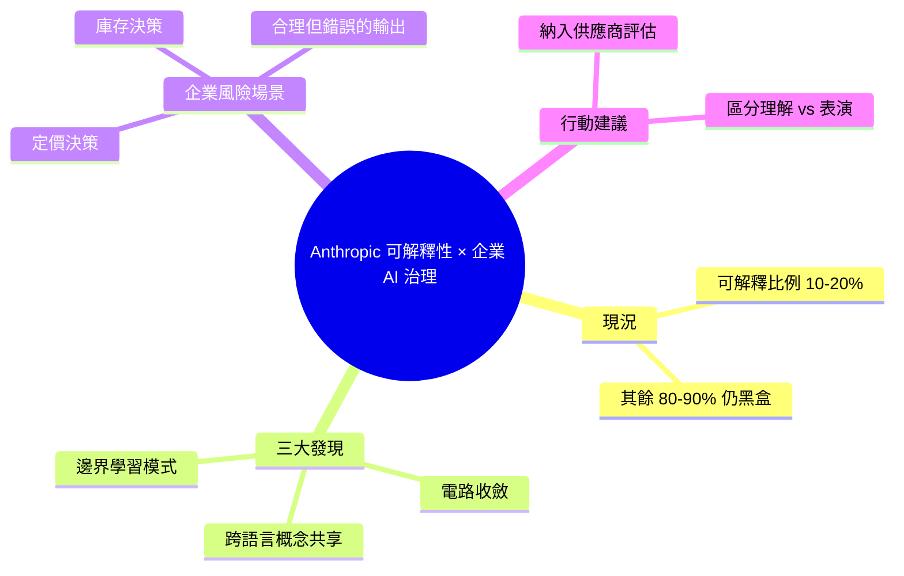

## The Black Box Is Starting to Open: What Anthropic’s Interpretability Research Means for Enterprise...

Anthropic 可解釋性研究團隊發現大語言模型內部機制的關鍵規律。目前人類僅能解釋模型行為的 10-20%，在企業部署的定價、庫存決策系統中構成治理風險。研究揭示：（1）同一神經迴路在不同上下文執行相同計算（電路收斂）；（2）多語言模型共享核心概念表示，如「大」在英文、法文、日文中用同樣神經編碼；（3）模型邊界情況會進入「學習模式」，看似合理但實際錯誤。企業應將可解釋性納入 AI 供應商評估，建立系統性認知何時 AI 真正理解輸出、何時則否。

### 重點
- 解釋性覆蓋率僅 10-20%：企業面臨「計畫 A vs 計畫 B」風險——模型 99% 時用正確推理，邊界情況卻轉向自信編造
- 神經迴路收斂：同一計算（如算術）在不同上下文複用相同迴路；多語言模型共享「大」等核心概念表示
- 企業對策：評估 AI 供應商的推理審計能力；大型多語言模型因架構優勢相較小型單市場模型更具成本優勢

**原文：** [medium-tag-llm](https://medium.com/@yangxu_16238/the-black-box-is-starting-to-open-what-anthropics-interpretability-research-means-for-enterprise-53496de90ff7?source=rss------large_language_models-5)

---

<!-- deep-analysis:begin -->
## 📌 摘要 (TL;DR)

- Anthropic 可解釋性（interpretability）研究團隊揭示，目前人類僅能解釋大語言模型內部行為的 **10-20%**，剩下 80-90% 仍是黑盒。
- 對於將 AI 嵌入**定價、庫存決策**等高影響流程的企業，這個比例構成實質治理風險。
- 三大關鍵發現：**電路收斂**（circuit convergence）、**跨語言概念共享**、邊界情況的**學習模式**（learning mode）。
- 跨語言實驗顯示「大」這個概念在英文、法文、日文中使用**同一組神經編碼**，多語言模型並非各語言獨立學習。
- 模型在邊界情況會切換到學習模式，輸出**看似合理但實際錯誤**——這是企業最該警覺的失效模式。
- 作者建議：把可解釋性正式納入 AI 供應商評估標準。

## 🎯 核心概念

- **可解釋性**（interpretability）：理解模型內部如何產生特定輸出的研究領域，對應「黑盒能被打開多少」。
- **電路收斂**（circuit convergence）：同一組神經迴路在不同上下文執行相同計算的現象，意味模型內部存在可重用的計算原件。
- **學習模式**（learning mode）：模型在不熟悉的邊界情境下進入的內部狀態，特徵是輸出表面合理但實質錯誤。

## 📖 整理分析

### 1. 黑盒只打開了 10-20%
依據 Anthropic 研究團隊的成果，目前人類能解釋的大語言模型行為比例僅落在 10-20% 之間。對企業領導者而言，這代表把 AI 用在影響營收的定價或庫存決策時，仍有 80-90% 的內部行為無從審計，這是治理層級的風險而非單純技術問題。

### 2. 電路收斂：模型內部的「函式庫」
研究觀察到同一神經迴路會在不同上下文執行相同計算，這個現象稱為電路收斂。它的意義在於模型不是每次任務都重新組裝邏輯，而是有可重用的內部計算原件——這讓「定位某個能力」在技術上成為可能。

### 3. 跨語言的共享表示
最具代表性的實驗結果：「大」這個語意概念在英文、法文、日文中使用**同樣的神經編碼**。這推翻了「每種語言各自學一套」的直覺假設，顯示多語言模型在內部維持一個跨語言的核心概念層，語言只是表面的輸出皮層。

### 4. 邊界情況觸發的學習模式
當模型遇到訓練分布邊緣的情境，內部會切換到一種「學習模式」，特徵是輸出仍然語句通順、看起來合理，但實質上是錯的。對企業使用者來說，這是最危險的失效模式——因為它不會自我宣告「我不確定」，而是用一樣的自信語氣給出錯誤答案。

### 5. 對企業 AI 治理的含意
作者主張企業必須把可解釋性正式納入 AI 供應商評估標準，建立一套系統性認知：**何時 AI 真正理解了輸出、何時只是在學習模式中表演**。光看輸出品質不足以承擔定價或庫存層級的決策責任。

## 🧠 Mindmap

<!-- deep-analysis:end -->
### 📄 原文內容

點此展開 / 收合

There is a question every enterprise leader deploying AI systems should be asking &#x2014; and almost none are:Do we actually know what our AI is&#x2026; Continue reading on Medium »

