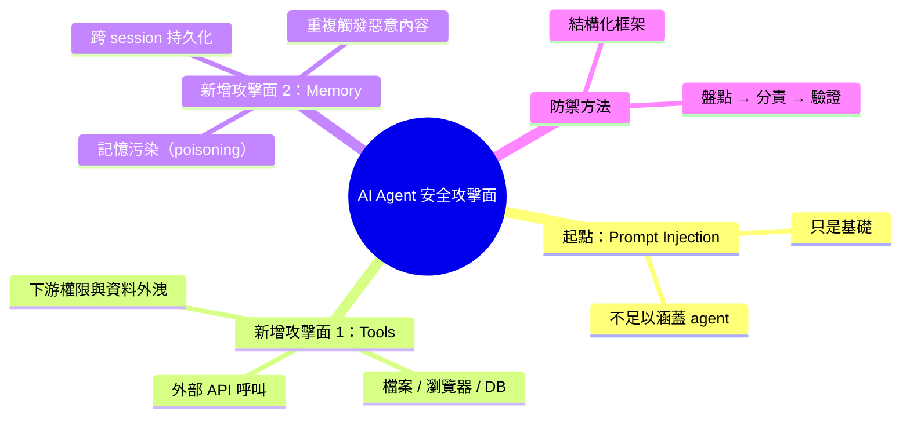

## The AI Agent Security Surface: What Gets Exposed When You Add Tools and Memory

AI Agent 的安全威脅遠超過提示注入這類標準攻擊。文章提出結構化框架用於識別與防禦 agentic workflows 的後端攻擊向量，涵蓋工具整合和記憶存儲等多層風險。

### 重點
- 標準提示攻擊只是起點，Agent 的工具和記憶引入新的後端攻擊面
- 需要系統化框架來映射 agentic workflows 的多維度安全風險
- 後端攻擊向量包括工具執行、記憶持久化、權限管理等

**原文：** [medium-towards-data-science](https://towardsdatascience.com/the-ai-agent-security-surface-what-gets-exposed-when-you-add-tools-and-memory/)

---

<!-- deep-analysis:begin -->
## 📌 摘要 (TL;DR)

- 原文主張：AI Agent 的安全威脅不只 **提示注入（prompt injection）**；當 agent 加上工具（tools）與記憶（memory）後，後端會出現新的攻擊面。
- 文章提出一個 **結構化框架（structured framework）**，用來盤點並緩解 agentic workflows 的攻擊向量。
- 兩個被點名的新增風險層：**工具整合（tool integration）** 與 **記憶儲存（memory storage）**。
- 讀者價值：把安全討論從「防 prompt」升級到「防整條 agent 後端鏈路」。

> ⚠️ 資料限制：本次擷取到的 `body_md` 僅含標題、副標題與 "The post ... appeared first on ..." boilerplate，未拿到正文段落。以下整理以**原文明示的論點骨架**為主，未杜撰具體攻擊手法、數據或案例。

## 🎯 核心概念

- **代理工作流（agentic workflows）**：LLM 結合工具呼叫與記憶，能跨多步驟自主完成任務的系統。
- **攻擊面（attack surface）**：一個系統暴露給攻擊者、可被利用作為入口的所有元件集合。
- **提示注入（prompt injection）**：透過輸入內容誘導模型偏離原始指令的攻擊，是 LLM 安全最早被廣泛討論的威脅。

## 📖 整理分析

### 1. 為什麼提示注入只是起點
副標題明確寫道 "Standard prompt attacks are merely the beginning"。原文的核心立場是：當 AI 從單純對話模型升級為具備工具使用與記憶的 agent，安全模型不能只停在輸入字串層次，因為新增的後端元件會把攻擊路徑延伸到模型之外的系統。

### 2. 工具整合帶來的後端風險
標題第一個被點名的擴展面是 **tools**。當 agent 能呼叫外部 API、檔案系統、瀏覽器或資料庫，原本停留在 prompt 層的指令偏移問題會傳播到下游服務，牽涉到權限邊界、輸入驗證與資料外洩等傳統後端安全議題。

### 3. 記憶儲存帶來的持久化風險
標題第二個關鍵字是 **memory**。長期記憶意味著一次性的惡意輸入可能在後續對話被反覆重新觸發；若記憶寫入沒有信任邊界，跨 session 的污染（poisoning）就成為與一次性 prompt 攻擊不同類型的新威脅。

### 4. 結構化框架的作用
副標題提到 "a structured framework to map and mitigate"。框架的價值在於把零散威脅整理成可盤點、可分配防禦責任、可逐項驗證的清單，避免團隊只防住輸入層卻漏掉工具與記憶兩條後端通道。

> 註：原文應有更細的攻擊分類、緩解步驟與工程實務建議，但本次擷取內容未包含這些細節，需回到原文 [Towards Data Science 連結](https://towardsdatascience.com/the-ai-agent-security-surface-what-gets-exposed-when-you-add-tools-and-memory/) 查看完整框架。

## 🧠 Mindmap

<!-- deep-analysis:end -->
### 📄 原文內容

點此展開 / 收合

Standard prompt attacks are merely the beginning. A structured framework to map and mitigate the backend attack vectors of agentic workflows. 
 The post The AI Agent Security Surface: What Gets Exposed When You Add Tools and Memory appeared first on Towards Data Science .

