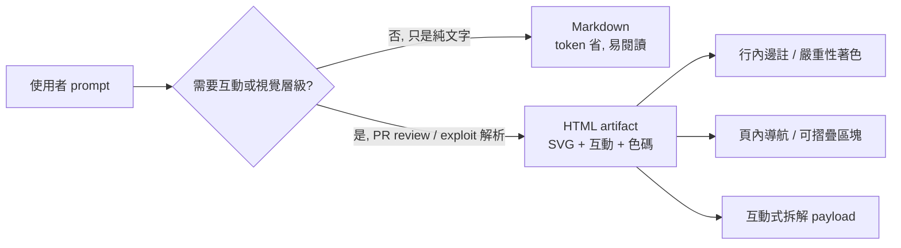
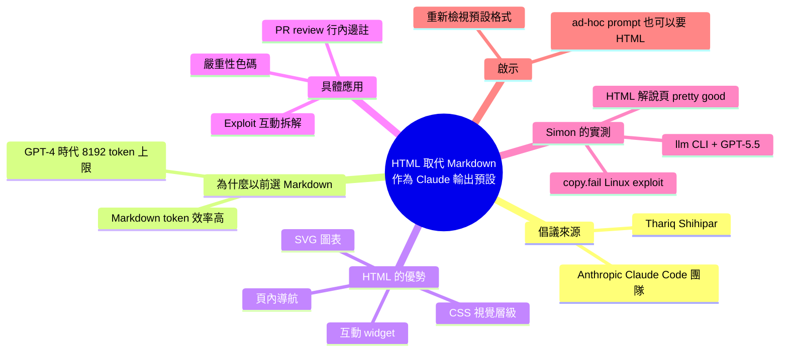

## Using Claude Code: The Unreasonable Effectiveness of HTML

Anthropic Claude Code團隊成員Thariq Shihipar倡議改用HTML而非Markdown作為Claude輸出格式。在GPT-4時代因8K token限制，Markdown效率優勢曾主導選擇，但HTML能承載SVG圖表、互動部件、頁內導航等豐富表達形式，尤其適合PR審查（帶行內邊註與嚴重性色碼）和安全漏洞分析（互動式解析obfuscated exploit）。Simon Willison實測用GPT-5.5生成的HTML頁面展示該方案可顯著提升複雜信息的可導航性與理解深度，標誌著提示工程對輸出格式選擇的思維更新。

### 重點
- Claude輸出從Markdown遷向HTML，利用SVG圖表、互動部件與頁內導航豐富表達能力
- HTML特別適合PR審查（行內邊註+色碼）與security分析（互動式漏洞解析），提示詞示例：'Reformat with inline annotations, color-code by severity'
- Token成本優化已非Markdown必選理由；新場景應探索HTML-CSS-JavaScript組合的表達形式升級

**原文：** [simon-willison](https://simonwillison.net/2026/May/8/unreasonable-effectiveness-of-html/#atom-everything)

---


<!-- deep-analysis:begin -->
## 📌 摘要 (TL;DR)

- Thariq Shihipar（Anthropic Claude Code 團隊成員）撰文主張：要 Claude 輸出時，HTML 比 Markdown 更值得當預設格式。
- HTML 可承載 SVG 圖表、互動 widget、頁內導航與 CSS 視覺層級，這些是 Markdown 做不到的。
- Simon Willison 自 GPT-4 時代（輸出 8,192 token 上限）習慣要 Markdown 以省 token，現在因模型上下文放寬而重新考慮這個預設。
- 兩個具體應用場景：PR 審查（diff 內嵌行內邊註 + 依嚴重性色碼）、安全漏洞解析（互動式拆解 obfuscated payload）。
- Simon 用 `llm` CLI 搭配 GPT-5.5，對 copy.fail 的 Linux exploit 實測產出 HTML 解說頁，自評「pretty good」。

## 🎯 核心概念

- **HTML 輸出格式** (HTML output)：要求 LLM 直接產生完整可渲染的 HTML 頁面，而不是純文字或 Markdown。
- **Token 效率** (token efficiency)：在輸出 token 上限緊張時，Markdown 標記字元比 HTML 標籤少，因此早期被當作預設。
- **Artifact**：Claude 產出的單頁互動文件，可內嵌 CSS / JS / SVG，在瀏覽器中直接操作。
- **Obfuscated payload**：刻意混淆過的攻擊程式碼（此處為 Python），需要拆解才能看懂行為。

## 📖 整理分析

### 1. 為什麼以前預設要 Markdown
Simon 在文中明說：自 GPT-4 時代起，因為輸出上限只有 8,192 tokens，Markdown 相對 HTML 的 token 效率「extremely worthwhile」，因此他把 Markdown 當作大多數請求的預設輸出格式。HTML 的開閉標籤在當時的成本，無法被它帶來的表達力抵銷。

### 2. Thariq 的論點：HTML 解鎖更豐富的呈現
Thariq Shihipar 在原文主張：HTML 能塞進 Markdown 做不到的元件—SVG 圖表、互動 widget、in-page navigation、依嚴重性著色的視覺層級。對於需要「在頁面上指東指西」的任務，例如 code review 或 exploit 拆解，HTML 是更自然的容器。

### 3. PR 審查的 prompt 範例
Thariq 在文中給了一個可直接抄用的 prompt：

> Help me review this PR by creating an HTML artifact that describes it. I'm not very familiar with the streaming/backpressure logic so focus on that. Render the actual diff with inline margin annotations, color-code findings by severity and whatever else might be needed to convey the concept well.

重點是：把 diff 本身渲染進 HTML，把 review 意見以行內邊註（inline margin annotation）貼在對應行旁，並依嚴重性上色。這種版面在純 Markdown 文字流裡幾乎不可能達成。

### 4. Simon 的 copy.fail 實測
Simon 拿 copy.fail（近期揭露的 Linux exploit，PoC 是 obfuscated Python）跑驗證，指令如下：

```bash
curl https://copy.fail/exp | llm -m gpt-5.5 -s 'Explain this code in detail. Reformat it, expand out any confusing bits and go deep into what it does and how it works. Output HTML, neatly styled and using capabilities of HTML and CSS and JavaScript to make the explanation rich and interactive and as clear as possible'
```

GPT-5.5 產出的 HTML 頁面 Simon 自評「pretty good」，但補充說 prompt 應該更明確強調解釋 exploit 本身，而不是外圍的 Python harness。

### 5. 對 prompt engineering 預設值的提醒
這篇文章本質上是「預設格式要重新檢視」的訊號。Simon 在 2025 年 12 月寫過 *Useful patterns for building HTML tools*，但那篇聚焦在 tools.simonwillison.net 上「明確要做互動工具」的場景；這次他明確表態要把 HTML 用法擴張到「ad-hoc prompts 的解釋型回答」，亦即一般問答也順手要 HTML。這是過去靠 token 成本決定的預設，被新的模型能力推翻的典型例子。

## 🧭 場景對比



## 🧠 Mindmap


<!-- deep-analysis:end -->
### 📄 原文內容

<details>
<summary>點此展開 / 收合</summary>

Using Claude Code: The Unreasonable Effectiveness of HTML 
Thought-provoking piece by Thariq Shihipar (on the Claude Code team at Anthropic) advocating for HTML over Markdown as an output format to request from Claude. 
 The article is crammed with interesting examples (collected on this site ) and prompt suggestions like this one: 
 
 Help me review this PR by creating an HTML artifact that describes it. I'm not very familiar with the streaming/backpressure logic so focus on that. Render the actual diff with inline margin annotations, color-code findings by severity and whatever else might be needed to convey the concept well. 
 
 I've been defaulting to asking for most things in Markdown since the GPT-4 days, when the 8,192 token limit meant that Markdown's token-efficiency over HTML was extremely worthwhile. 
 Thariq's piece here has caused me to reconsider that, especially for output. Asking Claude for an explanation in HTML means it can drop in SVG diagrams, interactive widgets, in-page navigation and all sorts of other neat ways of making the information more pleasant to navigate. 
 I wrote about Useful patterns for building HTML tools last December, but that was focused very much on interactive utilities like the ones on my tools.simonwillison.net site. I'm excited to start experimenting more with rich HTML explanations in response to ad-hoc prompts. 
 Trying this out on copy.fail 

 copy.fail describes a recently discovered Linux security exploit, including a proof of concept distributed as obfuscated Python. 
 I tried having GPT-5.5 create an HTML explanation of the exploit like this: 
 
 curl https://copy.fail/exp | llm -m gpt-5.5 -s 'Explain this code in detail. Reformat it, expand out any confusing bits and go deep into what it does and how it works. Output HTML, neatly styled and using capabilities of HTML and CSS and JavaScript to make the explanation rich and interactive and as clear as possible' 
 
 Here's the resulting HTML page . It's pretty good, though I should have emphasized explaining the exploit over the Python harness around it. 
 

 Tags: html , security , markdown , ai , prompt-engineering , generative-ai , llms , llm , claude-code

</details>