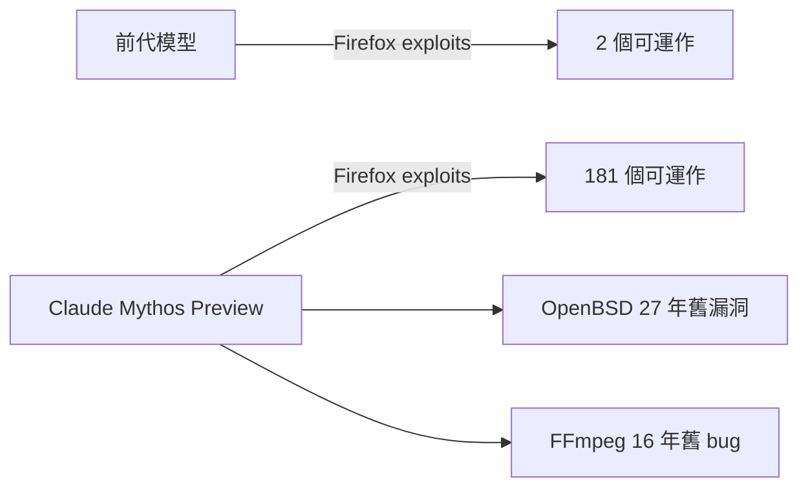
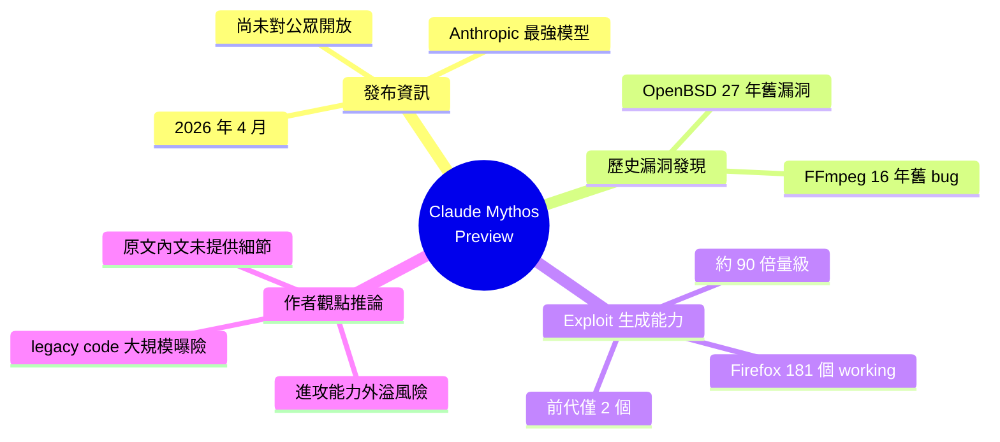

## Claude Mythos Found a 27-Year-Old Bug. Here’s Why That’s a Problem.

Anthropic 於 2026 年 4 月宣布 Claude Mythos Preview，為其最強大的模型。該模型發現了一個 27 年前的 OpenBSD 漏洞和一個 16 年前的 FFmpeg bug，並生成了 181 個可工作的 Firefox exploits（相比前代模型僅生成 2 個），展現其在安全漏洞發現和漏洞利用上的大幅進步。Claude Mythos 目前仍未向公眾開放。

### 重點
- Claude Mythos 發現 27 年前的 OpenBSD vulnerability 和 16 年前的 FFmpeg bug
- 生成 181 個工作的 Firefox exploits，對比前代模型的 2 個——性能跨越 90 倍
- 模型展現在安全漏洞分析上的突破性能力，但發布時間表待定

**原文：** [medium-tag-claude](https://medium.com/@hinditechbook/claude-mythos-found-a-27-year-old-bug-heres-why-that-s-a-problem-9b52c2f69908?source=rss------claude-5)

---

<!-- deep-analysis:begin -->
## 📌 摘要 (TL;DR)

- 2026 年 4 月 Anthropic 發布 **Claude Mythos Preview**，被定位為其史上最強模型。
- 該模型在安全研究情境下發現一個 **27 年前的 OpenBSD 漏洞**，以及一個 **16 年前的 FFmpeg bug**。
- 在 Firefox 漏洞利用生成測試中，Claude Mythos 產出 **181 個可運作的 exploit**，前代模型僅產出 **2 個**——量級差距約 90 倍。
- Claude Mythos **尚未對公眾開放**，僅以 Preview 形式釋出。
- 標題（「Here's Why That's a Problem」）暗示作者對 AI 進攻型安全能力（offensive security）外溢的擔憂——這是推論，原文未提供完整內文。

> ⚠️ 來源限制：本則 inbox 的 `body_md` 僅有開頭一句（「In April 2026, Anthropic announced Claude Mythos Preview — their most capable model yet. Continue reading on Medium »」），其餘細節全部來自既有的 `summary_zh`。下列分析以這些事實為界，未補完未提及的內容。

## 🎯 核心概念

- **Claude Mythos Preview**：Anthropic 於 2026/04 發布的旗艦模型 Preview 版本。
- **Exploit（漏洞利用）**：將漏洞轉成可實際執行攻擊的程式碼。
- **OpenBSD**：注重安全的開源類 Unix 作業系統，漏洞長期存活意味著傳統審計未能察覺。
- **FFmpeg**：被廣泛使用的多媒體處理函式庫，歷史上多次出現高影響力的 memory safety bug。

## 📖 整理分析

### 1. Claude Mythos 的定位
依據原文開場句，Claude Mythos Preview 在 2026 年 4 月發布，被 Anthropic 稱為「their most capable model yet（迄今最強模型）」。原文未提供 benchmark 細節或與前代的具體規格差異，因此本節僅能停留在定位層面。

### 2. 兩個被翻出的歷史漏洞
根據 brief 摘要，Claude Mythos 找出兩個重量級的歷史漏洞：
- **27 年前的 OpenBSD 漏洞**：以 2026 年回推，等於該 bug 自 1999 年前後即已存在，跨越多個 OpenBSD 主版本而未被發現。
- **16 年前的 FFmpeg bug**：對應約 2010 年導入的程式碼，影響範圍涵蓋十餘年來眾多依賴 FFmpeg 的應用。

這兩個案例的價值在於：傳統 fuzzing、靜態分析與人類 code review 在那麼長的時間內都沒翻出來，AI 卻找到了——意味著 AI 在某些 bug class 上已具備人類審計遺漏的覆蓋能力。

### 3. Firefox exploit 生成的量級跳躍
摘要提到：在某項 Firefox 漏洞利用測試中，Claude Mythos 產出 **181 個可運作 exploit**，相較**前代模型僅 2 個**。此處的關鍵是「working」——不是發現漏洞數量，而是**端到端可實際 trigger 的 exploit 數量**。從 2 → 181 大致是兩個量級的能力躍遷，遠超 incremental upgrade 的常態。

（推論）這代表的不是「找 bug 變強一點」，而是「把 bug 變成武器」這條鏈被打通。

### 4. 為什麼作者覺得這是「問題」
標題明確使用「Here's Why That's a Problem」。原文內文未提供，因此以下為**基於標題與行業脈絡的推論**，非原文陳述：
- **進攻—防守不對稱**：找 bug 的成本下降會讓攻擊者先受惠，防守端要等修補與部署。
- **歷史程式碼大規模曝險**：27 年、16 年的存活漏洞被翻出，等於整個開源生態的 legacy code 都成為新攻擊面。
- **可及性問題**：Mythos 雖未公開，但能力一旦下放（或被類似模型複現），門檻將顯著降低。

### 5. 目前的取得限制
摘要指出 Claude Mythos **仍未向公眾開放**，僅為 Preview。原文未說明 access policy、red-team 範圍、或部署時程，因此此處不臆測。

## 🧭 能力對比

## 🧠 Mindmap

<!-- deep-analysis:end -->
### 📄 原文內容

點此展開 / 收合

In April 2026, Anthropic announced Claude Mythos Preview &#x2014; their most capable model yet. Continue reading on Medium »

