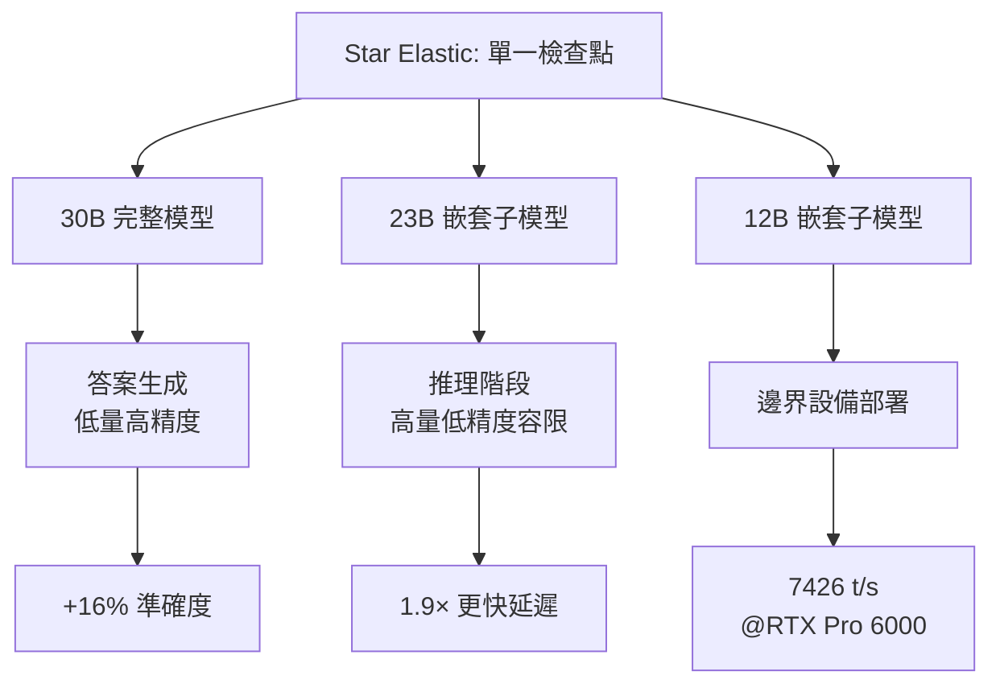

## NVIDIA AI Releases Star Elastic: One Checkpoint that Contains 30B, 23B, and 12B Reasoning Models with Zero-Shot Slicing

NVIDIA 發佈 Star Elastic，革新推理模型架構，將 30B、23B、12B 三個不同規模模型壓縮在單一檢查點中，透過可學習路由器（Gumbel-Softmax 訓練）實現零樣本切片提取。核心創新：根據任務複雜度動態分配模型規模——23B 用於推理階段（高容量容限）、30B 用於答案生成（低容量高精度），相比標準預算控制策略提升 16% 準確度、降低 1.9 倍延遲（在 AIME-2025、GPQA、LiveCodeBench v5、MMLU-Pro 測試）。訓練效率提升 360 倍（vs 從頭預訓練三模型）。量化版本（NVFP4）可在消費級硬體（RTX 5080）運行，於 RTX Pro 6000 達 7,426 tokens/秒，超越 30B BF16 基線 3.4 倍。

### 重點
- 單一檢查點嵌套三規模模型（30B、23B、12B），透過可學習路由零樣本提取子模型，支援 BF16/FP8/NVFP4 三種量化
- 彈性預算控制原則：23B 分配推理（容量容限大）、30B 分配答案（容量有限精度優先），相比標準方法 +16% 準確度、1.9× 更快延遲
- 硬體與效率：NVFP4 量化在 RTX 5080 可運行、Pro 6000 達 7,426 t/s；預訓練效率提升 360 倍（vs 獨立訓練三模型）

**原文：** [reddit-localllama](https://www.reddit.com/r/LocalLLaMA/comments/1t8s83r/nvidia_ai_releases_star_elastic_one_checkpoint/)

---

### 📄 原文內容

點此展開 / 收合

# NVIDIA AI Releases Star Elastic: One Checkpoint that Contains 30B, 23B, and 12B Reasoning Models with Zero-Shot Slicing

I saw this on another sub and didn't see it posted here, it looks awesome, and can definitely be run local. I guess it was released 11 days ago, but it never hit the top of my feed (which I look at way too often), so posting it again. This is my take on it: Think of this as like scalable video coding, you have a UHD stream, but strip some layers and you have a HD, or SD stream, it's all a single file stream, not multiple ones. Like nested models, rather than 3 different sets, and they can share their KV cache so the model can adjust speed like a sliding scale. You get an idea with a 30B model, then scale down and permutate all the thinking at 7000t/s on the 12B model, generating a book of reasoning in seconds, then slide up to 30B again to evaluate what's good. You could have a 30B kind of guide the smaller ones back and forth. Maybe it's somewhat of a hybrid between Dense and MoE, it's like MoE but with 3 dense models that are like russian dolls. Original Post: NVIDIA just released Star Elastic — and the inference strategy alone is worth understanding. Here's what's actually interesting from the technical side: One checkpoint. Three models. Star Elastic applies a post-training method to Nemotron Nano v3 that nests 23B and 12B submodels can be extracted zero-shot from the parent checkpoint the 30B parent. All three live in a single checkpoint in BF16, FP8, and NVFP4. The router learns the architecture, not just the weights. A learnable router trained via Gumbel-Softmax maps any target parameter budget to the optimal nested configuration across all elastic axes — attention heads, Mamba SSM heads, MoE experts, FFN channels, embedding dimensions. The importance-based ranking that orders these components is computed before training begins. Use a smaller model for thinking. Use the full model for the answer. This is the finding we found most interesting. Elastic budget control assigns the 23B submodel to the thinking phase and the 30B model to the final answer. Reasoning traces are high-volume but tolerant of lower capacity. The final answer is low-volume but requires precision. Matching model size to phase complexity gives: → +16% accuracy vs. standard budget control → 1.9× lower latency Measured on AIME-2025, GPQA, LiveCodeBench v5, and MMLU-Pro. The cost reduction is significant. → 360× fewer tokens vs. pretraining each variant from scratch → 7× fewer tokens vs. state-of-the-art sequential compression → The 23B and 12B nested models match or outperform independently trained baselines of comparable size Hardware accessibility. The 12B NVFP4 variant runs on an RTX 5080 where every BF16 configuration runs out of memory. On an RTX Pro 6000 it reaches 7,426 tokens/s — 3.4× the throughput of the 30B BF16 baseline. Read the full analysis which also has an interactive step-by-step code guide here: https://www.marktechpost.com/2026/05/09/nvidia-ai-releases-star-elastic-one-checkpoint-that-contains-30b-23b-and-12b-reasoning-models-with-zero-shot-slicing/ 3-in-1 model in BF16: https://huggingface.co/nvidia/NVIDIA-Nemotron-Labs-3-Elastic-30B-A3B-BF16 3-in-1 model in FP8: https://huggingface.co/nvidia/NVIDIA-Nemotron-Labs-3-Elastic-30B-A3B-FP8 3-in-1 model in NVFP4: https://huggingface.co/nvidia/NVIDIA-Nemotron-Labs-3-Elastic-30B-A3B-NVFP4 Related Papers: https://arxiv.org/abs/2511.16664 There's also a new one called &quot;Star Elastic: Many-in-One Reasoning {LLMs} with Efficient Budget Control&quot; but I can't find it. &#32; submitted by &#32; /u/phazei [link] &#32; [comments]

