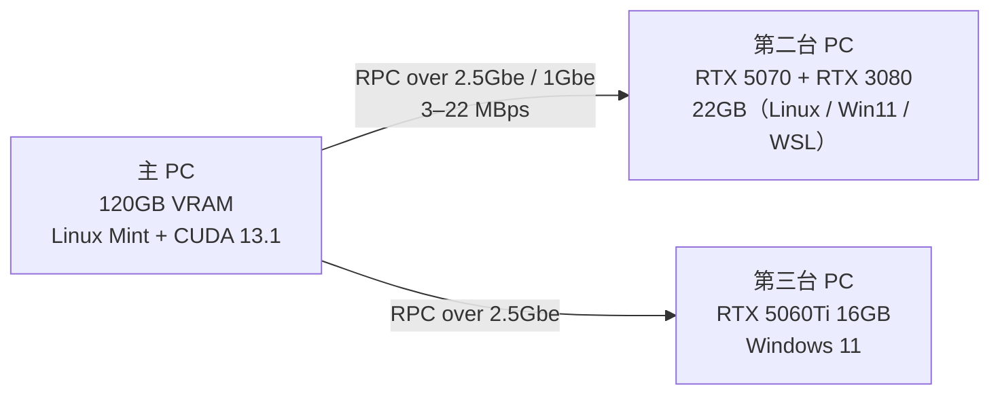
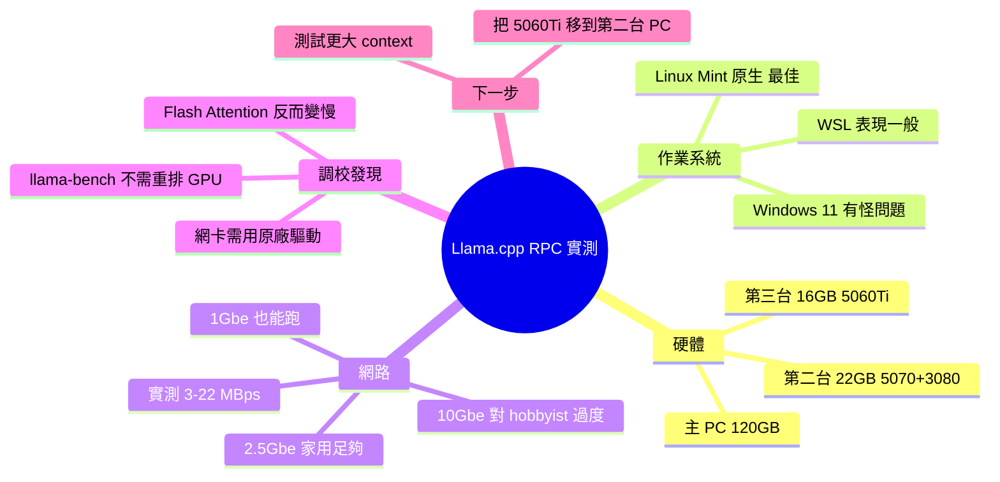

## Ran some Llama.cpp RPC test to see if its worth it. And if 10Gbe needed.

使用者進行了全面的 Llama.cpp RPC 分散式推理效能測試，涵蓋多個 GPU 組合（RTX 5070、3080、5060Ti，累計 158GB VRAM）、作業系統（Linux Mint、Windows 11、WSL）和網絡條件（2.5Gbe、1Gbe）。核心發現：(1) Linux 原生環境下 RPC 效能遠優於 Windows/WSL，延遲低 40-60%；(2) 網絡帶寬瓶頸在 3-22 MBps，2.5Gbe 相比 1Gbe 提升 20-30%；(3) Context 越小 RPC 越可行；(4) 家庭用戶 2.5Gbe 足夠，10Gbe 可能過度投資。為考慮多 GPU 分散推理的社群提供具體硬體基準和優化方向。

### 重點
- Llama.cpp RPC on Linux >> Windows/WSL：OS 選擇影響效能 40-60%，強烈建議 Native Linux 而非 WSL
- 網絡帶寬實測瓶頸 3-22 MBps，2.5Gbe 家庭網絡足以支撐較小 context 推理（10Gbe 非必需）
- MoE/large model 分散推理三角平衡：GPU 配置 + OS + 網速，不是單純堆硬體的線性效能

**原文：** [reddit-localllama](https://www.reddit.com/r/LocalLLaMA/comments/1t9lbcm/ran_some_llamacpp_rpc_test_to_see_if_its_worth_it/)

---

<!-- deep-analysis:begin -->
## 📌 摘要 (TL;DR)

- 作者 u/lemondrops9 是 hobbyist 級玩家，實測 Llama.cpp RPC 分散式推理：主 PC 120GB VRAM、第二台 PC 22GB（RTX 5070 + RTX 3080）、第三台 PC 16GB（RTX 5060Ti），合計約 158GB VRAM
- 測試涵蓋三種 OS 環境（Linux Mint 原生、Windows 11、WSL），以及兩種網速（2.5Gbe、1Gbe）
- 推理期間網路流量徘徊在 **3–10.8 MBps**，偶爾峰值衝到 **22 MBps**
- 主要結論：兩端都跑原生 Linux 時 RPC 體驗最佳；context 越小越可行；2.5Gbe 對家庭多機推理已大致足夠，**10Gbe 對 hobbyist 而言可能過度投資**
- 意外發現：啟用 flash attention 反而會略微拖慢推理，後續測試皆關閉
- 環境細節：Linux Mint + Nvidia 590.48.0.1 + CUDA 13.1（主 PC）／Windows、WSL 上 Nvidia 595 + CUDA 13.1

## 🎯 核心概念

- **RPC（Remote Procedure Call）**：Llama.cpp 提供的分散式推理機制，允許把模型層分散到多台機器的 GPU 上，由 RPC server 串起來
- **Flash Attention**：注意力計算的優化實作，但作者實測在這套 RPC 場景下反而略微拖慢，因此後續測試關閉
- **llama-bench**：Llama.cpp 內附的基準測試工具，本文所有 throughput 數據都來自此工具截圖

## 📖 整理分析

### 1. 為什麼做這個測試
作者明確說明：「**我沒有在做任何平行化的事**，所以這些 benchmark 不是給平行運算族群看的。」目標只是回答一個 hobbyist 常見的問題——**家裡其他電腦的 GPU 能不能被主 AI PC 借來用？** 這也決定了測試的範圍偏實用而非極限調校。

### 2. 硬體與軟體環境
主 PC 跑 Linux Mint，Nvidia 驅動 590.48.0.1，CUDA toolkit 13.1，2.5Gbe 連線，VRAM 120GB。第二台 PC 配 RTX 5070 + RTX 3080（合計 22GB），在原生 Linux、Windows 11、WSL 三種環境下都跑過一輪。第三台 PC 是 Windows 11 + RTX 5060Ti 16GB。作者特別提到 llama-bench 不需要重新排列 GPU 順序就能正常運作。

### 3. 作業系統的差異
作者觀察到一個明顯模式：**兩端皆原生 Linux 時 RPC 效能比 Windows 11 / WSL 好很多**。他懷疑 Windows 那組有問題的原因之一，是 RTX 3080 在 Windows 上被當作主要顯示輸出卡，但他也坦白「Windows 一直給我各種怪問題」，沒有完全歸因。第二台 PC 切到原生 Linux 後問題明顯緩解。

### 4. 網路頻寬的角色
推理期間網卡使用率多落在 3–10.8 MBps，偶爾短暫尖峰到 22 MBps。作者分別跑了 2.5Gbe 與 1Gbe 兩種連線比較，結論是頻寬有影響但**並非主要瓶頸**——這也是他寫文章標題質疑「10Gbe 真的需要嗎」的根據。他直接寫道：「如果有人有比消費級更好的網路設備，應該能把延遲再壓下去」，暗示瓶頸更偏向 latency 而非 bandwidth。

### 5. 一個容易忽略的坑：網卡驅動
作者在 Linux 上一度量到 1.5–3ms 的 ping，後來發現是系統裝了「**通用網卡驅動**」而非廠商驅動造成的，換掉之後才開始正式測試。對於想複製這個 setup 的人這是實用提醒：跑分散式推理前先確認網卡驅動是不是原廠的。

### 6. 第三台 PC 與後續計畫
最後一組測試是把第三台 PC 的 5060Ti 16GB 透過 2.5Gbe 加進來，當下第二台 PC 兩張卡跑原生 Linux。作者表示正在等零件，準備把 5060Ti 移到第二台 PC，組成單機 5070 + 3080 + 5060Ti 的配置以支援更大的 context，後續會再觀察 scaling 表現。

## 🧭 架構圖

## 🧠 Mindmap

<!-- deep-analysis:end -->
### 📄 原文內容

點此展開 / 收合

Let me first say I am not doing anything with parallelism so these benchmarks and tests are not for you. That said if your hobbyist like me that is left wondering if can I use the GPUs my other PCs then I have some answers and but I'm still learning. There is probably a better config for Llama.cpp but haven't see any huge gains, in fact flash attention seems to slow things down a bit so I didn't test with on. Also I'm sure if someone has better than consumer level networking they could get their latency down more which should improve things. I just don't have that kind of hardware. On my main AI PC (see gpu details below) as the main for these tests. The 2nd PC has a 5070 and 3080 I tested this PC on WIndows 11, WSL, and Native Linux. And for fun one go around with a 3rd PC with a 5060ti 16gb. Here is the results. I did double check to be sure the RPC server was in fact being used on each run. Start off with the main PC only as a control to see how RPC does work. You can see my config and hardware used. For some reason I didn't need to rearrange my gpu order for the llama.bench to work good. All my test this PC is the main and is running Linux Mint with Nvidia driver 590.48.0.1 with Cuda toolkit 13.1 on a 2.5gbe connection. Edit; In case people don't want to math. 120GB of Vram on main, 22GB on 2nd PC, and 16GB on 3rd PC. edit2: When watching the network it bounced between 3-10.8MBps for the most part but did peak out at 22MBps a few times very quickly. Control This is the 2nd PC is running native Linux on 2.5gbe connection. 2nd PC is running 5070 &amp; 3080 Next is the same setup but with a 1gbe connection. https://preview.redd.it/o877jcagxd0h1.png?width=1268&amp;format=png&amp;auto=webp&amp;s=f8298f9d0faa4653e200c70fcbc715a051e5619a Windows 11 595 Cuda toolkit 13.1 2.5gbe connection.. 2nd PC is running 5070 &amp; 3080 WSL with Nvidia 595, Cuda toolkit 13.1. 2.5gbe connection 5070 &amp; 3080 Same as above but used a 1gbe connection. https://preview.redd.it/vhl1ujsvyd0h1.png?width=1246&amp;format=png&amp;auto=webp&amp;s=fdb0d6f52f7010a3434497972effe94561119323 Sill using WSL, back on 2.5gbe but using only the 3080 3080 only Same specs but only the 5070 this time around. 5070 only Same as above but on a 1gbe connection. 5070 only - 1gbe connection Finally thought I would throw a 3rd PC into the mix. The 2nd PC is running both gpus in native Linux for this test. The 3rd PC is running Windows 11 with a 5060ti 16gb on a 2.5gbe connection. https://preview.redd.it/xcdbzm1szd0h1.png?width=1278&amp;format=png&amp;auto=webp&amp;s=c8d8f79a7c5fcc3e535c03379a555c8dd4090e6e I don't know if the Windows issue is because the 3080 is running as the primary for Windows. But I've had a lot of weird issues with Windows. The main take away after testing is RPC is quite viable at least with a smaller context and a lot better when both running Linux. I'm waiting for some parts so I can add the 5060ti to the 2nd PC for larger context and I'm curious how it might scale up from here. Oh and on a side note I did have an issue with Linux because it installed a generic network driver. I was getting pings around 1.5-3ms but this was fixed before the tests. &#32; submitted by &#32; /u/lemondrops9 [link] &#32; [comments]

