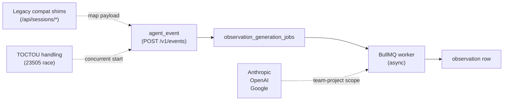

## v13.1.0

claude-mem v13.1.0 落地 server-beta 事件管道（第 4-13 階段）——獨立 Postgres + BullMQ 事件→觀察管道，含 API-key auth、team/project 作用域、審計日誌、3 AI 提供者（Anthropic、OpenAI、Google）、專屬 MCP 伺服器。事件管道：agent_event → observation_generation_jobs（outbox） → BullMQ worker → observation 列；等冪 enqueue、end-to-end request-id 傳播、結構化審計日誌。API 層：POST /v1/events、POST /v1/sessions/start、POST /v1/sessions/:id/end，生成工作 list/retry/cancel。既有相容層：/api/sessions/observations、/api/sessions/summarize shim 將既有 worker 負載映射至新事件/工作模型。POST /v1/sessions/start 捕捉 23505 並發同 externalSessionId 競態並取得贏家列；Postgres 失敗傳回結構化 JSON 不返 500。Docker/Compose 棧支援本地操作者工作流。

### 重點
- 事件管道：agent_event → observation_generation_jobs → BullMQ → observation 列；等冪 enqueue、request-id 傳播
- 3 提供者（Anthropic、OpenAI、Google）team-project 作用域；POST /v1/sessions/start 捕捉 23505 TOCTOU 競態
- 既有相容 shim（/api/sessions/observations、/api/sessions/summarize）；Postgres 失敗返回結構化 JSON；Docker/Compose 棧

**原文：** [claude-mem-releases](https://github.com/thedotmack/claude-mem/releases/tag/v13.1.0)

---

### 📄 原文內容

點此展開 / 收合

Server-beta event pipeline (phases 4–13) 
 This release lands the full server-beta track developed on server-beta-phase-4-event-pipeline — a self-contained Postgres + BullMQ event-to-observation pipeline with API-key auth, team/project scope, audit log, three AI providers (Anthropic, OpenAI, Google), a dedicated MCP server, legacy compat adapters for existing worker clients, a Docker/Compose stack, and a generation-job retry/cancel surface. 
 Highlights 
 
 Event pipeline : agent_event → observation_generation_jobs (outbox) → BullMQ worker → observation row. Idempotent enqueue, request-id propagation end-to-end, structured audit log. 
 API surface : POST /v1/events , POST /v1/sessions/start , POST /v1/sessions/:id/end , generation-job list/retry/cancel, MCP routes, scoped reads. 
 Legacy compat : /api/sessions/observations and /api/sessions/summarize shims map legacy worker payloads into the new event/job model without touching worker code. Both shims now wrap session lookup in their try/catch so Postgres failures return structured JSON, and resolveServerSession survives TOCTOU races via 23505 catch-and-refetch. 
 POST /v1/sessions/start also catches 23505 on concurrent start with the same externalSessionId and refetches the winning row instead of returning 500. 
 Generation providers : Anthropic, OpenAI, and Google with per-team-project scope enforcement and error classification. 
 Docker / Compose stack and bin/server-beta-cli for local operator workflows. 
 
 Bug fixes 
 
 resolveServerSession Postgres errors no longer escape asyncHandler.catch(next) and return HTML 500s to legacy clients. 
 POST /v1/sessions/start no longer returns 500 to the loser of a concurrent same- externalSessionId race. 
 
 Full PR thread: #2383 .

