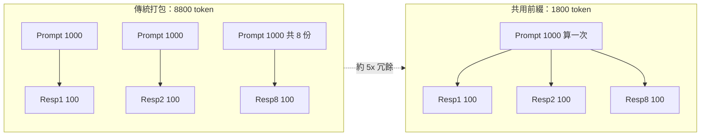
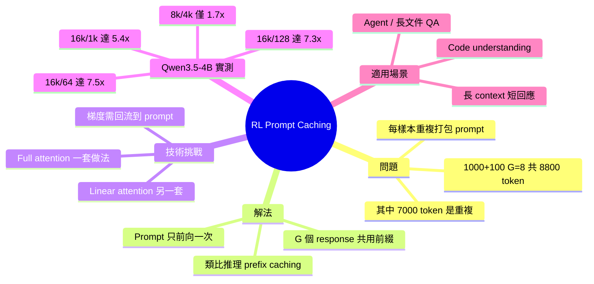

## prompt caching, but for rl training - 7.5x speedup on long-prompt/short-response workloads

研究者發現在 RL 訓練中應用類似推理 prefix caching 的技術，對長 prompt/短 response 工作負載可達 7.5 倍加速。傳統 RL 引擎打包方式低效：對每個樣本重複打包 prompt + response，造成大量計算冗餘（例 1000 token prompt + 100 token response×8 樣本，8800 token 中 6000 token 重複）。解決方案為計算一次 prompt，隨後計算所有 G 個 response，類似推理層 prefix caching 但需處理梯度反向傳播。實現需分別處理 full 和 linear attention 層。在 Qwen3.5-4B 實測：16k prompt/64 response 達 7.5x、16k/128 達 7.3x、16k/1k 達 5.4x、8k/4k 達 1.7x。

### 重點
- RL 訓練長 prompt/短 completion 場景存在 5 倍計算冗餘，prompt 單次計算 + 多 response 方案可根本優化
- Qwen3.5-4B 實測：16k/64 tokens 達 7.5x 加速，16k/128 達 7.3x，效果隨 prompt/response 比例變化
- 實現難點：梯度流需通過 prompt 部分，不同注意力機制需差異化處理，full/linear attention 層需分別實現

**原文：** [reddit-localllama](https://www.reddit.com/r/LocalLLaMA/comments/1tage06/prompt_caching_but_for_rl_training_75x_speedup_on/)

---

<!-- deep-analysis:begin -->
## 📌 摘要 (TL;DR)

- 研究者把推理階段常用的 prefix caching 概念搬到 RL 訓練，在「長 prompt、短 response」工作負載上對 Qwen3.5-4B 最高達 **7.5 倍加速**。
- 傳統開源 RL 引擎做法：每個樣本獨立打包 prompt+response，1000-token prompt × G=8 共要算 8800 token，其中只有 1800 token 是真正獨特的——約 5 倍冗餘算力被浪費。
- 新做法：prompt 只前向一次，然後 G 個 response 共用這份前綴各自展開——概念類似推理 prefix caching。
- 訓練比推理多一件事：梯度必須回流到 prompt 參數，這在 causal attention 的 mask 設計上並不直觀，且需對 full attention 與 linear attention 分別實作。
- Benchmark：16k/64 → 7.5x、16k/128 → 7.3x、16k/1k → 5.4x、8k/4k → 1.7x，prompt 越長、response 越短，加速越明顯。

## 🎯 核心概念

- **前綴快取（prefix caching）**：原本是推理時把共用 prompt 的 KV cache 留下重複利用的技巧，這裡被搬到 RL 訓練。
- **群組採樣（文中以 G 表示）**：RL 訓練時對同一個 prompt 採樣多個 response 一起更新策略，G 是組內 response 數，文中範例用 G=8。
- **完全注意力 / 線性注意力（full attention / linear attention）**：兩種注意力機制，反向傳播路徑不同，因此需要兩套不同的工程技巧。

## 📖 整理分析

### 1. 長 prompt + 短 response 為何浪費

在 RL 訓練裡，一個 prompt 通常會採樣 G 個 response。傳統做法把每個 (prompt, response) 當成獨立序列丟進前向傳播。當 prompt 是 1000 token、response 是 100 token、G=8 時，總計算量是 8 × (1000+100) = 8800 token，但真正獨特的只有 1000 + 8×100 = 1800 token。也就是說，prompt 被重複展開了 8 次、約 7000 token 是純粹重複計算，整體約 5 倍冗餘。

### 2. 解法：prompt 只算一次

核心想法很直接：把 prompt 的前向傳播只跑一次，然後在這份共用前綴之後附上 G 個不同的 response 各自計算。這正是推理階段 prefix caching 的訓練版本。

### 3. 為何不能照搬推理版

訓練比推理多一件事：梯度。反向傳播時，每個 response 的損失都需要把梯度回傳到 prompt token 的參數上。如果像推理那樣把 prompt 視為「凍結」的 KV cache，梯度就斷了；若直接把 prompt 重複展開，又回到原本的浪費。作者必須重新設計 attention，讓 G 個 response 在同一份 prompt 之上各自展開、又能正確匯總梯度——這在 causal attention 的 mask 設計上並不直觀。

### 4. Full vs Linear Attention 要分開處理

文章特別提到 full attention 與 linear attention 的反向傳播路徑不同，所以需要兩套不同實作技巧。原文細節在留言的 blogpost，但這點本身有意義：這不是一個 drop-in 的 mask 改寫，而是要動到 attention kernel 層級。

### 5. 實測加速幅度與適用場景

在 Qwen3.5-4B 上的數字呈現非常清楚的規律——response 越短、prompt 越長，加速越大：

| Prompt 長度 | Response 長度 | 加速倍數 |
|---|---|---|
| 16k | 64 | **7.5x** |
| 16k | 128 | 7.3x |
| 16k | 1k | 5.4x |
| 8k | 4k | 1.7x |

當 response 接近 prompt 長度（8k/4k），加速掉到 1.7x，因為被優化掉的「重複前綴」佔比變小。這指出本技術明確的適用場景：**agent 工作流、長文件問答、code understanding** 這類「給一大段 context、只回幾十到幾百 token」的 RL 訓練。

## 🧭 流程圖：傳統 vs 新法

## 🧠 Mindmap

<!-- deep-analysis:end -->
### 📄 原文內容

點此展開 / 收合

most open source RL engines pack sequences naively: prompt + response, repeated for every sample in the group. this is fine for short prompt, long completion workloads but inefficient for long prompt, short completion workloads. with 1000-token prompts and 100-token responses at G=8, you're processing 8800 tokens when only 1800 are unique. about 5x wasted compute. the fix is conceptually simple: compute the prompt once, then compute all G responses after it. it's analagous to inference prefix caching, except training needs gradients to flow back through the prompt, which breaks causal attention in the obvious implementation. getting it right required different tricks for full vs. linear attention layers. you can read about it in the blogpost in the comments. Numbers on Qwen3.5-4B: - 16k prompt / 64 out → 7.5x - 16k / 128 → 7.3x - 16k / 1k → 5.4x - 8k / 4k → 1.7x &#32; submitted by &#32; /u/girishkumama [link] &#32; [comments]

