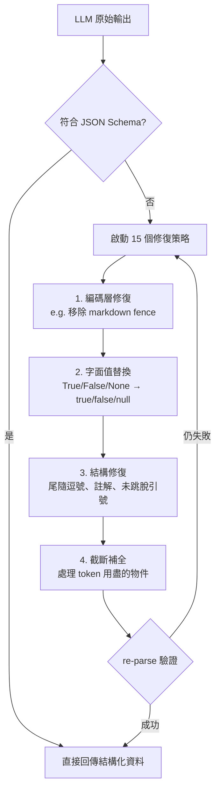
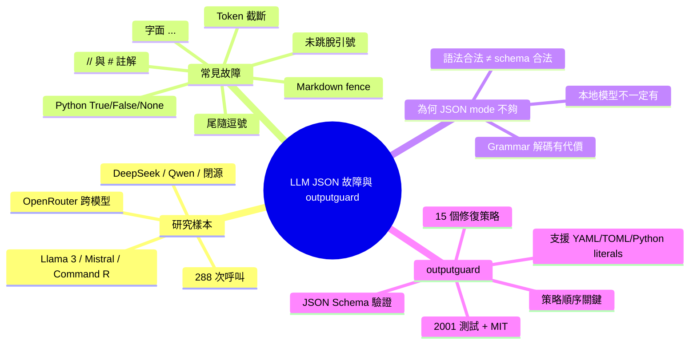

## I catalogued every way local models break JSON output and built a repair library, here's what I found across 288 model calls

開發者對 288 個 LLM 調用進行了系統化分析，發現所有模型（Llama 3、Mistral、Command R、DeepSeek、Qwen 及多個閉源模型）的 JSON 輸出故障模式幾乎相同。最常見的故障依序為：markdown fences 包裝 JSON、尾部逗號、Python True/False/None 代替 JSON 布林、token 耗盡導致對象截斷、未轉義的引號、注釋符號、省略號等。針對此問題，作者開發了 outputguard Python 庫，包含 15 個修復策略按特定順序執行，支持 JSON Schema 驗證、修復順序相依性（如在結構修復前修復編碼），並支持 YAML、TOML、Python literals。

### 重點
- 288 個測試調用：markdown fences、trailing commas、Python 類型為最常見故障，開源與閉源模型故障模式無差異
- outputguard 庫採 15 個修復策略按順序執行，策略順序相依性（編碼→結構→重新解析）比單個策略更關鍵
- 支持 JSON、YAML、TOML、Python literals，MIT 許可，無 LLM 提供商依賴，pip install outputguard

**原文：** [reddit-localllama](https://www.reddit.com/r/LocalLLaMA/comments/1tagtpv/i_catalogued_every_way_local_models_break_json/)

---


<!-- deep-analysis:begin -->
## 📌 摘要 (TL;DR)

- 作者在 OpenRouter 上跑了 **288 次結構化輸出呼叫**，涵蓋 Llama 3、Mistral、Command R、DeepSeek、Qwen 以及主流閉源模型，發現各家 JSON 故障模式幾乎一模一樣，只有頻率不同。
- 最常見的失敗依序為：**Markdown fence 包住 JSON、尾隨逗號（trailing comma）、Python 的 True/False/None、token 用盡截斷、字串內未跳脫的引號、`//` 或 `#` 註解、出現字面 `...` 偷懶**。
- 作者開源 Python 套件 **outputguard**（MIT 授權，2,001 個測試），用 **JSON Schema 驗證 + 15 個修復策略按固定順序執行**，且各策略間會重新 parse，避免後面修復把前面的修掉。
- 套件不只處理 JSON，也支援 **YAML、TOML、Python literals**，給沒有 JSON mode 的本地模型用。
- 對「直接用 JSON mode 或 grammar-constrained decoding」的常見建議，作者反駁：本地模型不一定有可靠 JSON mode、grammar 解碼有速度與相容性 trade-off，而且就算語法合法也仍可能違反 schema 或被截斷。

## 🎯 核心概念

- **結構化輸出（structured output）**：要求 LLM 回傳符合特定 schema 的 JSON / YAML 等格式。
- **Markdown fence**：模型把 JSON 包在 ` ```json ... ``` ` 區塊裡，技術上不是合法 JSON。
- **Constrained grammar / JSON mode**：在解碼階段限制模型只能輸出合法 JSON token 的方法，但本地模型支援度與效能不一。
- **修復策略順序（repair strategy ordering）**：作者強調的關鍵發現——修復必須先做編碼層再做結構層，並在每步之間 re-parse。

## 📖 整理分析

### 1. 樣本與方法
作者在過去幾個月內，於 OpenRouter 上對 Llama 3、Mistral、Command R、DeepSeek、Qwen 等開源模型，以及一般閉源 API 模型，總共執行 288 次結構化輸出呼叫。他想知道「實際會壞在哪、多常壞、開源與閉源是否有差」。

### 2. 發現：故障模式跨模型高度一致
結論是「沒有明顯差異」。失敗的**類別**幾乎一樣，差別只在**頻率**——有的模型幾乎每次都會用 markdown fence 包 JSON，有的則只在特定提示語法下才會這樣做。常見故障由高到低排序：

1. Markdown fence 包住 JSON（模型自以為貼心）
2. 尾隨逗號（訓練資料裡的 JS 習慣）
3. Python 的 `True` / `False` / `None` 取代 JSON 的 `true` / `false` / `null`
4. token 用盡導致物件中途截斷
5. 字串值內未跳脫的引號
6. JSON 內出現 `//` 或 `#` 註解
7. 字面 `...`——模型「偷懶」沒把資料生完

### 3. 為什麼不只用 JSON mode 就好
作者刻意把這篇貼到 r/LocalLLaMA，因為一般建議「直接用 JSON mode 或 grammar-based generation」對本地模型不夠用：
- 很多本地跑的模型沒有可靠的 JSON mode。
- Grammar-constrained decoding 有自己的代價（速度、相容性）。
- 就算拿到語法合法的 JSON，仍可能違反預期 schema 或被截斷。

### 4. outputguard 的設計重點
作者建立的 Python 套件 `outputguard`：
- 先用 **JSON Schema 驗證**，失敗時依序套用 **15 個修復策略**。
- **策略順序很關鍵**：例如先修編碼問題、再修結構問題；每個策略之後都重新 parse，避免後面的修復把前面已經修好的東西又改壞。
- 除了 JSON，也處理 **YAML、TOML、Python literals**——因為實務上跑本地模型時，模型常常「想用哪種格式就用哪種」。
- 規格：**2,001 個測試**，MIT 授權，**不依賴任何 LLM provider**，`pip install outputguard` 即可使用。

### 5. 作者向社群提問
貼文最後丟出問題：其他人是否看到相同故障模式？是否有某些模型或量化版本（quants）表現不同？這暗示他想累積更多跨模型的實證資料，而不只是單方面下結論。

## 🧭 流程圖 / 架構圖



## 🧠 Mindmap


<!-- deep-analysis:end -->
### 📄 原文內容

<details>
<summary>點此展開 / 收合</summary>

I've been running structured output prompts through a bunch of models on OpenRouter for the past few months — Llama 3, Mistral, Command R, DeepSeek, Qwen, and every other model on OpenRouter — alongside the usual closed-source suspects. 288 calls total. I wanted to know what actually breaks, how often, and whether open models fail differently from the API-only ones. Short answer: not really. The failure modes are almost identical across the board. The rate varies — some models hit you with markdown fences on nearly every call, others only when you phrase the prompt a certain way; but the categories of breakage are the same everywhere. What I saw most, roughly in order: Markdown fences wrapping the JSON (the model thinks it's being helpful) Trailing commas (JS habits from training data) Python True / False / None instead of JSON true / false / null Truncated objects from running out of tokens mid-response Unescaped quotes inside string values // or # comments inside JSON Literal ... where the model got lazy and didn't generate all the data The reason I'm posting here specifically: most of the advice I see for handling this is &quot;just use JSON mode&quot; or &quot;use a constrained grammar.&quot; And yeah, those help when they're available. But a lot of what people run locally doesn't have reliable JSON mode, grammar-based generation has its own tradeoffs (speed, compatibility), and even when you do get syntactically valid JSON you can still get schema violations and truncation. I ended up building a Python library ( outputguard ) that validates against JSON Schema and runs 15 repair strategies in a specific order when things break. The ordering part turned out to be more important than I expected: fixing encoding before structure, and re-parsing between each strategy so later fixes don't undo earlier ones. Also handles YAML, TOML, and Python literals, which came up more than I thought it would once I started working with models that don't have a JSON mode and just output whatever format they feel like. Wrote up the full findings in a blog post if anyone wants the details: What Breaks When You Ask an LLM for JSON 2,001 tests, MIT licensed, no LLM provider dependencies. pip install outputguard Curious what other people's experience has been — are you seeing the same failure patterns, or are there models/quants that behave differently than what I'm describing? &#32; submitted by &#32; /u/kexxty [link] &#32; [comments]

</details>