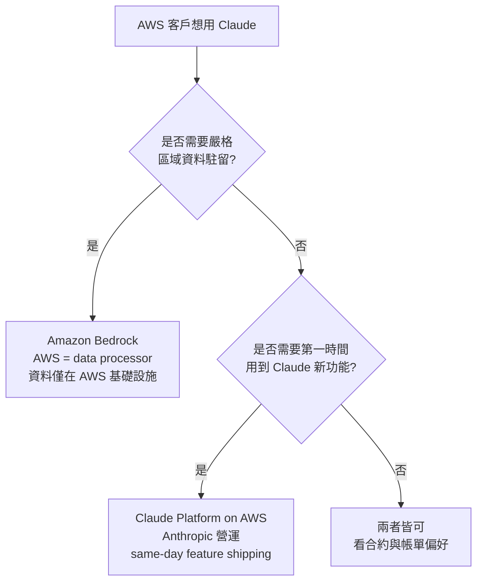
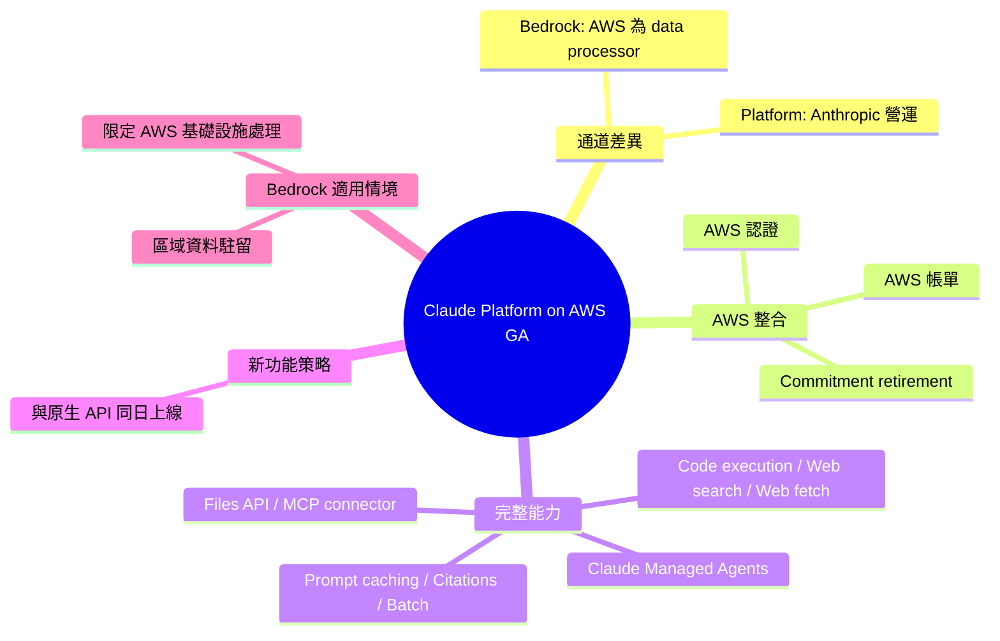

## The Claude Platform on AWS is now generally available.

Anthropic 宣布 Claude Platform on AWS 正式推出，提供完整的 Claude API 功能。AWS 客戶可利用 AWS 認證和帳單集成，並支援政策退休機制。服務由 Anthropic 運營，確保新功能同日上線至原生 Claude API。平台包含 Claude Managed Agents、code execution、web search、web fetch、Files API、MCP connector、prompt caching、citations 和 batch processing 等完整能力。此外，Amazon Bedrock 繼續作為替代方案，適合有嚴格地域數據駐留要求的團隊。AWS 在 Bedrock 上扮演數據處理者角色，確保數據僅在 AWS 基礎設施內處理。

### 重點
- Claude Platform on AWS 正式推出，由 Anthropic 運營，新功能同日上線至原生 Claude API
- 完整功能：Claude Managed Agents、code execution、web search、web fetch、Files API、MCP connector、prompt caching、citations、batch processing
- AWS 認證與帳單集成；Amazon Bedrock 作為地域數據駐留替代方案

**原文：** [reddit-claudeai](https://www.reddit.com/r/ClaudeAI/comments/1ta7p4n/the_claude_platform_on_aws_is_now_generally/)

---

<!-- deep-analysis:begin -->
## 📌 摘要 (TL;DR)

- Anthropic 宣布 **Claude Platform on AWS** 正式 GA（generally available），AWS 客戶可直接使用完整 Claude API 功能集。
- 整合 AWS 認證（authentication）、帳單（billing）與 commitment retirement，可用既有 AWS 承諾額度抵扣 Claude 用量。
- 服務由 Anthropic 自行營運，新功能與原生 Claude API **同日上線**（same day they go live）。
- 提供能力包含：Claude Managed Agents、advisor strategy、code execution、web search、web fetch、Files API、MCP connector、prompt caching、citations、batch processing。
- Amazon Bedrock 維持為替代方案：AWS 擔任資料處理者（data processor），適合對區域資料駐留（regional data residency）有嚴格要求的團隊。

## 🎯 核心概念

- **Claude Platform on AWS**：Anthropic 在 AWS 上自營的 Claude 服務通道，新功能與原生 API 同步發布。
- **Amazon Bedrock**：AWS 自家 GenAI 服務，AWS 為 data processor，資料只在 AWS 基礎設施內處理。
- **Commitment Retirement**：以既有 AWS 承諾使用額度抵扣 Claude 服務費用。
- **Claude Managed Agents**：Anthropic 提供的代理人託管能力，可在平台上大規模部署 agent。
- **MCP connector**：Model Context Protocol 連接器，用於把外部工具/資料源接到 Claude。

## 📖 整理分析

### 1. 兩條 AWS 通道並存
原文清楚區分兩個選項：Claude Platform on AWS 由 **Anthropic 營運**，Amazon Bedrock 則由 **AWS 營運**。差異在「誰是服務提供者」與「誰是 data processor」，這直接影響合約對象、資料治理責任與功能上線時程。

### 2. Platform 通道的賣點：功能同日對齊
原文明確承諾「all new features ship the same day they go live on the native Claude API」。意涵是 Bedrock 上的 Claude 在新功能可用性上仍可能有時間差；對需要第一時間用到新 API 能力的團隊，Platform 通道是更短的路徑，同時還能沿用 AWS 帳單與認證流程。

### 3. 功能集合與原生 API 對齊
原文列舉的可用能力，與 Anthropic 原生 Claude API 對外宣稱的功能集合一致：agent 託管（Claude Managed Agents）、advisor strategy、code execution、web search / web fetch、Files API、MCP connector、prompt caching、citations、batch processing。換言之，這條通道不是功能子集，而是平移版。

### 4. Bedrock 留存的明確理由：資料駐留
原文點名 Bedrock「This is a good fit for teams with strict regional data residency requirements or that need data processed exclusively within AWS infrastructure」。意即兩條通道並非取代關係：Platform 通道走 Anthropic、Bedrock 通道走 AWS 基礎設施，合規團隊可依資料治理要求二選一。

### 5. 未在原文出現的細節
原文沒有提到：具體區域（regions）、定價（pricing）、commitment retirement 的折抵比例、哪些模型版本（如 Opus / Sonnet / Haiku）已上架。如需這些資訊應參閱 Anthropic 官方 blog：<https://claude.com/blog/claude-platform-on-aws>。

## 🧭 通道選擇決策圖

## 🧠 Mindmap

<!-- deep-analysis:end -->
### 📄 原文內容

點此展開 / 收合

AWS customers get the full set of Claude API features, with AWS authentication, billing, and commitment retirement. Build and deploy agents at scale with Claude Managed Agents, or use features like the advisor strategy, code execution, web search, web fetch, the Files API, MCP connector, prompt caching, citations, and batch processing. Anthropic operates the service, and all new features ship the same day they go live on the native Claude API. Claude also remains available on Amazon Bedrock, where AWS is the data processor. This is a good fit for teams with strict regional data residency requirements or that need data processed exclusively within AWS infrastructure. Read more: https://claude.com/blog/claude-platform-on-aws &#32; submitted by &#32; /u/ClaudeOfficial [link] &#32; [comments]

