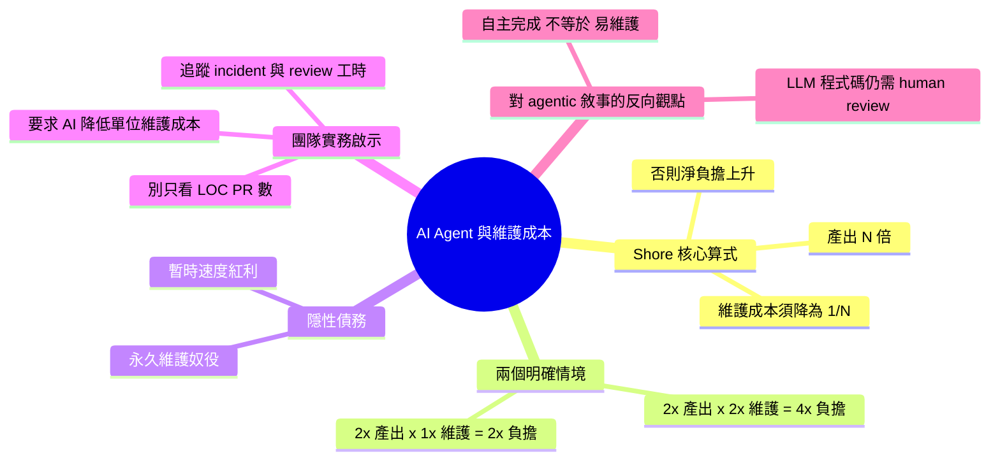

## Quoting James Shore

James Shore 揭示 AI 編碼代理的隱藏經濟成本：代理若提高開發生產力 N 倍，維護成本必須同時降低 1/N，否則淨成本反而倍增。具體計算：生產力×2 但維護成本×2 = 淨成本×4；生產力×2 但維護成本不變 = 淨成本×2；只有當生產力×2 且維護成本減半，總成本才能 break-even。此公式揭示許多團隊正在享受短期生產力提升的同時，累積長期維護成本債務。

### 重點
- 代理提升生產力 N 倍，維護成本必須降低 1/N：N=2 需降 50%、N=3 需降 66%，否則淨成本倍增
- 若生產力×2、維護成本×2 → 淨成本×4；若維護成本不變 → 淨成本×2；唯有維護成本同步降 50% 才能 break-even
- 此公式適用於所有代理工具評估，量化了採用代理的隱藏成本風險，是決策依據而非直觀感受

**原文：** [simon-willison](https://simonwillison.net/2026/May/11/james-shore/#atom-everything)

---

<!-- deep-analysis:begin -->
## 📌 摘要 (TL;DR)

- James Shore 在〈You Need AI That Reduces Maintenance Costs〉中提出核心命題：AI 編碼代理（AI coding agent）若把產出提升 N 倍，就必須把維護成本同步降為原本的 1/N，否則團隊長期上一定虧本。
- 具體算式：產出 ×2、維護成本也 ×2 ⇒ 總維護負擔變 4 倍；產出 ×2、維護成本不變 ⇒ 維護負擔變 2 倍；只有當產出 ×2、維護成本降到 0.5，才剛好持平。
- Shore 用「永久奴役」（permanent indenture）形容這種債務：短期的速度紅利是借來的，未來要用人類工時連本帶利還回去。
- Simon Willison 將整段引用收進 simonwillison.net，並標上 `coding-agents`、`agentic-engineering`、`ai-assisted-programming` 等 tag，把它定位為對 AI 編碼代理熱潮的反向視角。
- 對工程團隊的直接含意：用 commit 數、PR 數、LOC 衡量 AI 帶來的「生產力」，會嚴重低估隱形成本；真正要追蹤的是每行 AI 生成程式碼後續引發的 bug、review、重構工時。

## 🎯 核心概念

- **維護成本（maintenance cost）**：程式碼寫完之後，為了讀懂、除錯、修改、升級、重構而付出的時間與心力成本。
- **生產力倍數（productivity multiplier，N）**：使用 AI 工具後相對於人工撰寫的產出倍率，例如 2× 代表速度翻倍。
- **永久奴役（permanent indenture）**：Shore 用來形容團隊被自己生成的 AI 程式碼綁住、無法擺脫的長期維護負擔。
- **暫時速度紅利（temporary speed boost）**：Shore 認為若維護成本沒同步下降，AI agent 帶來的只是這種短期假象。

## 📖 整理分析

### 1. Shore 的核心算式
Shore 的論點極為簡潔：AI coding agent 的真正價值不在於「寫多快」，而在於「能不能讓既有與新增的程式碼更便宜維護」。如果你產出速度變兩倍，就必須把維護成本砍一半；變三倍，要降到三分之一。否則拿到的只是暫時的速度紅利，代價是長期難以擺脫的維護債。

### 2. 為什麼維護成本會等比放大
Shore 在引文中明確示範了兩個情境：產出 ×2 而維護成本也 ×2，乘起來等於維護負擔翻成 4 倍；產出 ×2 而維護成本維持不變，仍然等於維護負擔變 2 倍。換句話說，只要 AI 沒有「主動降低」單位維護成本，產出愈多，債務只會愈深。這是一個乘法、不是加法的結構。

### 3. Simon Willison 為何整段引用
Simon Willison 是 Datasette 作者，長期在 simonwillison.net 追蹤 LLM 與 coding agent 動態。他將整段 Shore 的文字以 quote 形式收錄，並掛上 `coding-agents`、`agentic-engineering`、`generative-ai`、`llms` 等 tag，顯示他把這篇定位為對「AI 寫程式 = 純賺」narrative 的重要修正。

### 4. 對工程團隊的實務啟示
若以 commit 數、PR 數或 LOC 來衡量 AI agent 的效益，會落入 Shore 警告的陷阱：產出指標漂亮，但維護債務同時悄悄翻倍。從他的算式可以推導出更合理的衡量方向——追蹤每行 AI 生成程式碼後續引發的 incident 數、bug fix 工時、code review 時間，以及重構時的閱讀理解成本。只有當這些指標也在下降，才算享受到真正的 net productivity。

### 5. 與 agentic engineering 主流敘事的張力
目前 agentic engineering 主流敘事強調「coding agent 能自主完成多步任務」，Shore 的論點則提醒：自主完成不代表低維護成本，反而可能因為人類不在 loop 中審視，產出更多難以維護的程式。這也呼應 Simon Willison 過去多次強調的立場——LLM 生成的程式碼仍需要 human review 與長期承擔責任的工程師。

## 🧭 情境對比表

| 情境 | 產出倍數 | 維護單位成本 | 總維護負擔 | 結論 |
| --- | --- | --- | --- | --- |
| A | ×2 | ×2 | ×4 | 嚴重虧損 |
| B | ×2 | ×1 | ×2 | 依然虧損 |
| C | ×2 | ×0.5 | ×1 | 剛好持平（break-even） |
| D | ×2 | ×0.25 | ×0.5 | 真正獲利 |

> 註：情境 A、B 為 Shore 在引文中明確列出的兩個算式；C、D 為由其「產出 N 倍 ⇒ 維護成本須降至 1/N」原則推導的延伸情境。

## 🧠 Mindmap

<!-- deep-analysis:end -->
### 📄 原文內容

點此展開 / 收合

Your AI coding agent, the one you use to write code, needs to reduce your maintenance costs. Not by a little bit, either. You write code twice as quick now? Better hope you’ve halved your maintenance costs. Three times as productive? One third the maintenance costs. Otherwise, you’re screwed. You’re trading a temporary speed boost for permanent indenture. [...] 
 The math only works if the LLM decreases your maintenance costs, and by exactly the inverse of the rate it adds code. If you double your output and your cost of maintaining that output, two times two means you’ve quadrupled your maintenance costs. If you double your output and hold your maintenance costs steady, two times one means you’ve still doubled your maintenance costs. 
 &mdash; James Shore , You Need AI That Reduces Maintenance Costs 

 Tags: coding-agents , ai-assisted-programming , generative-ai , agentic-engineering , ai , llms

