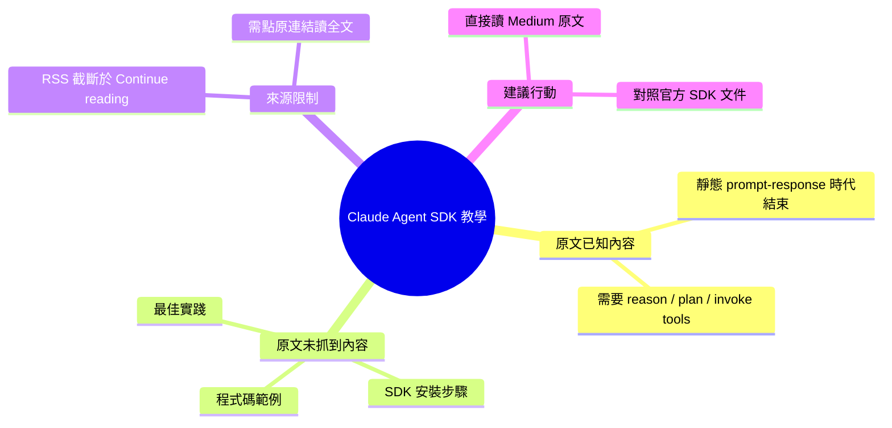

## Building Agentic Applications with the Claude Agent SDK: A Complete Guide

Medium 教程文章介紹如何使用 Claude Agent SDK 構建智能代理應用。文章開篇指出靜態「prompt-and-response」時代已終結，現代應用需要能推理、規劃、調用工具的智能代理系統。Claude Agent SDK 提供了構建此類系統所需的框架和工具集。文章旨在為開發者提供完整的 agentic 應用開發指南。具體的代碼示例和最佳實踐因 RSS 摘要截斷而未完整提供。

### 重點
- 智能代理系統（agentic systems）已成為現代 AI 應用的必要模式，靜態 prompt-response 架構已過時
- Claude Agent SDK 提供推理、規劃、工具調用等核心功能
- 教程涵蓋端到端的代理應用構建——從概念到實現的完整指南

**原文：** [medium-tag-claude](https://new2026.medium.com/building-agentic-applications-with-the-claude-agent-sdk-a-complete-guide-760728102a1f?source=rss------claude-5)

---

<!-- deep-analysis:begin -->
## 📌 摘要 (TL;DR)

- 本文為 Medium 教學文章，標題宣稱要完整介紹如何使用 **Claude Agent SDK** 建構 agentic 應用程式。
- 作者開篇主張：靜態的「prompt-and-response」AI 時代正在終結，現代應用需要能**推理（reason）、規劃（plan）、調用工具（invoke tools）**的代理式系統。
- ⚠️ **重要限制**：本次抓取到的原文 body 僅有開頭一句（RSS 摘要截斷於 “Continue reading on Medium »”），文章主體（SDK 安裝、API、程式範例、最佳實踐）**未包含在來源資料中**，因此以下整理無法涵蓋實作細節。
- 若需理解完整內容，請直接前往原文 URL 閱讀。

## 🎯 核心概念

- **Agentic 應用（agentic application）**：相較於單次問答的 LLM 應用，agentic 系統能自主推理、制定多步驟計畫、並呼叫外部工具來完成任務。
- **Claude Agent SDK**：Anthropic 提供用以建構上述代理式應用的開發套件（原文標題明示，但 SDK 的具體 API 與範例未出現在抓取到的內文中）。

## 📖 整理分析

### 1. 作者提出的問題陳述
原文開頭提出一個觀點：「prompt-and-response」風格的靜態 AI 互動模式已不足以支撐現代應用需求。應用層需要的是能主動推理、規劃並調用工具的智能體。這段陳述是原文目前唯一可直接引用的論點。

### 2. 本文預設要回答的問題（依標題推論）
標題明示是「A Complete Guide」，因此原文後段**理應**包含：SDK 的安裝、初始化、工具註冊（tool registration）、規劃迴圈（planning loop）、錯誤處理、以及部署範例。但這些段落**並未出現在抓取到的 body_md 中**，無法在此摘述具體做法。

### 3. 來源資料的限制說明
抓取到的 `body_md` 結尾為「Continue reading on Medium »」，這是 Medium RSS 將全文截斷後常見的結尾字串，代表後續正文需要點擊原連結才能讀取。先前 brief 摘要中所提到的「框架和工具集」「最佳實踐」等內容，在現有來源文字中**無對應段落**，因此無法於此驗證或展開。

### 4. 給讀者的建議
- 若你正在評估是否採用 Claude Agent SDK 建構代理式應用，建議直接點開原文閱讀完整章節。
- 由於本文是個人 Medium 教學（非官方文件），實作時仍應對照 Anthropic 官方 SDK 文件交叉驗證。

## 🧠 Mindmap

<!-- deep-analysis:end -->
### 📄 原文內容

點此展開 / 收合

The era of static, prompt-and-response AI is ending. Modern applications demand agentic systems &#x2014; software that can reason, plan, invoke&#x2026; Continue reading on Medium »

