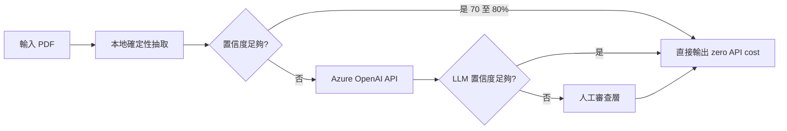
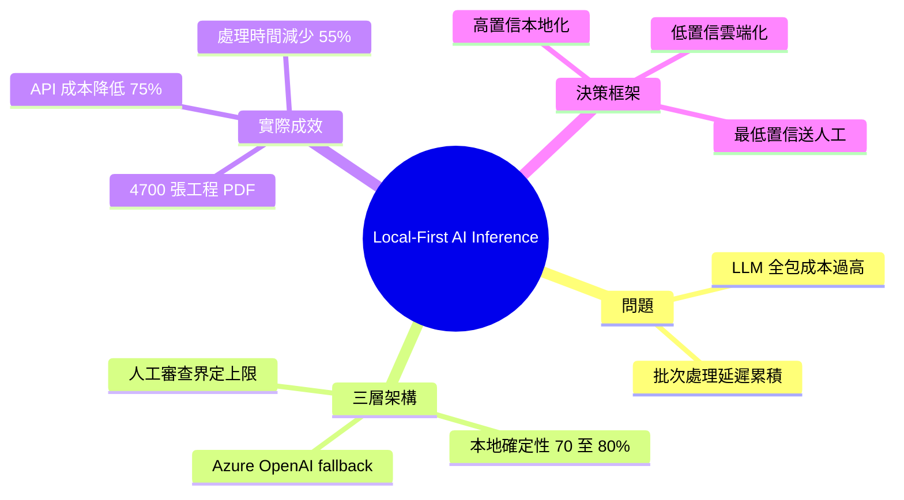

## Article: Local-First AI Inference: A Cloud Architecture Pattern for Cost-Effective Document Processing

Local-First AI Inference 是一種混合部署架構，將 70–80% 的文檔路由至本地確定性提取模組（零 API 成本），為邊界案例和低置信度結果保留 Azure OpenAI API 調用。該方案在 4,700 張工程設計 PDF 的實際部署中達成：API 成本降低 75%、處理時間減少 55%，同時通過人工審查層確保精度邊界。這展示了成本、性能和精度之間的有效權衡模式，其「高置信本地化、低置信雲端化」的決策框架可直接應用於文檔處理、數據提取等場景。

### 重點
- 70–80% 文檔本地提取（零成本），API 調用成本減少 75%
- 處理時間減少 55%，通過人工審查層確保精度下界
- 「高置信本地化、低置信+高置信邊界保留雲端化」的決策框架

**原文：** [infoq-ai-ml](https://www.infoq.com/articles/local-first-ai-inference-cloud/?utm_campaign=infoq_content&utm_source=infoq&utm_medium=feed&utm_term=AI%2C+ML+%26+Data+Engineering)

---

<!-- deep-analysis:begin -->
## 📌 摘要 (TL;DR)

- 作者 Obinna Iheanachor 於 InfoQ 提出 **本地優先 AI 推論**（Local-First AI Inference）混合雲架構，把 70–80% 的文件交給本地確定性抽取模組處理，僅將邊界案例與低置信度結果送往 Azure OpenAI API。
- 在 4,700 張工程設計 PDF 的實際部署中達成 **API 成本降低 75%、處理時間減少 55%**。
- 透過「本地確定性 → 雲端 LLM → 人工審查」三層路由建立精度邊界，避免單純依賴 LLM 帶來的高成本與不可預測性。
- 提出「高置信本地化、低置信雲端化」的決策框架，可直接套用到文件處理、結構化資料抽取等場景。

## 🎯 核心概念

- **本地優先 AI 推論**（Local-First AI Inference）：以本地確定性方法為主、雲端 LLM 為輔的混合推論架構。
- **確定性抽取**（Deterministic Extraction）：基於規則或模板的可預期抽取流程，輸出穩定、無 API 成本。
- **置信度路由**（Confidence Routing）：依本地結果的置信度判斷是否升級到雲端 LLM，或進一步送人工審查。
- **Azure OpenAI**：本案中作為高成本 fallback 推論層使用，而非主處理層。

## 📖 整理分析

### 1. 問題：純 LLM 處理大量文件成本失控
當企業要對大量結構化或半結構化文件（例如工程設計 PDF）做抽取時，若一律走雲端 LLM API，會面臨單張處理成本累積、批次處理時間拉長、以及對 API 配額敏感的問題。作者把這視為一個需要分層的成本工程議題，而不是讓 LLM 全包就好。

### 2. 架構：三層遞進的處理路徑
Local-First AI Inference 用三層路由設計分配工作量：
- **第一層**：本地確定性抽取，zero API cost，吸收 70–80% 的文件流量。
- **第二層**：對結果置信度不足或結構異常的邊界案例，呼叫 Azure OpenAI。
- **第三層**：對 LLM 仍然低置信的結果，標記送人工審查。

關鍵在於把「決定哪些走 LLM」這件事本身做成可量化的路由邏輯，而不是讓 LLM 全包。

### 3. 實際效果：4,700 張工程設計 PDF
作者報告的部署規模是 4,700 張工程設計 PDF。對照純 LLM baseline，這套架構達成：
- API 成本下降 **75%**
- 端到端處理時間下降 **55%**

精度方面，系統不保證自動 100% 正確，而是透過第三層人工審查界定錯誤上限——也就是讓低置信案例不會被默默通過，而是顯式進入人工流程。

### 4. 適用情境與權衡
摘要直接點出這個決策框架「可直接應用於文檔處理、數據抽取等場景」。套用此模式時必須處理的工程問題包括：本地確定性層需要前期投入建模板或規則、置信度閾值需要校準、以及人工審查容量會成為實際瓶頸——這些是把成本省下來的代價，必須在落地前盤點清楚。

## 🧭 流程圖

## 🧠 Mindmap

<!-- deep-analysis:end -->
### 📄 原文內容

點此展開 / 收合

The Local-First AI Inference pattern routes 70–80% of documents to deterministic local extraction at zero API cost, reserving Azure OpenAI calls for edge cases and flagging low-confidence results for human review. Deployed on 4,700 engineering drawing PDFs, it cut API costs by 75% and processing time by 55%, while bounding errors through a human review tier. By Obinna Iheanachor

