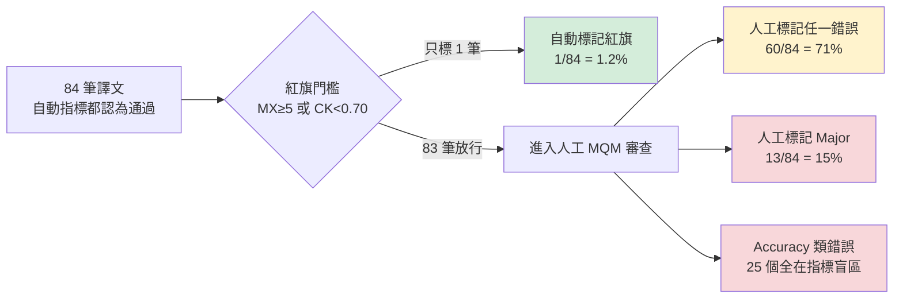
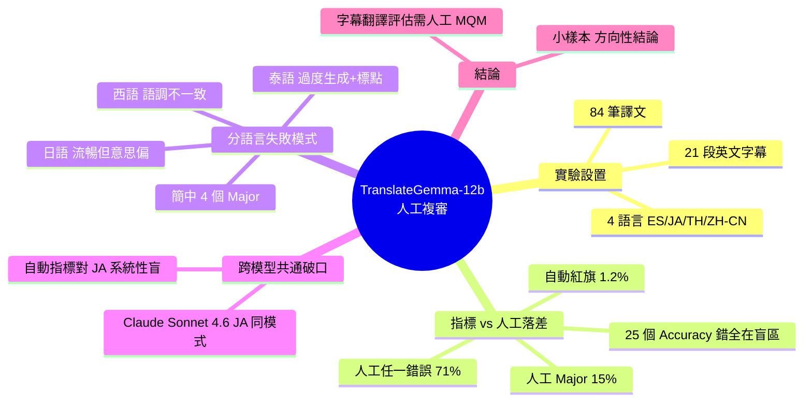

## Follow-up to my TranslateGemma-12b benchmark post: human reviewers flagged 71% of the segments automated metrics rated clean

TranslateGemma-12b 在字幕翻譯基準測試中超越 Claude Sonnet、GPT-5.4、DeepSeek、Gemini Flash Lite，但後續人工審查揭露自動評估指標高度不可靠：71% 的自動指標評為「通過」的翻譯被人工標記有問題，100% 的準確度錯誤均在自動指標「視盲區」。分語言分析顯示：日語呈現「流暢但錯誤意思」模式（與 Claude Sonnet 4.6 一致），泰語過度生成內容，西班牙語為語調不一致。此失敗模式跨模型複現，指出字幕翻譯評估必須納入人工驗證。

### 重點
- 自動指標準確度 98.8% 失敗率：1/84 被自動標記異常，60/84 被人工標記有問題，13/84 為重大錯誤
- 日語「流暢但意思錯誤」失敗模式在 Claude Sonnet 4.6 也出現，跨模型複現
- 自動指標捕捉零個準確度錯誤；25 個準確度類錯誤全部在指標視盲區

**原文：** [reddit-localllama](https://www.reddit.com/r/LocalLLaMA/comments/1taxrm6/followup_to_my_translategemma12b_benchmark_post/)

---

<!-- deep-analysis:begin -->
## 📌 摘要 (TL;DR)

- 原作者兩週前發文，宣稱 **TranslateGemma-12b** 在字幕翻譯基準測試中擊敗 Claude Sonnet、GPT-5.4、DeepSeek、Gemini Flash Lite，本篇是加入人工審查後的回頭驗證
- 在 4 語言 × 21 段 = **84 筆翻譯**中，自動指標只標記 **1/84（1.2%）** 有問題，人工 MQM 審查卻標記 **60/84（71%）** 有問題、其中 **13/84（15%）** 為 Major 錯誤
- 人工抓到的 **25 個 Accuracy 類錯誤（誤譯、遺漏、增添、未翻譯）100% 全部落在自動指標盲區**——指標一個都沒抓到
- 失敗模式分語言：**日語 = 流暢但意思偏**（COMETKiwi 0.86 mean，卻有 10/15 誤譯）、**泰語 = 過度生成**（添加原文沒有的內容）、**西語 = 語調不一致**（formal/informal 混用）、**簡中 4 個 Major**
- 「流暢但意思錯」的日語失敗模式在 Claude Sonnet 4.6 上也出現（TQI 0.5364、MetricX 3.90、COMETKiwi 0.79），暗示這是**跨模型家族的共通破口**，不是 TranslateGemma 獨有的問題

## 🎯 核心概念

- **MQM**（Multidimensional Quality Metrics）：人工分類審查框架，把翻譯錯誤分成 Accuracy、Fluency、Style、Terminology 等維度
- **COMETKiwi**：無需參考譯文的自動翻譯品質評估指標（CK），分數越高越好
- **MetricX**：另一種自動評估指標（文中縮寫 MX），分數越低越好
- **TQI**（Translation Quality Index）：綜合品質分數
- **指標盲區**（metric-blind quadrant）：自動指標未標記為紅旗、但人工審查發現有錯的範疇

## 📖 整理分析

### 1. 實驗設置與紅旗門檻

本次審查取一支教學影片的 21 段英文字幕，翻譯到 **ES（西語）、JA（日語）、TH（泰語）、ZH-CN（簡中）** 共 4 種語言，產出 84 筆譯文。原本基準測試還包含韓語與繁體中文，這次被剔除。所有被審查的譯文都是**在兩個自動指標上都得分良好**的——也就是說，是「指標認為沒問題」的樣本。紅旗門檻定義為 `MetricX ≥ 5 或 COMETKiwi < 0.70`。

### 2. 自動指標 vs 人工審查：71% 落差

| 語言 | 自動紅旗 | 人工標記任一錯誤 | 人工標記 Major |
|---|---|---|---|
| ES | 0/21 | 11/21 | 2/21 |
| JA | 0/21 | 17/21 | 3/21 |
| TH | 0/21 | 17/21 | 5/21 |
| ZH-CN | 1/21 | 15/21 | 3/21 |
| **合計** | **1/84 (1.2%)** | **60/84 (71%)** | **13/84 (15%)** |

更刺眼的數字：人工找到的 **25 個 Accuracy 類錯誤**（誤譯 mistranslation、遺漏 omission、增添 addition、未翻譯 untranslated）**全部都在指標沒標記的範疇裡**——自動指標在這個樣本中**抓到的 Accuracy 錯誤是 0**。

### 3. 分語言的失敗模式很不一樣

- **日語：流暢但意思偏**。COMETKiwi 平均 0.86、MetricX 也合理，但全資料集 15 個誤譯中有 10 個出現在日語。讀起來通順，但語義已經漂離原文。
- **泰語：過度生成**。出現 5 個 Accuracy/Addition 錯誤——模型插入了原文沒有的內容；另外因為用英文式的句號標點，產生大量泰語標點錯誤（泰語不用句號）。
- **西語：語調不一致**。主要問題是 formal/informal（敬語/平語）切換，是 4 語言中最輕的。
- **簡中：4 個 Major**。包含唯一一個自動指標也抓到的 Style 錯誤（「不地道搭配與不當風格」，人工同意指標的判斷）；另 3 個 Major 是 Style（直譯）、Accuracy/Omission（漏掉「store」導致意思變了）、Fluency/Inconsistency（「ticket」在不同段落翻譯不一致）。

### 4. JA 失敗模式跨模型複現

原始基準測試報告裡，**Claude Sonnet 4.6 在日語**就已經是同一個模式：TQI 0.5364、MetricX 3.90、COMETKiwi 0.79——聽起來流暢，但跟原文意思有偏移。作者觀察到這個「fluent but wrong meaning」的破口似乎**會跨模型家族出現在日語**，不是 TranslateGemma 特有的弱點，而是現有自動指標在評估日語譯文時的共通盲點。

### 5. 對評估方法論的含義

如果你正在用 COMETKiwi、MetricX 這類自動指標來決定一個翻譯模型「好不好」——本案例顯示：**指標認為通過的譯文裡，有 71% 會被人工挑出問題、15% 是嚴重錯誤**。在字幕、影視這類對語義準確度敏感的場景，自動指標只能當第一層粗篩，**真正的品質判斷必須有人工 MQM 介入**。作者也明確標註：這是單一模型、單一內容集的小型審查，數字是方向性的而非定論。

## 🧭 指標盲區示意

## 🧠 Mindmap

<!-- deep-analysis:end -->
### 📄 原文內容

點此展開 / 收合

A couple of weeks ago I shared the results of a benchmark here showing TranslateGemma-12b beating frontier general models (Claude Sonnet, GPT-5.4, DeepSeek, Gemini Flash Lite) on subtitle translation across 6 languages. The result was strong enough that we wanted to verify it ourselves - was TranslateGemma really that good, or were the metrics easy on it? So we added a layer of human review. Setup: 21 English subtitle segments from one tutorial video. TranslateGemma's translations into 4 languages (ES, JA, TH, ZH-CN - Korean and Traditional Chinese got dropped). 84 translations total, all chosen because they scored well on both automated metrics. Then we sent every translation to human MQM review. Under the dashboard's own red-flag threshold ( MX ≥ 5 OR CK &lt; 0.70 ): auto-flagged human-flagged (any) human-flagged (Major) ES 0/21 11/21 2/21 JA 0/21 17/21 3/21 TH 0/21 17/21 5/21 ZH-CN 1/21 15/21 3/21 Total 1/84 (1.2%) 60/84 (71%) 13/84 (15%) Of 25 Accuracy-class errors humans found (mistranslation, omission, addition, untranslated), every single one was in the metric-blind quadrant. The metrics caught zero accuracy errors in this sample. Per-language failure modes look quite different: Japanese is the &quot;fluent but wrong meaning&quot; pattern - high COMETKiwi (0.86 mean), reasonable MetricX, but 10 of the 15 total mistranslations in the dataset are in JA. In the original report we'd already seen the same pattern in Claude Sonnet 4.6 on Japanese (TQI 0.5364, MetricX 3.90, COMETKiwi 0.79 - fluent-sounding but drifting from source). Looks like the failure mode generalises across model families on JA. Thai is over-production: 5 Accuracy/Addition errors where the model inserted content not in the source, plus a bunch of punctuation errors driven by English-style periods that Thai doesn't use. Spanish is mostly tone inconsistencies (formal/informal switches), genuinely the easiest of the four. Chinese ZH-CN had 4 Major errors total, including the one segment automated metrics flagged (Style - &quot;unidiomatic collocation and inappropriate style&quot;; humans agreed with the metric on that one). The other 3 Majors: another Style (&quot;literal translation&quot;), an Accuracy/Omission where &quot;store&quot; was dropped and the meaning changed, and a Fluency/Inconsistency where &quot;ticket&quot; was translated inconsistently across segments. Caveat: small audit on one model, one content set, so the numbers are directional rather than definitive. &#32; submitted by &#32; /u/ritis88 [link] &#32; [comments]

