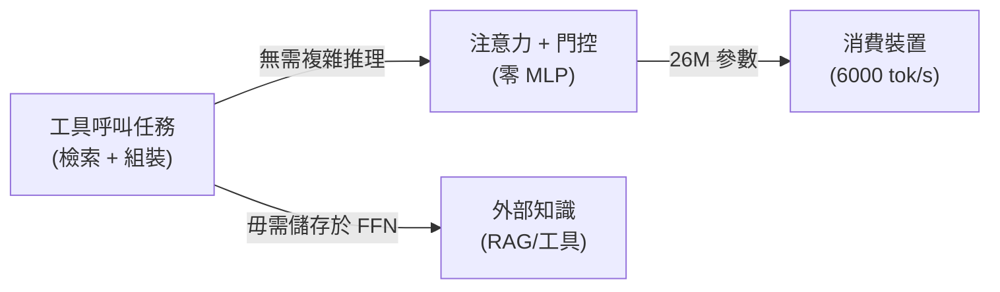
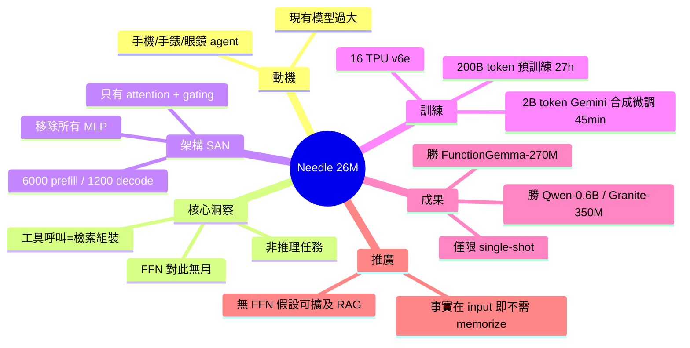

## Show HN: Needle: We Distilled Gemini Tool Calling into a 26M Model

開源發布 Needle：26M 參數工具呼叫模型，透過蒸餾 Gemini 功能實現。在消費裝置上達 6000 tok/s 預填充、1200 tok/s 解碼。核心創新：採用「僅注意力網路」（無 MLP 層），基於洞察「工具呼叫本質為檢索-組裝，非推理，因此無需大模型」。於 16 個 TPU v6e 預訓練 200B token、微調 2B 合成函數呼叫資料。在單次呼叫任務上超越 FunctionGemma-270M、Qwen-0.6B、Granite-350M。

### 重點
- 26M 參數注意力-僅架構零 MLP，消費裝置達 6000 tok/s 預填充、1200 tok/s 解碼
- 核心框架：工具呼叫為檢索-組裝任務；有外部知識時 FFN 參數冗餘，Simple Attention Network 充分
- 15 種工具類別合成微調資料，單次函數呼叫性能超 270M+ 參數基準模型

**原文：** [hackernews](https://github.com/cactus-compute/needle)

---

<!-- deep-analysis:begin -->
## 📌 摘要 (TL;DR)

- Cactus 團隊開源 **Needle**：26M 參數函式呼叫（function calling）模型，從 Gemini 蒸餾而來，MIT 授權
- 消費級裝置實測：預填充（prefill）6000 tok/s、解碼（decode）1200 tok/s，目標跑在手機、手錶、眼鏡
- 架構創新：**純注意力網路（Simple Attention Networks）**，整個模型只有 attention 與 gating，**完全移除 MLP / FFN 層**
- 核心洞察：工具呼叫本質是「檢索-組裝」（match tool name、抽參數、輸出 JSON），不是推理 → 不需要 FFN 存事實
- 訓練成本極低：16 個 TPU v6e 上預訓練 200B token（27 小時）+ 2B token Gemini 合成資料微調（45 分鐘）
- 單次函式呼叫（single-shot）勝過 FunctionGemma-270M、Qwen-0.6B、Granite-350M、LFM2.5-350M

## 🎯 核心概念

- **函式呼叫 / 工具呼叫** (function calling / tool use)：模型把使用者意圖轉成結構化 JSON（工具名 + 參數）
- **純注意力網路** (Simple Attention Networks, SAN)：移除 Transformer 的 FFN/MLP 層，只留 attention + gating
- **FFN** (Feed-Forward Network)：Transformer 中存事實知識的 MLP 區塊，傳統占大半參數
- **單次呼叫** (single-shot)：一輪對話內完成工具選擇與參數抽取，非多輪 agent loop

## 📖 整理分析

### 1. 動機：手機端 agent 模型空缺

Henry（Cactus 創辦人）觀察到業界投入到「跑在便宜手機上的 agent 模型」太少。多數 function calling 模型在 270M~600M 級別（FunctionGemma、Qwen、Granite、LFM2.5），對手錶、眼鏡等穿戴裝置仍太重。Needle 把參數壓到 26M，比現有最小選項再小 10 倍。

### 2. 關鍵洞察：工具呼叫 ≠ 推理

團隊主張工具呼叫的本質是 **retrieval-and-assembly**：把 query 對到 tool name、抽出參數值、組成 JSON。這操作只需要 cross-attention 把 input 中的 token 拷貝/重組到 output，**不需要 FFN 存的世界知識**。如果工具描述已在 input 中提供，模型沒必要用 FFN 權重去記憶這些事實。

### 3. 架構：移除 MLP 的純注意力網路

Needle 整個模型只剩 **attention + gating**，沒有任何 MLP 層。傳統 Transformer 中 FFN 通常占 60-70% 參數；移除後同樣的參數預算可堆更多 attention 容量，且推理時 memory bandwidth 壓力顯著下降，這是達到 6000 tok/s prefill 的關鍵。

### 4. 訓練 pipeline

- **預訓練**：200B token，16 顆 TPU v6e，27 小時
- **後訓練**：2B token 函式呼叫合成資料，45 分鐘
- **資料合成**：用 Gemini 生成涵蓋 15 個工具類別（timer、messaging、navigation、smart home 等）的 function calling 樣本

總算力極低，顯示小模型 + 高品質合成資料的可行性。

### 5. Benchmark 與限制

Needle 在 **single-shot** function calling 上超越 FunctionGemma-270M、Qwen-0.6B、Granite-350M、LFM2.5-350M。但團隊明確聲明：那些模型**容量更大**，在多輪對話、開放式對談場景仍勝出。Needle 是專用單發工具呼叫器，不是通用聊天模型。

### 6. 推廣假設：FFN 對 RAG 類任務皆可省

團隊主張「移除 FFN」這個發現可推廣到任何**模型能取得外部結構化知識**的任務——RAG、tool use、retrieval-augmented generation 都適用。若事實在 input 中，FFN 權重就是浪費。這是比 Needle 本身更大的架構主張，需更多後續驗證。

## 🧠 Mindmap

<!-- deep-analysis:end -->
### 📄 原文內容

點此展開 / 收合

Hey HN, Henry here from Cactus. We open-sourced Needle, a 26M parameter function-calling (tool use) model. It runs at 6000 tok&#x2F;s prefill and 1200 tok&#x2F;s decode on consumer devices. We were always frustrated by the little effort made towards building agentic models that run on budget phones, so we conducted investigations that led to an observation: agentic experiences are built upon tool calling, and massive models are overkill for it. Tool calling is fundamentally retrieval-and-assembly (match query to tool name, extract argument values, emit JSON), not reasoning. Cross-attention is the right primitive for this, and FFN parameters are wasted at this scale. Simple Attention Networks: the entire model is just attention and gating, no MLPs anywhere. Needle is an experimental run for single-shot function calling for consumer devices (phones, watches, glasses...). Training:
- Pretrained on 200B tokens across 16 TPU v6e (27 hours)
- Post-trained on 2B tokens of synthesized function-calling data (45 minutes)
- Dataset synthesized via Gemini with 15 tool categories (timers, messaging, navigation, smart home, etc.) You can test it right now and finetune on your Mac&#x2F;PC: https:&#x2F;&#x2F;github.com&#x2F;cactus-compute&#x2F;needle The full writeup on the architecture is here: https:&#x2F;&#x2F;github.com&#x2F;cactus-compute&#x2F;needle&#x2F;blob&#x2F;main&#x2F;docs&#x2F;simp... We found that the &quot;no FFN&quot; finding generalizes beyond function calling to any task where the model has access to external structured knowledge (RAG, tool use, retrieval-augmented generation). The model doesn&#x27;t need to memorize facts in FFN weights if the facts are provided in the input. Experimental results to published. While it beats FunctionGemma-270M, Qwen-0.6B, Granite-350M, LFM2.5-350M on single-shot function calling, those models have more scope&#x2F;capacity and excel in conversational settings. We encourage you to test on your own tools via the playground and finetune accordingly. This is part of our broader work on Cactus ( https:&#x2F;&#x2F;github.com&#x2F;cactus-compute&#x2F;cactus ), an inference engine built from scratch for mobile, wearables and custom hardware. We wrote about Cactus here previously: https:&#x2F;&#x2F;news.ycombinator.com&#x2F;item?id=44524544 Everything is MIT licensed. Weights: https:&#x2F;&#x2F;huggingface.co&#x2F;Cactus-Compute&#x2F;needle 
GitHub: https:&#x2F;&#x2F;github.com&#x2F;cactus-compute&#x2F;needle

