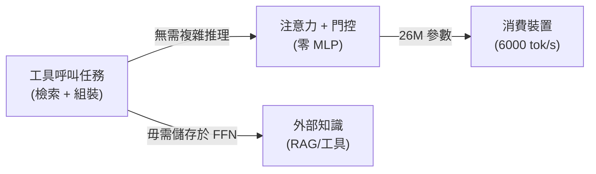

## Show HN: Needle: We Distilled Gemini Tool Calling into a 26M Model

開源發布 Needle：26M 參數工具呼叫模型，透過蒸餾 Gemini 功能實現。在消費裝置上達 6000 tok/s 預填充、1200 tok/s 解碼。核心創新：採用「僅注意力網路」（無 MLP 層），基於洞察「工具呼叫本質為檢索-組裝，非推理，因此無需大模型」。於 16 個 TPU v6e 預訓練 200B token、微調 2B 合成函數呼叫資料。在單次呼叫任務上超越 FunctionGemma-270M、Qwen-0.6B、Granite-350M。

### 重點
- 26M 參數注意力-僅架構零 MLP，消費裝置達 6000 tok/s 預填充、1200 tok/s 解碼
- 核心框架：工具呼叫為檢索-組裝任務；有外部知識時 FFN 參數冗餘，Simple Attention Network 充分
- 15 種工具類別合成微調資料，單次函數呼叫性能超 270M+ 參數基準模型

**原文：** [hackernews](https://github.com/cactus-compute/needle)

---

### 📄 原文內容

點此展開 / 收合

Hey HN, Henry here from Cactus. We open-sourced Needle, a 26M parameter function-calling (tool use) model. It runs at 6000 tok&#x2F;s prefill and 1200 tok&#x2F;s decode on consumer devices. We were always frustrated by the little effort made towards building agentic models that run on budget phones, so we conducted investigations that led to an observation: agentic experiences are built upon tool calling, and massive models are overkill for it. Tool calling is fundamentally retrieval-and-assembly (match query to tool name, extract argument values, emit JSON), not reasoning. Cross-attention is the right primitive for this, and FFN parameters are wasted at this scale. Simple Attention Networks: the entire model is just attention and gating, no MLPs anywhere. Needle is an experimental run for single-shot function calling for consumer devices (phones, watches, glasses...). Training:
- Pretrained on 200B tokens across 16 TPU v6e (27 hours)
- Post-trained on 2B tokens of synthesized function-calling data (45 minutes)
- Dataset synthesized via Gemini with 15 tool categories (timers, messaging, navigation, smart home, etc.) You can test it right now and finetune on your Mac&#x2F;PC: https:&#x2F;&#x2F;github.com&#x2F;cactus-compute&#x2F;needle The full writeup on the architecture is here: https:&#x2F;&#x2F;github.com&#x2F;cactus-compute&#x2F;needle&#x2F;blob&#x2F;main&#x2F;docs&#x2F;simp... We found that the &quot;no FFN&quot; finding generalizes beyond function calling to any task where the model has access to external structured knowledge (RAG, tool use, retrieval-augmented generation). The model doesn&#x27;t need to memorize facts in FFN weights if the facts are provided in the input. Experimental results to published. While it beats FunctionGemma-270M, Qwen-0.6B, Granite-350M, LFM2.5-350M on single-shot function calling, those models have more scope&#x2F;capacity and excel in conversational settings. We encourage you to test on your own tools via the playground and finetune accordingly. This is part of our broader work on Cactus ( https:&#x2F;&#x2F;github.com&#x2F;cactus-compute&#x2F;cactus ), an inference engine built from scratch for mobile, wearables and custom hardware. We wrote about Cactus here previously: https:&#x2F;&#x2F;news.ycombinator.com&#x2F;item?id=44524544 Everything is MIT licensed. Weights: https:&#x2F;&#x2F;huggingface.co&#x2F;Cactus-Compute&#x2F;needle 
GitHub: https:&#x2F;&#x2F;github.com&#x2F;cactus-compute&#x2F;needle

