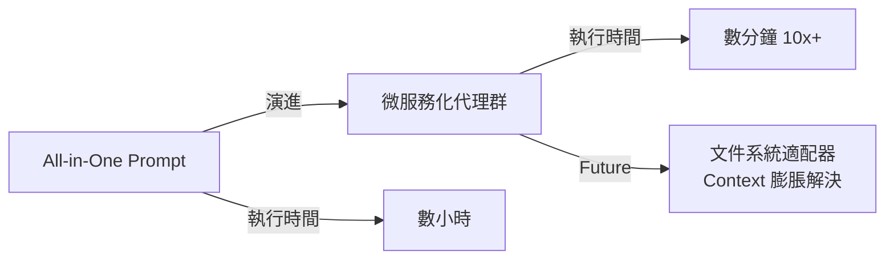

## Presentation: What I Learned Building Multi-Agent Systems From Scratch

Shopify 在多代理 AI 系統演進中的經驗分享：從單一巨大 prompt 轉向由專業化微服務代理組成的代理群。此架構轉變使任務執行時間從數小時劇烈下降至數分鐘，性能提升 10 倍以上。Paulo Arruda 進一步提出基於文件系統的適配器架構作為未來方向，以根本性解決多代理系統中的 context 膨脹瓶頸。該案例揭示了從 all-in-one LLM 應用向微服務化代理轉移的關鍵架構優勢。

### 重點
- 架構轉變：從單一 all-in-one prompt 遷移至專業化、窄焦點的代理微服務，性能提升 10 倍+
- 具體數據：任務執行時間從小時級別降至分鐘級別（hours → minutes）
- Context 管理方案：提出基於文件系統適配器的架構設計，以解決多代理系統的 context bloat 問題

**原文：** [infoq-main](https://www.infoq.com/presentations/multi-agent-system-lessons/?utm_campaign=infoq_content&utm_source=infoq&utm_medium=feed&utm_term=global)

---

### 📄 原文內容

點此展開 / 收合

# Presentation: What I Learned Building Multi-Agent Systems From Scratch

Paulo Arruda discusses Shopify’s evolution in AI adoption, moving from simple chat tools to a sophisticated swarm of specialized agents. He explains the transition from massive "all-in-one" prompts to lean, narrow-focused agent microservices that slash task times from hours to minutes. He also shares a future-looking hypothesis on using filesystem-based adapters to solve context bloat. By Paulo Arruda

