## Built an open-source one-prompt-to-cinematic-reel pipeline on a single GPU — FLUX.2 [klein] for character keyframes, Wan2.2-I2V for animation, vision critic with auto-retry, music + 9-language narration in the same pipeline

建立開源「一句話到電影級視頻」的完整 pipeline，在單個 AMD Instinct MI300X (192GB HBM3) 上端到端執行，總耗時 45 分鐘。8 個階段串連：Qwen3.5-35B-A3B Director Agent（規劃 6 個鏡頭、角色設定、配樂、旁白）→ FLUX.2 [klein]（角色肖像、關鍵幀）→ Wan2.2-I2V-A14B（81 幀@16fps 動畫）→ 視覺評論家（自動檢測 10 類失敗自動重試）→ ACE-Step v1（配樂）→ Kokoro-82M（9 語言旁白）→ ffmpeg 混音。所有模型 Apache 2.0/MIT 授權。支援 ParaAttention FBCache (2×加速) 和 torch.compile (1.2×)，從 25.9 分鐘優化至 10.4 分鐘。

```mermaid
graph LR
    A["Director Agent<br/>(Qwen3.5-35B)"] -->|"6 shots<br/>character bible<br/>music brief"| B["Character Masters<br/>(FLUX.2 klein)"]
    B -->|"canonical portraits"| C["Per-shot Keyframes<br/>(FLUX.2)"]
    C -->|"reference editing"| D["Animation<br/>(Wan2.2-I2V-A14B)"]
    D -->|"81 frames@16fps"| E{"Vision Critic<br/>(Qwen3.5-35B)"}
    E -->|"10 failure labels"| F["Retry with<br/>strategies"]
    F -->|"clean clips"| G["Music<br/>(ACE-Step v1)"]
    G -->|"30s instrumental"| H["Narration<br/>(Kokoro-82M)"]
    H -->|"9 languages"| I["Mix<br/>(ffmpeg)"]
    I -->|"final mp4"| J["Output"]
    style A fill:#e1f5ff
    style E fill:#fff3e0
    style J fill:#c8e6c9
```

### 重點
- 單卡 MI300X (192GB) 序列執行 35B MoE Director + 4B 擴散 + 14B I2V MoE + 3.5B 音樂 + TTS，避免多 GPU 複雜性和高功耗
- 視覺評論家架構自動分類 10 種失敗模式（角色漂移、演員入侵、相機忽視、逆向行走、物體變形、手指瑕疵、服裝漂移、霓虹漏光、AI 風格化、親密感）並自動重試
- Camera language 框架：每個鏡頭一個相機動詞、句首位置、避免「cinematic」關鍵詞（觸發風格化分支），改用鏡頭/膠片標籤如「Arri Alexa anamorphic 35mm film grain」

**原文：** [reddit-localllama](https://www.reddit.com/r/LocalLLaMA/comments/1tcsqwk/built_an_opensource_oneprompttocinematicreel/)

---

### 📄 原文內容

點此展開 / 收合

# Built an open-source one-prompt-to-cinematic-reel pipeline on a single GPU — FLUX.2 [klein] for character keyframes, Wan2.2-I2V for animation, vision critic with auto-retry, music + 9-language narration in the same pipeline

Shipped this for the AMD x lablab hackathon. Attached video is one of the actual reels the pipeline produced - one English sentence in, finished mp4 with characters, story, music, and voice-over out (fast demo video, not the best quality). ~45 minutes end-to-end on a single AMD Instinct MI300X. Every model is Apache 2.0 or MIT. Pipeline (8 stages, all sequential on the same GPU): Director Agent - Qwen3.5-35B-A3B (vLLM + AITER MoE) plans 6 shots from one sentence, returns structured JSON with character bibles, shot prompts, music brief, per-shot voice-over script, narration language Character masters - FLUX.2 [klein] paints one canonical portrait per character. No LoRA training step - reference editing pins identity across shots by construction Per-shot keyframes - FLUX.2 again with reference image. Sub-second per keyframe after warmup Animation - Wan2.2-I2V-A14B, 81 frames @ 16 fps native. FLF2V for cut:false continuation arcs (last frame of shot N anchors first frame of shot N+1) Vision critic - same Qwen3.5-35B reloaded with 10 structured failure labels (character drift, extras invade frame, camera ignored, walking backwards, object morphing, hand/finger artifact, wardrobe drift, neon glow leak, stylized AI look, random intimacy). Bad clips re-render with targeted retry strategies (different seed, FLF2V anchor, prompt simplification) Music - ACE-Step v1 generates a 30s instrumental from Director's brief Narration - Kokoro-82M, 9 languages. Director picks language to match setting (Tokyo→Japanese, Paris→French, Mumbai→Hindi) Mix - ffmpeg with per-shot vo aligned via adelay Wan 2.2 specifics (the bit this sub will care about): - 1280×720, not 640×640 default. Costs more but matches what producers want - 121 frames at 24 fps was my first attempt - gave temporal rippling. Switched to 81 @ 16 fps native (the distribution Wan was trained on) and it cleaned up - flow_shift = 5 for hero shots, 8 for b-roll (upstream wan_i2v_A14B.py defaults) - Negative prompt: verbatim Chinese trained negative from shared_config.py. umT5 was multilingual-pretrained against those exact tokens. English translation is observably weaker - Camera language: ONE camera verb per shot, sentence-case, placed first (&quot;Tracking shot following from behind&quot;). Multiple verbs in one prompt cancel each other out - Avoid the word &quot;cinematic&quot; - triggers Wan's stylization branch, gives the AI look. Use lens/film tags instead (&quot;Arri Alexa, anamorphic, 35mm film grain&quot;) Performance work: - ParaAttention FBCache (lossless 2× on Wan2.2) - torch.compile on transformer_2 (selective, the dual-expert MoE makes full compile flaky) - another 1.2× - AITER MoE acceleration on Qwen director (vLLM) - End-to-end: 25.9 min → 10.4 min per 720p clip on MI300X Why a single MI300X: 192 GB HBM3 lets a 35B MoE, 4B diffusion, 14B I2V MoE, 3.5B music, and a TTS share the same card sequentially. Same stack on a 24 GB consumer GPU would need 4-5 boxes wired together. Code (public, Apache 2.0): https://github.com/bladedevoff/studiomi300 Hugging Face (documentation, like this space 🙏) https://huggingface.co/spaces/lablab-ai-amd-developer-hackathon/studiomi300 Live demo on HF Space is temporarily offline while infra restores - should be back within hours. In the meantime the showcase reels in the repo are real pipeline outputs, no human re-edited shots. Happy to dig into AITER MoE setup, FBCache tuning, FLF2V anchoring, or the vision critic's failure taxonomy in comments. &#32; submitted by &#32; /u/Inevitable-Log5414 [link] &#32; [comments]

