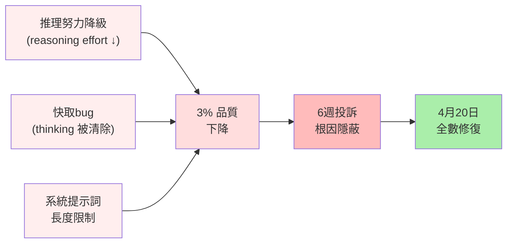

## Anthropic Traces Six Weeks of Claude Code Quality Complaints to Three Overlapping Product Changes

Anthropic 公開 Claude Code 品質衰退的事後分析報告，追溯 6 週投訴週期的根本原因並非模型退化，而是三個重疊的產品層變更（product-layer changes）。第一變更：降低推理努力（reasoning effort downgrade），加快回應但犧牲思考深度；第二：快取層 bug 導致模型自有思考（model's own thinking）被逐漸清除；第三：系統提示詞長度限制，進一步壓低品質。三重疊加效應導致 3% 品質下降，卻因變更隱蔽性高，直到 4 月 20 日修復才被完全關聯。API 與模型權重本身未變，凸顯產品層設定與應用邏輯的重要性。此案例示範多個獨立決策疊加時，根因隱蔽性如何倍增。

### 重點
- 三重打擊：推理 effort 下調 + cache bug（清除 thinking） + prompt 詞長限制 = 3% 品質衰退
- 根本隔離：Claude 模型本身未變，問題純屬產品層決策與實施缺陷
- 修復時程：4 月 20 日完全解決；變更隱蔽性強，5+ 週後才被關聯到

**原文：** [infoq-main](https://www.infoq.com/news/2026/05/anthropic-claude-code-postmortem/?utm_campaign=infoq_content&utm_source=infoq&utm_medium=feed&utm_term=global)

---

### 📄 原文內容

點此展開 / 收合

# Anthropic Traces Six Weeks of Claude Code Quality Complaints to Three Overlapping Product Changes

Anthropic published a postmortem tracing six weeks of Claude Code quality complaints to three overlapping product-layer changes: a reasoning effort downgrade, a caching bug that progressively erased the model's own thinking, and a system prompt verbosity limit that caused a 3% quality drop. The API and model weights were unaffected. All issues were resolved April 20. By Steef-Jan Wiggers

