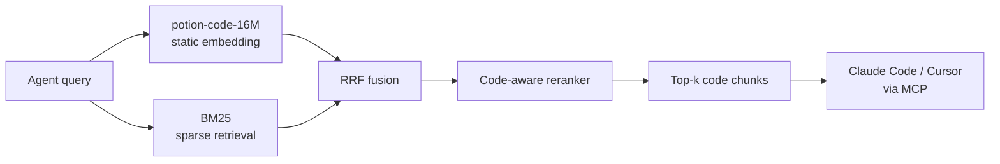
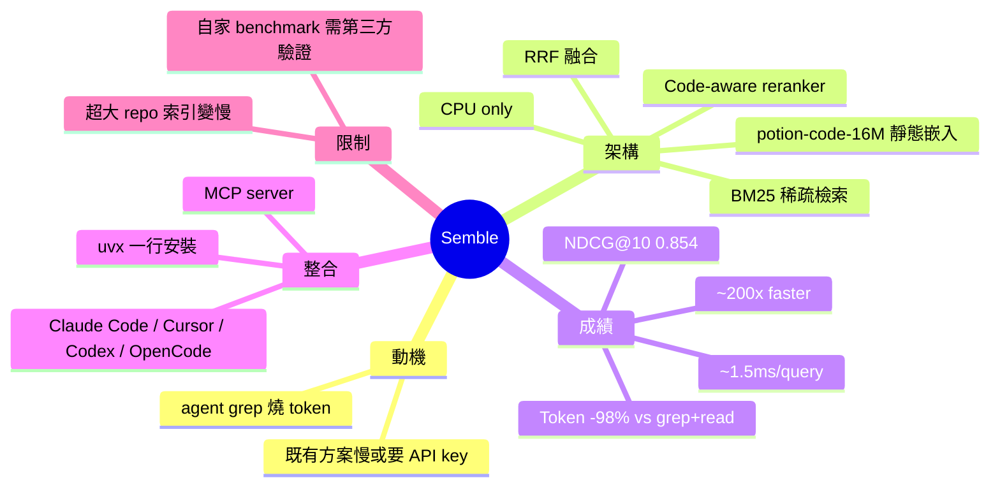

## Show HN: Semble – Code search for agents that uses 98% fewer tokens than grep

MinishLab 開源 Semble——為 AI agents 設計的代碼搜尋工具。相比傳統 grep+read，Semble 使用 98% 更少的 tokens，同時達到 99% 的檢索品質，查詢速度快 200 倍（~1.5ms per query）。技術堆棧：Model2Vec 靜態嵌入 + BM25 + RRF（reciprocal rank fusion）+ 代碼感知重排序，100% CPU 執行，無需 GPU 或 API 密鑰。可作為 MCP server 無縫整合進 Claude Code、Cursor、Codex。

### 重點
- Token 效率：比 grep+read 少用 98%，達到 0.854 NDCG@10、99% transformer 品質
- 性能：索引 ~250ms、查詢 ~1.5ms（CPU only，支援大型代碼庫）
- 開箱即用：MCP server 支援 Claude Code / Cursor / Codex，無 API 密鑰、GPU 依賴

**原文：** [hackernews](https://github.com/MinishLab/semble)

---


<!-- deep-analysis:begin -->
## 📌 摘要 (TL;DR)

- MinishLab（Stephan、Thomas）開源 **Semble**：為 AI agents 設計的代碼搜尋工具，解決 Claude Code / Cursor 在大型 codebase 上 grep + read 燒 token 的痛點。
- 相較 grep+read，token 使用量減少 **98%**，檢索品質達最佳 transformer 設定的 **99%**（NDCG@10 = 0.854），查詢速度約 **1.5ms**、快約 **200 倍**。
- 技術堆疊：靜態嵌入模型 **potion-code-16M**（Model2Vec）+ **BM25**，用 **RRF**（reciprocal rank fusion）融合，再做 code-aware 重排序，**全 CPU** 執行，無 GPU、無 API key、無外部服務。
- 提供 **MCP server**，可直接掛進 Claude Code、Cursor、Codex、OpenCode。一行安裝：`claude mcp add semble -s user -- uvx --from "semble[mcp]" semble`。
- Benchmark 規模：~1250 query/document pairs、63 repos、19 種語言；索引一個典型 repo 約 250ms。

## 🎯 核心概念

- **Model2Vec**：把 transformer 蒸餾成靜態 embedding 的技術，推論時不跑 transformer，純查表 + 線性運算，因此 CPU 就夠快。
- **potion-code-16M**：MinishLab 自家最新 static code embedding model，16M 參數。
- **BM25**：經典稀疏檢索演算法，基於詞頻 / 逆文件頻率（term frequency / inverse document frequency）。
- **RRF（Reciprocal Rank Fusion）**：把多個排序結果（dense + sparse）依倒數排名加權合併的融合方法。
- **NDCG@10**：Normalized Discounted Cumulative Gain at 10，檢索品質指標，越接近 1 越好。
- **MCP（Model Context Protocol）**：Anthropic 提出的 agent 工具掛載協定，讓 Claude Code / Cursor 等共用同一套外掛介面。

## 📖 整理分析

### 1. 解決的痛點：agent grep 燒 token
作者在大型 codebase 用 Claude Code 時觀察到：agent 找不到目標時會 fallback 到 grep，接著 read 整份檔案或開 subagent，token 消耗暴增且常常還是漏掉相關代碼。市面既有方案不是索引太慢、就是要 API key，或檢索品質差。Semble 鎖定這個缺口。

### 2. 架構：dense + sparse 混合檢索
Semble 把 **potion-code-16M 靜態嵌入** 與 **BM25** 兩條 retrieval pipeline 並行，用 **RRF** 把兩邊排名融合，再套一層 **code-aware reranker**（針對代碼結構特性加權）。因為嵌入是靜態的，沒有 transformer forward pass，整條 pipeline 在 CPU 上就能跑出毫秒級延遲。

### 3. Benchmark 結果
- 資料集：~1250 query/document pairs、跨 63 repos、19 種程式語言。
- Token 用量：比 grep+read 少 **98%**。
- 品質：NDCG@10 = **0.854**，達到他們測過的最佳 137M 參數 code-trained transformer 的 **99%**。
- 速度：索引典型 repo **~250ms**，單次查詢 **~1.5ms**，比 transformer 設定快約 **200×**。
- 注意：超大 repo 索引時間會拉長（作者自己標註）。

### 4. 部署模型：MCP drop-in
Semble 以 **MCP server** 形式發佈，相容 Claude Code、Cursor、Codex、OpenCode。零設定：不用 API key、不用 GPU、不用連外部服務，本地跑。Claude Code 安裝指令：

```
claude mcp add semble -s user -- uvx --from "semble[mcp]" semble
```

### 5. 限制與待驗證點
作者自承非常大的 repo 索引會變慢（沒給具體門檻）。Benchmark 是自家設計的 ~1250 pairs，跨領域泛化能力需第三方驗證。code-aware reranker 細節在 README，本貼文沒展開。對「99% 品質、98% 省 token」的對比 baseline（grep+read 配什麼 agent、什麼 prompt）也需細看 benchmarks 目錄。

## 🧭 架構流程



## 🧠 Mindmap


<!-- deep-analysis:end -->
### 📄 原文內容

<details>
<summary>點此展開 / 收合</summary>

Hey HN! We (Stephan and Thomas) recently open-sourced Semble. We kept running into the same problem while using Claude Code on large codebases: when the agent can&#x27;t find something directly, it falls back to grep, reading full files or launching subagents. This uses a lot of tokens, and often still misses the relevant code. There are existing tools for this, but they were either too slow to index on demand, needed API keys, or had poor retrieval quality. Semble is our solution for this. It combines static Model2Vec embeddings (using our latest static model: potion-code-16M) with BM25, fused via RRF and reranked with code-aware signals. Everything runs on CPU since there&#x27;s no transformers involved. On our benchmark of ~1250 query&#x2F;document pairs across 63 repos and 19 languages, it uses 98% fewer tokens than grep+read and reaches 99% of the retrieval quality of a 137M-parameter code-trained transformer, while being ~200x faster. Main features: - Token-efficient: 98% fewer tokens than grep+read - Fast: ~250ms to index a typical repo on our benchmark, ~1.5ms per query on CPU (very large repos may take longer) - Accurate: 0.854 NDCG@10, 99% of the best transformer setup we tested - MCP server: drop-in for Claude Code, Cursor, Codex, OpenCode - Zero config: no API keys, no GPU, no external services Install in Claude Code with:
claude mcp add semble -s user -- uvx --from &quot;semble[mcp]&quot; semble Or check our README for other installation instructions, benchmarks, and methodology: Semble: https:&#x2F;&#x2F;github.com&#x2F;MinishLab&#x2F;semble Benchmarks: https:&#x2F;&#x2F;github.com&#x2F;MinishLab&#x2F;semble&#x2F;tree&#x2F;main&#x2F;benchmarks Model: https:&#x2F;&#x2F;huggingface.co&#x2F;minishlab&#x2F;potion-code-16M Let us know if you have any feedback or questions!

</details>