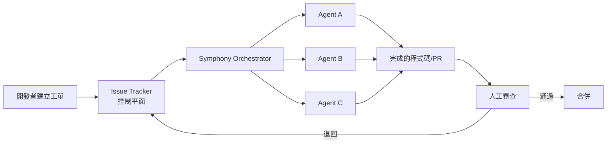
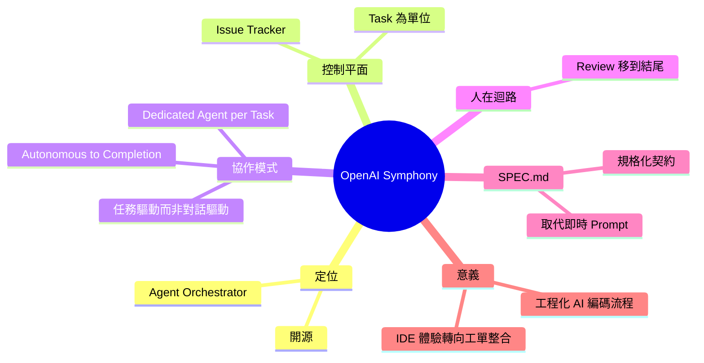

## OpenAI Open-Sources Symphony, a SPEC.md for Autonomous Coding Agent Orchestration

OpenAI 開源 Symphony，一個代理編排框架，以 issue tracker 等項目管理工具作為控制平面，協調多個自主編碼代理完成任務。替代傳統互動式開發工作流——開發者不再逐行與單個代理互動，而由 Symphony 自主分配任務給專門代理，最後由人工審查結果。這改變了 AI 輔助開發的協作模式，從即時對話轉為異步任務驅動。

### 重點
- Symphony 用 issue tracker 作為代理編排的控制平面，取代互動式編碼會話
- 多個代理自主並行完成分配的任務，人工事後審查成果
- 開發者角色轉為任務管理者，而非與代理實時互動

**原文：** [infoq-main](https://www.infoq.com/news/2026/05/openai-symphony-agents/?utm_campaign=infoq_content&utm_source=infoq&utm_medium=feed&utm_term=global)

---

<!-- deep-analysis:begin -->
## 📌 摘要 (TL;DR)

- OpenAI 開源 **Symphony**，定位為自主編碼代理（autonomous coding agent）的編排器（orchestrator），由 InfoQ 作者 Sergio De Simone 報導。
- 核心設計：把 **issue tracker 等專案管理工具**當作控制平面（control plane），由 Symphony 把工單（task）派發給專屬代理（dedicated agent）。
- 工作流改變：開發者不再逐行對話餵單一代理，而是讓 Symphony 自主指派任務，代理跑到完成（autonomously to completion），最後由人工審查結果。
- 標題提到 **SPEC.md**——以規格文件作為代理協作的共同契約，呼應「異步任務驅動」而非「即時對話驅動」的協作模式。
- 對讀者意義：這是把 AI 編碼從 IDE 內互動式 copilot 推向 **issue → autonomous agent → review** 的工程化流程，預示團隊協作介面從 chat 轉為 ticket。

## 🎯 核心概念

- **編排器（orchestrator）**：協調多個代理執行任務的中介層，本身不寫程式，而是分派與追蹤。
- **控制平面（control plane）**：系統中負責決策與調度的層級，這裡由 issue tracker 擔任，與「執行任務的代理」分離。
- **SPEC.md**：以規格化的 markdown 文件描述任務目標與驗收條件，作為代理與人之間的契約介面。
- **autonomous coding agent**：能在指派任務後自行完成編碼工作、不需逐步人類介入的代理。

## 📖 整理分析

### 1. Symphony 把 issue tracker 當控制平面

依原文敘述，Symphony 不是新的 IDE 外掛或 chat 介面，而是把既有的專案管理工具（例如 issue tracker）當成代理協作的中樞。任務以工單形式存在，Symphony 讀取工單後決定派給哪個代理。此設計把「人類已熟悉的工程流程」直接接上 AI 代理，降低團隊導入成本。

### 2. 從互動式編碼轉為任務驅動

原文明確對比兩種模式：傳統互動式開發是開發者同時管理多個編碼會話（interactive coding sessions），逐步給單一代理指示；Symphony 模式是 Symphony 自身管理 task，把每個 task 指派給一個 dedicated agent，代理自主跑到完成。開發者角色從「即時 co-pilot」變成「任務發起者 + 結果審查者」。

### 3. 人在迴路放在結尾而非中途

原文指出 once a task is finished, a human is in charge to review the resulting output。亦即 human-in-the-loop 的點位被移到 **任務完成後**，而非任務執行中。這是 Symphony 與傳統 pair-programming 風格 AI 工具最大的差異：信任代理跑完全程，再由人決定接受或退回。

### 4. SPEC.md 作為代理間的契約

標題提到「a SPEC.md for Autonomous Coding Agent Orchestration」。雖然 body 沒展開細節，但從命名可推論（此為推論）：SPEC.md 是規格文件約定，讓多個代理在沒有即時對話的情況下，仍能對任務的目標與邊界達成一致。等同把「Prompt」升級為「可版本控管的規格文件」。

### 5. 對 AI 輔助開發的意義

若 Symphony 流程被廣泛採用，AI 編碼工具的競爭場域可能從 IDE 內體驗（completion、chat panel）轉向 **工單系統整合與代理品質**。團隊衡量 AI 投入的單位也可能從「節省多少打字時間」轉為「每張工單代理完成率與審查通過率」。

## 🧭 流程圖

## 🧠 Mindmap

<!-- deep-analysis:end -->
### 📄 原文內容

點此展開 / 收合

OpenAI Symphony is an agent orchestrator that uses project-management tools, like issue trackers, as a control plan to coordinate multiple coding agents. Instead of developers managing interactive coding sessions, Symphony manages "tasks" by assigning each one to a dedicated agent that works autonomously to completion. Once a task is finished, a human is in charge to review the resulting output. By Sergio De Simone

