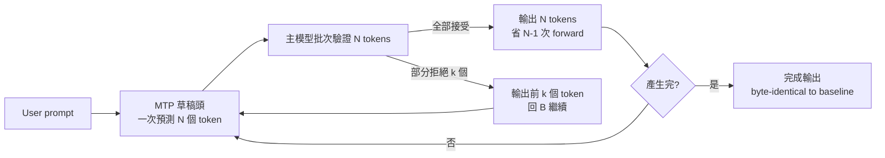
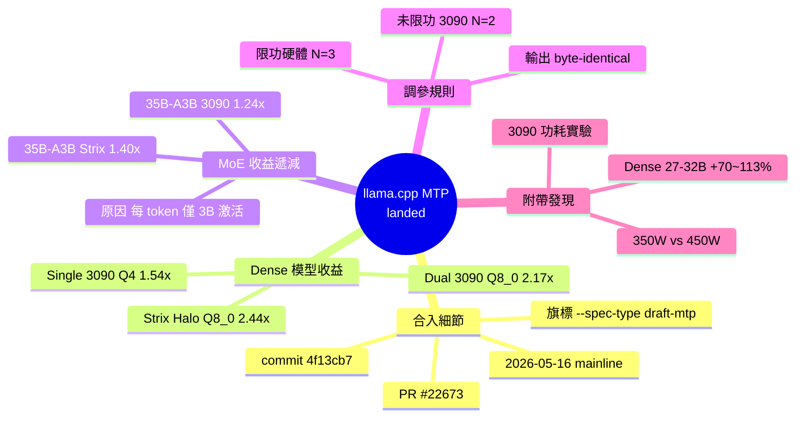

## llama.cpp MTP support landed - Qwen3.6 27B at 2.44× on a Strix Halo, 2.17× on a RTX 3090 rig

llama.cpp 於 2026 年 5 月 16 日在 mainline 中實現 MTP（多 token 預測）投機解碼，輸出與基線字節相同。測試數據：Strix Halo（AMD ROCm）上 Qwen3.6 27B 的 Q8_0 量化版本達到 2.44× 加速（從 7.4 → 18.1 tok/s）。RTX 3090 雙卡達到 2.17× 加速（從 25.7 → 55.9 tok/s）。MTP 對稀疏 MoE 模型效果有限（1.24–1.40×）。因為 MoE 每個 token 只運行 ~3B 參數，前向傳遞本已輕量，投機的收益邊際遞減。

### 重點
- MTP 推測解碼於 llama.cpp mainline 實現（PR #22673，commit 4f13cb7），可用 --spec-draft-n-max 參數控制
- Strix Halo Q8_0 達 2.44× 加速，RTX 3090 Q8_0 達 2.17×；sweet-spot 預草稿 token 數依硬體而異（3090 偏 n=2，Strix Halo 偏 n=3）
- MTP 對 MoE 模型加速較小（1.24–1.40×），因稀疏架構每 token 計算量已低，投機解碼空間受限

**原文：** [reddit-localllama](https://www.reddit.com/r/LocalLLaMA/comments/1tgxau6/llamacpp_mtp_support_landed_qwen36_27b_at_244_on/)

---

<!-- deep-analysis:begin -->
## 📌 摘要 (TL;DR)

- 2026 年 5 月 16 日，llama.cpp PR #22673（commit `4f13cb7`）將 MTP（Multi-Token Prediction，多 token 預測）投機解碼合入 mainline，輸出在相同 seed / temperature 下與 baseline **位元組相同**。
- 在 Strix Halo（Framework Desktop + ROCm 7.0.2）上跑 Qwen3.6 27B Q8_0，從 7.4 tok/s 拉到 18.1 tok/s，**2.44× 加速**；Q4_K_M 也有 1.81×（11.7 → 21.2）。
- 雙 RTX 3090（layer-split，CUDA 12.9 / driver 590.26）跑 Qwen3.6 27B Q8_0 達 **2.17×**（25.7 → 55.9 tok/s）；單卡 450W Q4_K_M 為 1.54×（38.7 → 59.5）。
- 稀疏 MoE 模型 Qwen3.6 35B-A3B 收益小（Strix Halo 1.40×、3090 1.24×），因每 token 只啟用 ~3B 參數，forward pass 本就便宜。
- 啟用方式：`--spec-type draft-mtp --spec-draft-n-max N`，N 甜蜜點隨硬體變動（未限功 3090 偏好 N=2、限功 3090 與 Strix Halo 偏好 N=3）。

## 🎯 核心概念

- **多 token 預測（Multi-Token Prediction，MTP）**：模型一次預測多個未來 token，作為 draft 提交給主模型驗證，省下 N-1 次完整 forward pass。
- **投機解碼（speculative decoding）**：用便宜的草稿模型（draft model）猜測，再由目標模型批次驗證；MTP 是把草稿能力內建到模型本身的變體。
- **稀疏混合專家（sparse Mixture-of-Experts，MoE）**：每個 token 只路由到部分專家權重，例如 35B-A3B 代表總共 35B 參數但每 token 只激活約 3B。
- **Layer-split**：將模型不同層拆到多張 GPU，與 tensor-split 對比，通訊量較低但平行度也較低。
- **Strix Halo**：AMD Ryzen AI Max 平台（Framework Desktop 採用），整合大記憶體頻寬的 APU 架構，跑 LLM 走 ROCm。

## 📖 整理分析

### 1. MTP 已進入 mainline，不再是 fork
貼文作者 C_Coffie 確認 PR #22673（commit `4f13cb7`）於 2026-05-16 合入 llama.cpp 主線，啟用旗標為 `--spec-type draft-mtp --spec-draft-n-max N`。重點是**輸出與 baseline byte-identical**：在相同 seed 與 temperature=0 下，逐 byte 相同，代表這是純加速、不是品質取捨。

### 2. Strix Halo 收益最大：Q8_0 達 2.44×
在 Framework Desktop（Strix Halo、ROCm 7.0.2）上跑 Qwen3.6 27B，dense 模型：

| 量化 | Baseline (tok/s) | MTP (tok/s) | 加速比 |
|---|---|---|---|
| Q4_K_M | 11.7 | 21.2 | 1.81× |
| Q8_0 | 7.4 | 18.1 | **2.44×** |

Q8_0 收益高於 Q4 的原因可推測為：Q8_0 的單 token forward pass 在 Strix Halo 上更受 memory bandwidth 限制，省下幾次 pass 的邊際效益更大（此為推論，作者文章未直接歸因）。

### 3. RTX 3090 也有 1.5–2.17×，但 N 甜蜜點不同
單張 3090 @ 450W（CUDA 12.9、driver 590.26）跑 Q4_K_M 為 1.54×（38.7 → 59.5）；雙卡 layer-split 跑 Q8_0 為 2.17×（25.7 → 55.9）。作者註記：**未限功的 3090 偏好 `n=2`（Q4 情境），限功的 3090 與 Strix Halo 偏好 `n=3`**——硬體越「吃緊」，越值得多投機幾步。

### 4. MoE 模型收益遞減
Qwen3.6 35B-A3B（稀疏 MoE，每 token 啟用 ~3B 參數）：
- Strix Halo：49.5 → 69.4 tok/s（1.40×）
- 3090：120.0 → 148.3 tok/s（1.24×）

作者解釋：「MoE 每 token 只有 35B 中的 ~3B 參數實際運行，每次 forward pass 已經便宜，省下 N-1 次的絕對收益就小」。這對選型有實際意義：**MoE 已自帶稀疏激活的速度紅利，疊加 MTP 的邊際空間有限**；dense 模型才是 MTP 的最大受益者。

### 5. 順帶釐清的功耗實驗
作者在前一篇 thread 的 3090 數據被一個未揭露的 **200W 限功**（因為 4 卡共用一個電路會跳閘）拖累。這次重新在 350W 與 450W 下 bench 26 個 3090 模型，**dense 27–32B 模型加速 +70% 到 +113%**。完整曲線見其文章：https://calebcoffie.com/blog/how-much-do-power-limits-affect-llm-benchmark-tok-s

## 🧭 流程圖

## 🧠 Mindmap

<!-- deep-analysis:end -->
### 📄 原文內容

點此展開 / 收合

PR #22673 (commit 4f13cb7) landed MTP speculative decoding in mainline llama.cpp on May 16. I tested it on two separate rigs. Qwen3.6 27B, single-stream chat, temperature 0, median of 5 runs: Strix Halo (Framework Desktop, ROCm 7.0.2): Q4_K_M: 11.7 → 21.2 tok/s (1.81×) Q8_0: 7.4 → 18.1 tok/s (2.44×) Single RTX 3090 @ 450W (CUDA 12.9, driver 590.26): Q4_K_M: 38.7 → 59.5 tok/s (1.54×, n=2) Dual RTX 3090, layer-split: Q8_0: 25.7 → 55.9 tok/s (2.17×, n=3) Qwen3.6 35B-A3B (MoE): Strix Halo: 49.5 → 69.4 tok/s (1.40×) 3090: 120.0 → 148.3 tok/s (1.24×) Enable with --spec-type draft-mtp --spec-draft-n-max N . Output is byte-identical to baseline at the same seed and temperature. MTP helps MoE less because only ~3B of 35B params run per token — each forward pass is already cheap, so saving N-1 of them is a smaller win. Sweet-spot N also depends on the rig: uncapped 3090 prefers n=2 at Q4, capped 3090 and Strix Halo prefer n=3. Couple of follow-ups from the last thread: The 3090 numbers in my earlier post were undercut by an undisclosed 200W cap (breaker-popping issue with 4 cards on one circuit). I re-benched 26 of the 3090 models at 350W and 450W; dense 27-32B models gained +70 to +113%. Writeup with the curve and full table: https://calebcoffie.com/blog/how-much-do-power-limits-affect-llm-benchmark-tok-s Prompt-processing tok/s and prompt-token columns are now on every row of the benchmarks page. MTP writeup with both rigs side-by-side, build commands, and per-shape tables: https://calebcoffie.com/blog/benchmarking-llama-cpp-mtp-on-strix-halo Raw YAML per run: https://github.com/CCoffie/CalebCoffie.com/tree/main/content/benchmarks/runs &#32; submitted by &#32; /u/C_Coffie [link] &#32; [comments]

