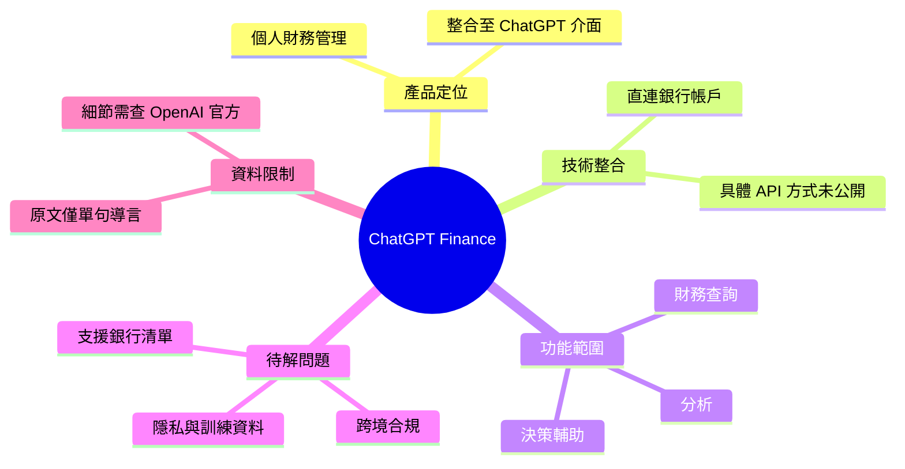

## ChatGPT Finance Launches With Bank Account Integration: OpenAI’s Bold Move Into AI Personal Finance

OpenAI 推出 ChatGPT Finance，支持直接銀行帳戶集成，正式進入個人財務管理領域。產品允許用戶通過 ChatGPT 介面進行財務查詢、分析和決策支持，標誌著 AI 助手從對話工具向財務應用和敏感數據交互的拓展。

### 重點
- ChatGPT Finance：銀行帳戶直接集成，支持財務查詢和分析
- OpenAI 從通用對話助手向垂直領域應用的延伸

**原文：** [medium-tag-claude](https://medium.com/@bali4u2001/chatgpt-finance-launches-with-bank-account-integration-openais-bold-move-into-ai-personal-finance-6bb6795691d6?source=rss------claude-5)

---

<!-- deep-analysis:begin -->
## 📌 摘要 (TL;DR)

- OpenAI 推出 **ChatGPT Finance**，定位為個人財務管理（personal finance）功能，支援直接與使用者銀行帳戶整合（bank account integration）。
- 使用者可在 ChatGPT 介面內進行財務查詢、分析與決策輔助，無需切換到獨立的銀行 app 或財務工具。
- 此舉代表 AI 助手從「純對話工具」延伸到「處理敏感金融資料」的應用層，跨入 fintech 領域。
- ⚠️ **資料限制**：原文（Medium 文章）內文僅有一句導言「OpenAI Just Launched ChatGPT Finance — And It Connects Directly to Your Bank」，完整內容需至 Medium 原站閱讀。以下分析僅根據標題與既有摘要，未涵蓋的具體細節（支援銀行清單、上線日期、定價、地區、隱私機制）原文未在抓取範圍內提供。

## 🎯 核心概念

- **ChatGPT Finance**：OpenAI 在 ChatGPT 內推出的個人財務功能模組，名稱由原文標題給出，具體形式（獨立 app、GPT、還是內建工具）原文未明示。
- **銀行帳戶整合（bank account integration）**：允許 ChatGPT 直接讀取使用者銀行帳戶資料，技術細節（API 提供方、是否走 Plaid 等聚合服務）原文未說明。

## 📖 整理分析

### 1. 產品定位：AI 進入個人財務
根據標題與摘要，ChatGPT Finance 是 OpenAI 將 ChatGPT 從通用對話助手延伸到 personal finance 場景的產品線。摘要描述其支援「財務查詢、分析和決策支持」，但原文未列出具體 use case 範例（例：對帳、預算規劃、投資建議、信用卡比較等何者實際支援）。

### 2. 銀行整合的意義
標題強調「Connects Directly to Your Bank」，暗示是直連而非單純檔案上傳。這在技術上通常需要 OAuth 授權 + 銀行 API 或第三方聚合層。原文摘錄未指明 OpenAI 採用哪一種架構，也未列出已支援的銀行名單。

### 3. 敏感資料處理的爭議空間
摘要點出「敏感數據交互」是這次推進的關鍵延伸。AI 模型直接接觸銀行交易紀錄會帶出三個未解問題：(a) 資料是否進入訓練、(b) 跨境合規（GDPR、各國金融監理）、(c) 帳戶被誤操作的責任歸屬。原文摘錄未提及 OpenAI 對這些問題的官方說法。

### 4. 競品脈絡（推論，非原文）
📌 **以下為推論**：個人財務 AI 既有玩家包括 Intuit Mint（已收掉）、Monarch、Copilot Money、Cleo 等。OpenAI 若以 ChatGPT 既有用戶基數切入，對既有 fintech 是渠道層級壓力。原文未做此比較，此段為背景脈絡推論。

### 5. 待補資訊
要完整評估這項發布，需要從 OpenAI 官方公告補齊：上線地區、支援銀行、是否需訂閱 ChatGPT Plus/Pro、隱私白皮書、與監理機關的合作。本文 body 抓取不完整，建議直接查閱 OpenAI 公告或完整 Medium 原文。

## 🧠 Mindmap

<!-- deep-analysis:end -->
### 📄 原文內容

點此展開 / 收合

OpenAI Just Launched ChatGPT Finance &#x2014; And It Connects Directly to Your Bank Continue reading on Medium »

