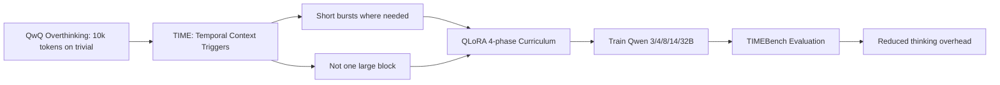

## I trained TIME: short context-triggered thinking on Qwen model instead of overthinking

研究者發表ACL 2026論文，提出TIME方法（Temporal Intermittent Thinking）讓Qwen模型在response中需要時進行短期context觸發思考，而非開頭長推理塊，解決QwQ過度思考（trivial問題耗費10k+ tokens）問題。採QLoRA在Qwen 3/4/8/14/32B上四階段課程訓練，搭配TIMEBench新評測基準。訓練成本低可複製（7950X3D + RTX Pro 6000 Blackwell 96GB；24GB VRAM到14B，48GB到32B）。代碼、數據、Notebook全開源，後續計劃擴展到Qwen 3.5/3.6。

### 重點
- TIME框架：temporal context觸發短期思考而非長推理塊，通過時間間隙/靜默/過期假設重新思考
- ACL 2026獨立完成論文，QLoRA四階段課程在Qwen多版本，訓練資源透明化可複製
- TIMEBench新基準開源，代碼+數據+Notebook全公開，後續擴展Qwen 3.5/3.6

**原文：** [reddit-localllama](https://www.reddit.com/r/LocalLLaMA/comments/1tg90pu/i_trained_time_short_contexttriggered_thinking_on/)

---

### 📄 原文內容

點此展開 / 收合

# I trained TIME: short context-triggered thinking on Qwen model instead of overthinking

Started this as a personal project for my Open-WebUI setup to use. Somehow it ended up as an ACL 2026 paper. Not some lab paper, it is personal solo independent paper that happened. TIME is basically my attempt to train Qwen3 models to think in short bursts wherever the response actually needs it, instead of dumping one giant reasoning block at the start. Not just “make thinking shorter&quot; or “turn thinking on/off per task” or &quot;split thinking to interleaving reasoning for the task&quot; More like: let the model re-think mid-response when context gives it a reason to. The temporal part came in because time is a really clean way to model latent context changes: silence, gaps, stale assumptions, deadlines, timezone shifts, etc. Also, time just matters in a ton of normal conversations. Funny side effect: it also helps with what I think of as the QwQ problem. QwQ was the OG overthinker benchmaxxing model, and the Qwen line still has this vibe where thinking mode can go burn 10k tokens for even trivial stuff like hi. Methods side: QLoRA on Qwen3 4B/8B/14B/32B, four-phase curriculum, Unsloth , vLLM eval, TIMEBench benchmark. Trained locally on my own personal PC: 7950X3D, 128GB RAM, RTX Pro 6000 Blackwell 96GB. All Notebooks and data are available, anyone can replicate it easily (24 GB VRAM good enough upto 14B training, 48 GB good enough for 32B) I intend to do the same on Qwen3.5 and Qwen3.6 later to see if i can reduced overthinking issues. Model uploads are taking time because the merged checkpoints are huge, but datasets, notebooks, scripts, training curriculum, and eval harness are up. Paper : https://arxiv.org/abs/2601.05300v2 TIME repo (Data and Code): https://github.com/The-Coherence-Initiative/TIME TIMEBench repo : https://github.com/The-Coherence-Initiative/TIMEBench &#32; submitted by &#32; /u/susmitds [link] &#32; [comments]

