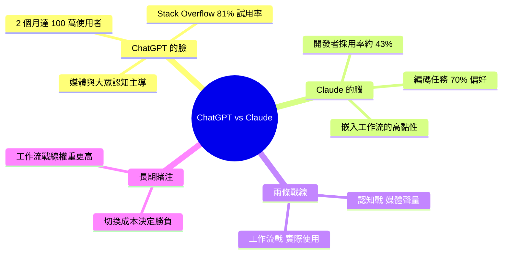

## ChatGPT Is the Face of AI. Claude Is Becoming Its Brain.

深度分析 ChatGPT 與 Claude 在 AI 市場上的競爭分裂。OpenAI 占據媒體頭條與公眾認知（2 個月內 100 萬使用者；Stack Overflow 2025 調查顯示 81% 開發者使用或試過 GPT 系列），但 Claude 在信任度與工作流採用上正在竄起——同年底約 43% 開發者採用 Claude，且 70% 開發者在編碼任務上明確偏好 Claude。核心洞察：競爭發生在兩個不同層次，「媒體與認知戰爭」vs「信任與實務工作流競賽」，後者可能決定長期勝敗。

### 重點
- OpenAI ChatGPT：公眾面孔與頭條制造者（100M 用戶 2 個月；81% 開發者採用率；連續發佈 GPT-4/4o/o1/o3/GPT-5 造成媒體事件）
- Claude：編碼優先的工作流選擇（43% 開發者採用但增速更快；編碼任務 70% 偏好度；隱藏著 awareness-preference gap）
- 市場分工框架：awareness/adoption gap 是產業隱藏斷層；不同層次的競爭（頭條 vs 信任、消費者 vs 開發者工作流）可能決定未來生態

**原文：** [medium-tag-claude](https://medium.com/ai-analytics-diaries/chatgpt-is-the-face-of-ai-claude-is-becoming-its-brain-4a267f00574b?source=rss------claude-5)

---

<!-- deep-analysis:begin -->
## 📌 摘要 (TL;DR)

- OpenAI 的 ChatGPT 主導媒體聲量與大眾認知：上線 2 個月內突破 100 萬使用者，Stack Overflow 2025 開發者調查顯示 81% 受訪者使用或試用過 GPT 系列。
- Anthropic 的 Claude 在開發者工作流中悄悄崛起：同年底約 43% 開發者採用 Claude，且在編碼任務上 70% 開發者明確偏好 Claude 而非 GPT。
- 作者核心論點：AI 競爭分裂成兩條戰線——「媒體與認知戰爭」（ChatGPT 領先）vs「信任與實務工作流競賽」（Claude 領先）。
- 戰略意涵：短期媒體聲量贏家未必是長期市場贏家，誰握住開發者日常工作流，誰可能決定 AI 平台的最終勝負。
- 原文為 Medium 短文（本次抓到的 body 僅為導言段），以下分析以原文標題、副標與 brief 摘要中已揭示的數據為主，不作額外推測。

## 🎯 核心概念

- **媒體與認知戰爭** (mindshare war)：誰被大眾、媒體、投資人記住為「AI 的代名詞」。
- **信任與工作流競賽** (trust & workflow race)：誰被專業使用者（特別是開發者）放進每天必用的工具鏈。
- **臉 vs 腦** (face vs brain)：作者用比喻將 ChatGPT 定位為 AI 的「公眾形象」、Claude 定位為背後的「實際運算核心」。

## 📖 整理分析

### 1. ChatGPT 拿下「臉」的位置

ChatGPT 於 2022 年底上線後 2 個月內衝到 100 萬使用者，是公眾媒體中 AI 的代名詞。Stack Overflow 2025 開發者調查中 81% 受訪者使用或試用過 GPT 系列，代表它在「曾經接觸」這個維度幾乎飽和。OpenAI 的優勢來自先發、品牌、與媒體頭條的占有率。

### 2. Claude 拿下「腦」的位置

同一份 Stack Overflow 2025 調查顯示，到年底約 43% 開發者已採用 Claude；更關鍵的是在編碼任務（coding tasks）上，70% 開發者偏好 Claude 而非 GPT。換句話說，Claude 雖然「試用率」低於 GPT，卻在「實際被選來做事」的場景拉出明顯優勢，特別是在程式開發這個高價值工作流中。

### 3. 兩條戰線的策略差異

作者把競爭拆成兩層：
- **認知層**：ChatGPT 用品牌與大眾化贏得「AI = ChatGPT」的聯想。
- **工作流層**：Claude 用程式能力、長文本、可控性贏得開發者的日常採用。

這兩層不直接互相替代——大眾使用者看到的是 ChatGPT，但企業內部工程師打開 IDE 時，越來越多人選 Claude。

### 4. 為何工作流戰線可能更決定長期勝負

根據作者推論（這是觀點，非數據驗證）：媒體聲量會隨產品週期波動，但被嵌進工作流的工具會產生切換成本（switching cost）。一旦 Claude 成為開發團隊 CI、code review、agent pipeline 的預設模型，要把它換掉的代價遠高於使用者「換個聊天 App」。

### 5. 原文限制與資料缺口

本次抓到的 Medium 原文僅含標題與一段導言（teaser），完整 Medium 全文未公開於此 RSS 內。上述分析以 brief 摘要中已標註的數據為主；作者在原文中可能還提及企業採用率、API 收入、模型版本對比等細節，未抓到的部分本文不作推測。

## 🧠 Mindmap

<!-- deep-analysis:end -->
### 📄 原文內容

點此展開 / 收合

OpenAI owns the headlines. Anthropic owns the workflows. Understanding this distinction might be the most important strategic insight in&#x2026; Continue reading on AI &amp; Analytics Diaries »

