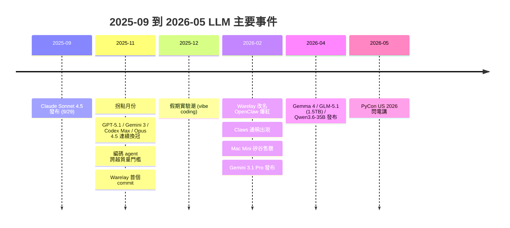
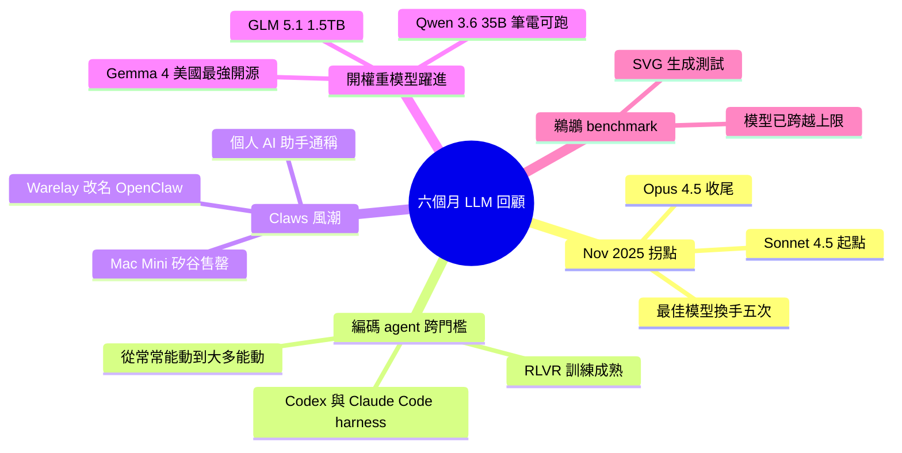

## The last six months in LLMs in five minutes

Simon Willison 在 PyCon US 2026 回顧過去六個月 LLM 發展，指出 November 2025 為關鍵轉折點。期間「最佳」模型在 Claude Sonnet 4.5（9 月 29 日發布）→ GPT-5.1 → Gemini 3 → GPT-5.1 Codex Max → Claude Opus 4.5 間轉換五次，反映各家激烈競爭。兩大核心進展：（1）編碼代理跨越質量門檻，從「有時工作」進化為「大多數工作」、可日常使用工具，源自 OpenAI 與 Anthropic 全年 RLVR（Reinforcement Learning from Verifiable Rewards）強化學習成果；（2）開權重模型大幅躍進，Gemma 4、GLM-5.1（1.5TB）、Qwen 3.6-35B（20.9GB 筆記本可執行）等新近發布，性能逼近或超越閉源模型。Warelay 首次提交於 11 月末，經歷名稱變更後以 OpenClaw 於 2 月風行全球，帶動個人 AI 助手（Claws）概念爆紅，甚至驅動 Mac Mini 在矽谷銷售一空。

### 重點
- November 2025 inflection point：模型競爭白熱化，Opus 4.5 最終奪冠；編碼代理透過 RLVR 跨越可用性閾值
- Warelay → OpenClaw：首次提交 11 月末，3 個月內成為風潮，Mac Mini 銷售一空用於運行 Claws
- 開權重模型大躍進：GLM-5.1（1.5TB 中文怪獸）、Qwen 3.6-35B（20.9GB 筆記本可跑）超越預期，Gemma 4 成美國最強開權重

**原文：** [simon-willison](https://simonwillison.net/2026/May/19/5-minute-llms/#atom-everything)

---

<!-- deep-analysis:begin -->
## 📌 摘要 (TL;DR)

- Simon Willison 在 PyCon US 2026 五分鐘閃電講，回顧過去六個月 LLM 發展，斷言 **November 2025 是關鍵拐點**。
- 期間「最佳」模型換手 5 次：Claude Sonnet 4.5（9/29 發布）→ GPT-5.1 → Gemini 3 → GPT-5.1 Codex Max → Claude Opus 4.5（守冠約兩個月）。
- 編碼代理（coding agent）11 月跨過質量門檻，從 *often-work* 變 *mostly-work*，源自 OpenAI 與 Anthropic 整年 2025 跑的 RLVR 訓練。
- 11 月底起步的小 repo「Warelay」→ 2 月改名 **OpenClaw** 席捲全球，帶起 **Claws**（個人 AI 助手）類別，連帶 Mac Mini 在矽谷賣到缺貨。
- 開權重模型大躍進：**Gemma 4**（Google）、**GLM-5.1**（1.5TB 中國開源巨獸）、**Qwen3.6-35B-A3B**（20.9GB 筆電可跑、畫鵜鶘贏 Opus 4.7）。

## 🎯 核心概念

- **強化學習從可驗證獎勵**（Reinforcement Learning from Verifiable Rewards, RLVR）：以可自動驗證的任務（如程式碼能否通過測試）作為獎勵訊號訓練模型。
- **編碼代理**（coding agent）：LLM 配上 harness（Codex、Claude Code）自主執行多步編碼任務。
- **Claws**：個人 AI 助手通稱，命名源自 NanoClaw、ZeroClaw、OpenClaw 等系列。
- **開權重模型**（open weight model）：權重公開可下載並自行部署。
- **鵜鶘騎腳踏車**（pelican riding a bicycle）：Simon 自創的 SVG 生成 benchmark，理由是鵜鶘難畫、腳踏車難畫、兩者組合幾乎不可能出現在訓練資料中。

## 📖 整理分析

### 1. Nov 2025 拐點與冠軍輪替
六個月內「最佳模型」（依 vibes 判定）換手 5 次。起點為 9 月 29 日發布的 Claude Sonnet 4.5；11 月先被 GPT-5.1 超越，接著 Gemini 3、GPT-5.1 Codex Max 連續換手，最後 Anthropic 用 Claude Opus 4.5 奪回王座並守了約兩個月。Simon 主觀認為 Gemini 3 畫的鵜鶘最好看，但 Opus 4.5 整體實力最強。

### 2. 編碼代理跨越質量門檻
OpenAI 與 Anthropic 整個 2025 都在跑 RLVR，特別針對 Codex、Claude Code 這類 agent harness 強化程式碼品質。11 月成果集中浮現：編碼 agent 從「有時能動」進化到「大多能動」，使用者不再需要花大半時間修低級錯誤，可以當日常工具用。

### 3. Warelay → OpenClaw 與 Claws 風潮
11 月底，某個叫 Pete 的人 commit 了當時無名的 repo「Warelay」。12 月到 1 月經歷數次改名，2 月以最終名稱 **OpenClaw** 爆紅——對一個不到三個月的專案來說，能見度驚人。這類「個人 AI 助手」獲得通稱 **Claws**。連帶效應是 Mac Mini 在矽谷售罄，使用者買來跑自己的 Claw；Drew Breunig 笑稱 Mac Mini 是養 Claw 的完美水族箱。Simon 最愛的比喻是 2004 年《蜘蛛人 2》Doc Ock 的觸手：AI 驅動、抑制晶片壞掉前都很安全。

### 4. 過去一個月：開權重模型三連發
- **Gemma 4**（Google）：Simon 認為是美國公司迄今最強的開權重系列。
- **GLM-5.1**（中國 GLM 實驗室）：1.5TB 巨獸開權重模型，能力強但硬體門檻極高；它畫的鵜鶘很到位，動畫版則出現腳踏車彈飛變形的 bug。Bluesky 網友 Charles 建議用「北維吉尼亞負鼠騎電動滑板車」測試，GLM-5.1 寫出「Cruising the commonwealth since dusk」並做出動畫，其他模型完全跟不上。
- **Qwen3.6-35B-A3B**：阿里出的 20.9GB 開權重模型，在筆電上跑，畫出的鵜鶘比 Claude Opus 4.7 還好——Simon 也順帶承認鵜鶘 benchmark 已經失效。

### 5. 兩大主題收束
六個月可濃縮成兩條線：（1）編碼 agent 真的好用了；（2）筆電可跑的本地模型雖仍弱於前沿，但表現遠超預期。Sonnet 4.5（9 月）vs Qwen 35B（4 月）的鵜鶘對照，直觀展示半年的差距。

## 🧭 時間線

## 🧠 Mindmap

<!-- deep-analysis:end -->
### 📄 原文內容

點此展開 / 收合

I put together these annotated slides from my five minute lightning talk at PyCon US 2026, using the latest iteration of my annotated presentation tool . 

 
 
 # 
 I presented this lightning talk at PyCon US 2026, attempting to summarize the last six months of developments in LLMs in five minutes. 
 
 
 
 
 # 
 Six months is a pretty convenient time period to cover, because it captures what I've been calling the November 2025 inflection point . November was a critical month in LLMs, especially for coding. 
 
 
 
 
 # 
 For one thing, the supposedly "best" model (depending mostly on vibes) changed hands five times between the three big providers. 
 
 
 
 
 # 
 As always, I'm using my Generate an SVG of a pelican riding a bicycle test to help illustrate the differences between the models. 
 Why this test? Because pelicans are hard to draw, bicycles are hard to draw, pelicans can't ride bicycles ... and there's zero chance any AI lab would train a model for such a ridiculous task. 
 
 
 
 
 # 
 At the start of November the widely acknowledged "best" model was Claude Sonnet 4.5, released on 29th September . It drew me this pelican. 
 In November it was overtaken by GPT-5.1 , then Gemini 3 , then GPT-5.1 Codex Max , and then Anthropic took the crown back again with Claude Opus 4.5 . 
 I think Gemini 3 drew the best pelican out of this lot, but pelicans aren't everything. Most practitioners will agree that Opus 4.5 held the crown for the next couple of months. 
 
 
 
 
 # 
 It took a little while for this to become clear, but the real news from November was that the coding agents got good . 
 OpenAI and Anthropic had spent most of 2025 running Reinforcement Learning from Verifiable Rewards to increase the quality of code written by their models, especially when paired up with their Codex and Claude Code agent harnesses. 
 In November the results of this work became apparent. Coding agents went from often-work to mostly-work, crossing a quality barrier where you could use them as a daily-driver to get real work done, without needing to spend most of your time fixing their stupid mistakes. 
 
 
 
 
 # 
 Also in November, this happened - the first commit to an obscure (back then) repo called "Warelay" by some guy called Pete. 
 
 
 
 
 # 
 Over the holiday period, from December to January, a whole lot of us took advantage of the break to have a poke at these new models and coding agents and see what they could do. 
 They could do a lot! Some of us got a little bit over-excited. I had my own short-lived bout of a form of LLM psychosis as I started spinning up wildly ambitious projects to see how far I could push them. 
 
 
 
 
 # 
 One of my projects was a vibe-coded implementation of JavaScript in Python - a loose port of MicroQuickJS - which I called micro-javascript . You can try it out in your browser in this playground . 
 
 
 
 
 # 
 That playground demo shows JavaScript code run using my micro-javascript library, in Python, running inside Pyodide, running in WebAssembly, running in JavaScript, running in a browser! 
 It's pretty cool! But did anyone out there need a buggy, slow, insecure half-baked implementation of JavaScript in Python? 
 They did not. I have quite a few other projects from that holiday period that I have since quietly retired! 
 
 
 
 
 # 
 On to February. Remember that Warelay project that had its first commit at the end of November? 
 
 
 
 
 # 
 In December and January it had gone through quite a few name changes ... and by February it was taking the world by storm under its final name, OpenClaw. 
 The amount of attention it got is pretty astonishing for a project that was less than three months old. 
 
 
 
 
 # 
 OpenClaw is a "personal AI assistant", and we actually got a generic term for these, based on NanoClaw and ZeroClaw and suchlike... they're called Claws . 
 
 
 
 
 # 
 Mac Minis started to sell out around Silicon Valley, because people were buying them to run their Claws. 
 Drew Breunig joked to me that this is because they're the new digital pets, and a Mac Mini is the perfect aquarium for your Claw. 
 
 
 
 
 # 
 My favourite metaphor for Claws is Alfred Molina's Doc Ock in the 2004 movie Spider-Man 2. His claws were powered by AI, and were perfectly safe provided nothing damaged his inhibitor chip... after which they turned evil and took over. 
 
 
 
 
 # 
 Also in February: Gemini 3.1 Pro came out, and drew me a really good pelican riding a bicycle . Look at this! It's even got a fish in its basket. 
 
 
 
 
 # 
 And then Google's Jeff Dean tweeted this video of an animated pelican riding a bicycle, plus a frog on a penny-farthing and a giraffe driving a tiny car and an ostrich on roller skates and a turtle kickflipping a skateboard and a dachshund driving a stretch limousine. 
 So maybe the AI labs have been paying attention after all! 
 
 
 
 
 # 
 A lot of stuff happened just in the past month. 
 
 
 
 
 # 
 Google released the Gemma 4 series of models, which are the most capable open weight models I've seen from a US company. 
 
 
 
 
 # 
 Also last month, Chinese AI lab GLM came out with GLM-5.1 - an open weight 1.5TB monster! This is a very effective model... if you can afford the hardware to run it. 
 
 
 
 
 # 
 GLM-5.1 drew me this very competent pelican on a bicycle. 
 
 
 
 
 # 
 ... though when it tried to animate it the bicycle bounced off into the top and the bicycle got warped. 
 
 
 
 
 # 
 Charles on Bluesky suggested I try it with a North Virginia Opossum on an E-scooter 
 
 
 
 
 # 
 And it did this! I've tried this on other models and they don't even come close. "Cruising the commonwealth since dusk" is perfect. It's animated too . 
 
 
 
 
 # 
 The other neat Chinese open weight models in April came from Qwen. Qwen3.6-35B-A3B on my laptop drew me a better pelican than Claude Opus 4.7 . That's a 20.9GB open weights model that runs on my laptop! 
 (I think this mainly demonstrates that the pelican on the bicycle has firmly exceeded its limits as a useful benchmark.) 
 
 
 
 
 # 
 Here's that Claude Sonnet 4.5 pelican from September for comparison. 
 
 
 
 
 # 
 So those were the two main themes of the past six months. The coding agents got really good... and the laptop-available models, while a lot weaker than the frontier, have started wildly outperforming expectations. 
 
 
 
 Tags: lightning-talks , pycon , speaking , ai , generative-ai , local-llms , llms , annotated-talks , pelican-riding-a-bicycle , coding-agents

