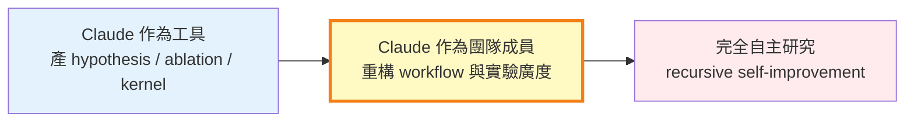
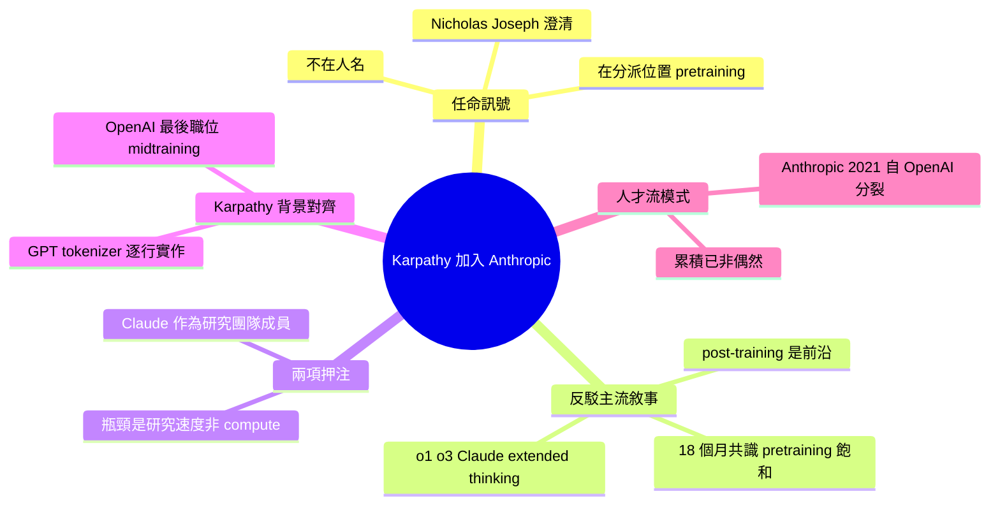

## Karpathy Joining Anthropic Isn’t About Talent. It’s a Bet That Pretraining Isn’t Done.

Andrej Karpathy 加入 Anthropic，引發業界關注。文章論證此舉不純粹是「挖人才」，而是 Anthropic 在賭 pretraining（預訓練）還有重大改進空間。文章強調「人事任命的結構性信號在於賦予的職位，不在人名」，暗示 Karpathy 被指派從事預訓練相關工作，反映 Anthropic 對此領域的長期投資決心。這是基礎模型廠商技術方向的重要指標。

### 重點
- Karpathy 加入 Anthropic：人事任命反映公司的技術研發優先級
- Anthropic 的賭注：相信預訓練（pretraining）仍有突破空間，不同於「模型已成熟」的論調
- 組織信號論：研究人員的具體職位分配比招聘本身更能透露企業戰略

**原文：** [medium-tag-claude](https://medium.com/@AdithyaGiridharan/karpathy-joining-anthropic-isnt-about-talent-it-s-a-bet-that-pretraining-isn-t-done-1baf36e040c6?source=rss------claude-5)

---

<!-- deep-analysis:begin -->
## 📌 摘要 (TL;DR)

- 2026 年 Andrej Karpathy 週二宣布加入 Anthropic；數小時內 pretraining 主管 Nicholas Joseph（同為 OpenAI 出身）公開澄清角色：Karpathy 啟動新子團隊，用 Claude 加速 pretraining 研究本身，Anthropic 發言人對 VentureBeat 同口徑確認
- 任命的結構性訊號在「分派位置」而非「人名」——把最受推崇的研究者放在外界宣告「已成熟」的 pretraining 環節
- 反駁過去約 18 個月的主流敘事：scaling law 已彎、前沿全在 post-training（RLHF / RLVR / reasoning-trace 蒸餾 / agentic scaffolding / inference-time compute）。o1、o3、Claude extended thinking 皆是 post-training 產物
- 兩項押注：(1) pretraining 瓶頸是研究迭代速度而非 compute 或資料量 (2) 把 Claude 當作研究團隊「成員」而非工具，重構整個 workflow
- Karpathy 在 OpenAI 最後職務即為 midtraining 與合成資料生成團隊，與新任務範疇直接相鄰；非泛用空降
- 自 2021 Anthropic 從 OpenAI 分裂以來，OpenAI → Anthropic 人才流已累積到難以視為偶然

## 🎯 核心概念

- **預訓練**（pretraining）：在大規模 corpus 上訓練 base model 的階段，產生模型基礎能力
- **後訓練**（post-training）：base model 之後的所有調教，涵蓋 RLHF、RLVR（可驗證獎勵的 reinforcement learning from verifiable rewards）、reasoning-trace 蒸餾、agentic scaffolding、inference-time compute
- **中訓練**（midtraining）：介於 pretraining 與 post-training 之間的階段，常涉及合成資料生成；Karpathy 上一份 OpenAI 工作即此
- **遞迴自我改進**（recursive self-improvement）：模型參與訓練後繼模型的研究流程；過去多在 AI safety 圈討論，作者稱此為前沿實驗室首次明確的人事承諾

## 📖 整理分析

### 1. 任命訊號在分派位置，不在名字

主流媒體把 Karpathy 入職寫成「talent war」「又一位 OpenAI 校友轉投 Anthropic」。作者主張此層敘事不算錯，但停在表面。真正訊號是 Anthropic 把這位人選指向哪個堆疊位置——pretraining，而非外界預期的 reasoning RL 或新 agent team。Nicholas Joseph 在數小時內公開澄清，Anthropic 發言人對 VentureBeat 同口徑確認。

### 2. 反駁「pretraining 已飽和」的共識

過去約 18 個月的主流論述：從 GPT-2 → GPT-3 → GPT-4 之間的躍升後，scaling law 已彎、加更多參數與 token 的邊際 capability 趨平、前沿已轉移到 post-training。過去一年定義業界的 reasoning model（o1、o3、Claude 的 extended thinking 模式）幾乎全在 post-training 完成。在此共識下，pretraining 被當成「已解決的基礎設施問題」。Anthropic 將 Karpathy 放在這個被宣告成熟的環節，是對該共識的明確不接受。隱含論點：瓶頸已不是 compute 或資料量，而是研究迭代速度——架構變體、資料 mixture、optimizer、curriculum、tokenizer 等可測試組合遠超人類團隊吞吐量。

### 3. 第二層押注：把模型當作研究團隊成員

新子團隊不是「pretraining team」，而是「用 Claude 加速 pretraining 研究」的團隊。作者將此能力光譜分三段：
- **左端**：把 Claude 當生產力工具（生 hypothesis、寫 ablation、PyTorch kernel、arxiv 摘要）——已普及於各前沿實驗室，不算新
- **右端**：完全自主研究——agent 提案實驗、跑內部 infra、分析結果、迭代追問，迴圈內無人類，即 recursive self-improvement
- **中段**：把強模型結構性納入團隊「有效產能」，重新設計 workflow——此為新團隊定位

中段的關鍵差異：實驗成本下降後值得跑的範圍變寬；並行假設探索的廣度變大；人類研究者對 in-flight 實驗的比例改變。這不是把 Claude bolt 到既有 pipeline 上能達成的。

### 4. Karpathy 背景與新角色精準對齊

Karpathy 近三年最被廣為觀看的講座是從零實作 GPT 與 tokenizer 的逐行 walkthrough——正好需要理解 pretraining 堆疊裡哪些選擇是 load-bearing、哪些是 incidental。這種直覺是「自動化 pretraining 研究」最缺的能力，因為難題不是讓模型跑實驗，而是讓模型跑對的實驗、辨認哪個結果真正有資訊量。Karpathy 自述 OpenAI 最後一份工作即建立 midtraining 與合成資料生成團隊，與新團隊範疇直接相鄰。

### 5. OpenAI → Anthropic 人才流的結構性訊號

Anthropic 2021 年由一群 OpenAI 離職者創立，五年來人才流持續，且每次跳槽者的公開動機都集中在「前沿研究應如何進行」的特定觀點。Nicholas Joseph 與 Karpathy 皆屬此模式。累積數量已大到難以用個人偶然解釋。

## 🧭 概念地圖：模型參與研究的光譜

中段（黃框）即 Anthropic 新子團隊的定位點。

## 🧠 Mindmap

<!-- deep-analysis:end -->
### 📄 原文內容

點此展開 / 收合

The hire&#x2019;s structural signal lives in the assignment, not the name. Anthropic is putting one of the field&#x2019;s most respected researchers on&#x2026; Continue reading on Medium »

