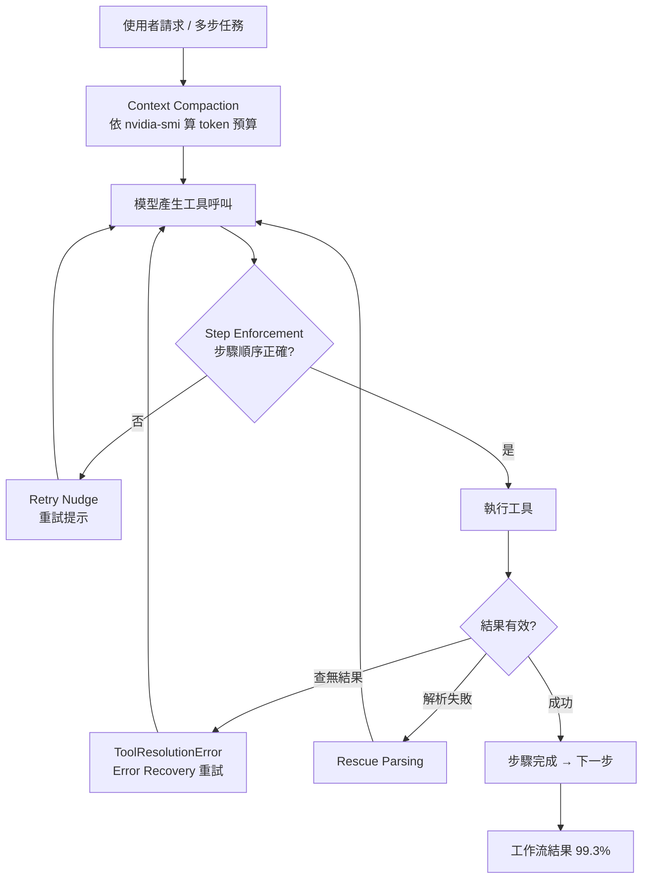
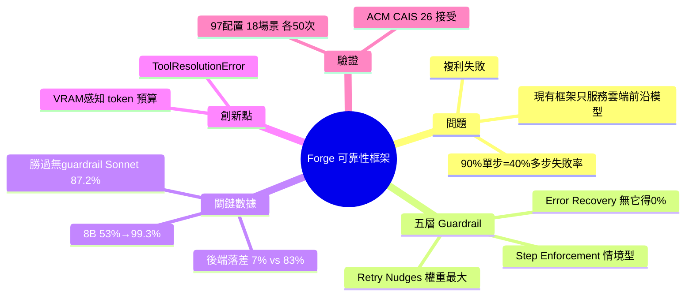

## Show HN: Forge – Guardrails take an 8B model from 53% to 99% on agentic tasks

Forge 是開源可靠性框架，透過 5 層可切換 guardrail 堆棧將自託管 8B LLM 在多步代理工作流的成功率從 53% 提升至 99.3%。核心發現：本地 8B + Forge (99.3%) 超越無 guardrails Claude Sonnet (87.2%)，後端基礎設施影響巨大（同一模型在不同 serving 層達 7% vs 83% 差異），新增 ToolResolutionError 異常類補足「成功但無結果」的缺陷。Retry nudges (禁用時 24-49 點降幅) 與 error recovery (~10 點) 為最關鍵層級。論文已接受 ACM CAIS '26，測試涵蓋 97 模型配置、18 場景、各 50 次運行。作者目前用於家庭助手與本地代碼生成系統。

### 重點
- 8B 模型 + Forge guardrails 達 99.3% 成功率，超越無 guardrails Claude Sonnet (87.2%)；後端基礎設施影響 (7% vs 83%) 重於模型選擇
- Retry nudges 與 error recovery 為兩大關鍵層，禁用時各降 24-49 點與 ~10 點；新 ToolResolutionError 類補足「成功但無結果」缺陷
- OpenAI 相容代理模式 + Eval 儀表板；v0.6.0 硬化 eval 至 26 場景，暴露 Opus 4.6 等前沿模型間隙

**原文：** [hackernews](https://github.com/antoinezambelli/forge)

---

<!-- deep-analysis:begin -->
## 📌 摘要 (TL;DR)

- Antoine Zambelli（Texas Instruments AI 總監）發布開源框架 Forge，為自託管 LLM 工具呼叫加上可靠性層，把 8B 模型在多步代理工作流的成功率從 ~53% 拉到 ~99.3%——不改模型，只改模型周邊的系統。
- 動機是「複利失敗（compounding failure）」：每步 90% 準確率聽起來不錯，但 5 步工作流就是 40% 失敗率。現有框架多為雲端前沿模型量身打造，沒處理這個機械式可靠性問題。
- 本地 8B + Forge（99.3%）勝過無 guardrail 的 Claude Sonnet（87.2%）；Ministral 8B + Forge 達 99.3%、Claude Sonnet + Forge 達 100%，自由本地 8B 模型（$600 GPU）與前沿 API 差距不到 1 分。
- 五層 guardrail 中，retry nudges（停用時掉 24-49 分）與 error recovery（掉約 10 分）權重最大。所有受測模型在無 retry 機制時，error recovery 得分皆為 0%——是架構缺席，不是能力缺口。
- 意外發現：同一份 Mistral-Nemo 12B 權重，在 llama-server 原生 function calling 模式只跑 7%，在 Llamafile prompt 模式跑 83%，純基礎設施造成 75 分落差。
- 論文獲 ACM CAIS '26 接受（5/26-29 於 San Jose 發表），測試涵蓋 97 組模型/後端配置、18 場景、各 50 次運行。

## 🎯 核心概念

- **Guardrail 堆棧（guardrail stack）**：包在模型外的可靠性層，五層各自可獨立開關
- **複利失敗（compounding failure）**：每步成功率相乘，多步驟工作流會放大失敗
- **ToolResolutionError**：新增的異常類，用來區分「工具成功且回傳資料」與「工具成功但查無結果」
- **消融研究（ablation study）**：逐層停用以量測各層貢獻，搭配 McNemar's test 檢定統計顯著性
- **上下文壓縮（context compaction）**：依 VRAM 推算 token 預算，避免溢出觸發 CPU fallback

## 📖 整理分析

### 1. 複利數學問題
作者想跑幾個常駐代理系統做投資組合管理，又不想付雲端前沿模型的費用，轉用本地模型後立刻撞上複利數學：單步 90% 準確率，5 步工作流的整體失敗率高達 40%。他觀察到現有 agent 框架都假設底層是雲端前沿模型，沒人專門解決本地模型這種「機械式可靠性」缺陷，於是寫了 Forge。

### 2. 五層 guardrail 堆棧
Forge 的核心是五層可獨立切換的 guardrail：retry nudges（重試提示）、step enforcement（步驟強制）、error recovery（錯誤復原）、rescue parsing（救援解析）、context compaction（上下文壓縮）。經 McNemar's test 消融驗證：retry nudges 與 error recovery 扛最大權重；step enforcement 屬情境型，只對排序紀律較弱的模型才觸發；rescue parsing 與 context compaction 在評測中不顯著，但因生產環境偶爾會用到而保留。

### 3. 後端基礎設施是隱形變數
最出乎意料的發現：serving 後端本身就決定成敗。同一份 Mistral-Nemo 12B 權重，在 llama-server 原生 function calling 模式只有 7% 準確率，換到 Llamafile 的 prompt 模式卻飆到 83%——純基礎設施造成 75 分擺盪。作者認為沒人發表過這點，因為標準 benchmark 不會控制 serving 後端這個變數。

### 4. ToolResolutionError：工具呼叫缺失的「404」
現行 LLM 工具呼叫不區分「工具成功且回傳資料」與「工具成功但查無結果」——兩者都回傳一個值，orchestrator 一律標記步驟完成，壞資料就往下游層層擴散。作者形容這等同 HTTP 只有 200、卻沒有 404。Forge 新增 ToolResolutionError 異常類，讓模型看得到錯誤、能重試，而非默默把垃圾資料傳下去。

### 5. VRAM 感知與評測規模
記憶體受限硬體的最大技術挑戰是 context compaction：Ollama 與 Llamafile 在模型超過 VRAM 時會默默退回 CPU——沒警告、沒報錯，推論卻慢 10-100 倍。Forge 在啟動時查詢 nvidia-smi，推算出 token 預算來預防。v0.6.0 因 dogfooding 而優化了模型參數，並推出 26 場景的更難評測套件刻意拉高天花板，連 Opus 4.6 都無法橫掃。作者目前把 Forge 用於跑在 Ministral 14B-Reasoning 上的家庭助手，以及本地代理式編碼系統（8B 模型已能對該 codebase 貢獻程式碼）。

## 🧭 流程圖：五層 guardrail 處理流程

## 🧠 Mindmap

<!-- deep-analysis:end -->
### 📄 原文內容

點此展開 / 收合

Hi HN, I&#x27;m Antoine Zambelli, AI Director at Texas Instruments. I built Forge, an open-source reliability layer for self-hosted LLM tool-calling. What it does: - Adds domain-and-tool-agnostic guardrails (retry nudges, step enforcement, error recovery, VRAM-aware context management) to local models running on consumer hardware - Takes an 8B model from ~53% to ~99% on multi-step agentic workflows without changing the model - just the system around it - Ships with an eval harness and interactive dashboard so you can reproduce every number I wanted to run a handful of always-on agentic systems for my portfolio, didn&#x27;t want to pay cloud frontier costs, and immediately hit the compounding math problem on local models. 90% per-step accuracy sounds great, but with a 5-step workflow that&#x27;s a 40% failure rate. No existing framework seemed to address this mechanical reliability issue - they all seemed tailor-made for cloud frontier. Demo video: https:&#x2F;&#x2F;youtu.be&#x2F;MzRgJoJAXGc (side-by-side: same model, same task, with and without Forge guardrails) The paper (accepted to ACM CAIS &#x27;26, presenting May 26-29 in San Jose) covers the peer-reviewed findings across 97 model&#x2F;backend configurations, 18 scenarios, 50 runs each. Key numbers: - Ministral 8B with Forge: 99.3%. Claude Sonnet with Forge: 100%. The gap between a free local 8B model on a $600 GPU and a frontier API is less than 1 point. - The same 8B local model with Forge (99.3%) outperforms Claude Sonnet without guardrails (87.2%) - an 8B model with framework support beats the best result you can get through frontier API alone. - Error recovery scores 0% for every model tested - local and frontier - without the retry mechanism. Not a capability gap, an architectural absence. I&#x27;m currently using this for my home assistant running on Ministral 14B-Reasoning, and for my locally hosted agentic coding harness (8B managed to contribute to the codebase!). The guardrail stack has five layers, each independently toggleable. The two that carry the most weight (per ablation study with McNemar&#x27;s test): retry nudges (24-49 point drops when disabled) and error recovery (~10 point drops, significant for every model tested). Step enforcement is situational - only fires for models with weaker sequencing discipline. Rescue parsing and context compaction showed no significance in the eval but are retained for production workloads where they activate once in a while. One thing I really didn&#x27;t expect: the serving backend matters. Same Mistral-Nemo 12B weights produce 7% accuracy on llama-server with native function calling and 83% on Llamafile in prompt mode. A 75-point swing from infrastructure alone. I don&#x27;t think anyone&#x27;s published this because standard benchmarks don&#x27;t control for serving backend. Another surprise: there&#x27;s no distinction in current LLM tool-calling between &quot;the tool ran successfully and returned data&quot; and &quot;the tool ran successfully but found nothing.&quot; Both return a value, the orchestrator marks the step complete, and bad data cascades downstream. It&#x27;s the equivalent of HTTP having 200 but no 404. Forge adds this as a new exception class (ToolResolutionError) - the model sees the error and can retry instead of silently passing garbage forward. Biggest technical challenge was context compaction for memory-constrained hardware. Both Ollama and Llamafile silently fall back to CPU when the model exceeds VRAM - no warning, no error, just 10-100x slower inference. Forge queries nvidia-smi at startup and derives a token budget to prevent this. How to try it: - Clone the repo, run the eval harness on a model I haven&#x27;t tested. If you get interesting results I&#x27;ll add them to the dashboard. - Try the proxy server mode - point any OpenAI-compatible client at Forge and it handles guardrails transparently. It&#x27;s the newest model and I&#x27;d love more eyes on it. - Dogfooding led me to optimize model parameters in v0.6.0. The harder eval suite (26 scenarios) is designed to raise the ceiling so no one sits at 100%. Several that did on the original suite can&#x27;t sweep it - including Opus 4.6. Curious if anyone finds scenarios that expose gaps I haven&#x27;t thought of. Paper numbers based on pre v0.6.0 code. Background: prior ML publication in unsupervised learning (83 citations). This paper accepted to ACM CAIS &#x27;26 - presenting May 26-29. Repo: https:&#x2F;&#x2F;github.com&#x2F;antoinezambelli&#x2F;forge Paper: https:&#x2F;&#x2F;www.caisconf.org&#x2F;program&#x2F;2026&#x2F;demos&#x2F;forge-agentic-re... https:&#x2F;&#x2F;github.com&#x2F;antoinezambelli&#x2F;forge&#x2F;blob&#x2F;main&#x2F;docs&#x2F;forg... Dashboard: https:&#x2F;&#x2F;github.com&#x2F;antoinezambelli&#x2F;forge&#x2F;docs&#x2F;results&#x2F;dashbo...

