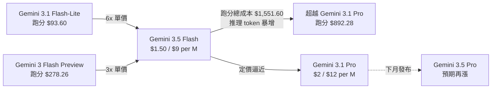
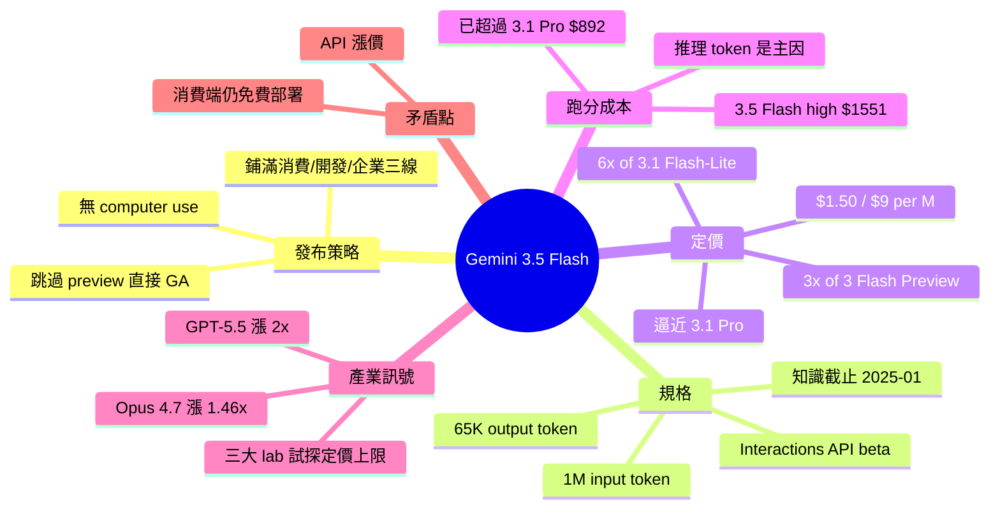

## Gemini 3.5 Flash: more expensive, but Google plan to use it for everything

Google 在 I/O 大會發布 Gemini 3.5 Flash（GA），部署到 Gemini app、Search AI Mode、Antigravity、Gemini API、Android Studio 和企業平台。規格：1M input token、65.5K output token、Jan 2025 知識截斷、無電腦操控。但定價大幅上漲：$1.50/M input、$9/M output，較 Gemini 3 Flash Preview 漲 3 倍、較 3.1 Flash-Lite 漲 6 倍，接近更高階的 Gemini 3.1 Pro（$2/$12）。Artificial Analysis 基準測試成本對比揭示關鍵洞察：Gemini 3.5 Flash (high) 執行成本 $1,551.60 甚至超過 3.1 Pro Preview 的 $892.28，因為推理 token 高。新增 Interactions API（beta），提供 server-side history 管理（類似 OpenAI Responses）。所有三大 AI lab 都在探索定價上限：OpenAI GPT-5.5 為 5.4 的 2 倍，Claude Opus 4.7 為 4.6 的 1.46 倍（計入新 tokenizer）。Google 卻將 3.5 Flash 部署到消費級免費產品，形成有趣的商業矛盾。

### 重點
- Gemini 3.5 Flash 定價 $1.50/$9，漲幅 3-6 倍，但實際執行成本 $1,551.60 已超過更好的 3.1 Pro ($892.28)，反映推理 token 成本結構
- 廣泛部署到 Gemini app、Search、Antigravity、Android Studio 等消費級和企業平台，但免費層承載高成本模型
- 新 Interactions API（beta）提供 server-side history，跟進 OpenAI Responses 設計模式

**原文：** [simon-willison](https://simonwillison.net/2026/May/19/gemini-35-flash/#atom-everything)

---

<!-- deep-analysis:begin -->
## 📌 摘要 (TL;DR)

- Google 在 I/O 大會直接發布 Gemini 3.5 Flash GA（跳過 preview 階段），同步部署至 Gemini app、Google Search AI Mode、Antigravity、Gemini API、Android Studio 與 Gemini Enterprise Agent Platform。
- 模型規格：model ID `gemini-3.5-flash`、輸入 1,048,576 token、輸出上限 65,536 token、知識截止 2025 年 1 月，**不支援電腦操控**（computer use）。
- 定價大幅上調：$1.50/M input、$9/M output——是 Gemini 3 Flash Preview 的 3 倍、3.1 Flash-Lite 的 6 倍，已接近 Gemini 3.1 Pro 的 $2/$12。
- Artificial Analysis 基準測試的實際執行成本顯示 Gemini 3.5 Flash (high) 跑完一輪要 **$1,551.60**，比 Gemini 3.1 Pro Preview 的 $892.28 還貴——原因是推理 token（reasoning tokens）暴增。
- 三大 AI 實驗室同步試探定價上限：GPT-5.5 是 5.4 的 2 倍；Claude Opus 4.7 計入新 tokenizer 後是 4.6 的 1.46 倍。
- 新增 Interactions API（beta），提供 server-side 對話歷史管理，對標 OpenAI Responses API。

## 🎯 核心概念

- **推理 token** (reasoning tokens)：模型在輸出最終答案前內部「思考」消耗的 token，會計入計費，是 3.5 Flash 跑分成本暴漲的主因。
- **Interactions API**：Google 新推出的 beta API，由伺服器端保存對話歷史，呼叫端不必每次重送完整 context，類似 OpenAI Responses 模式。
- **跑分執行成本** (benchmark cost)：Artificial Analysis 公布跑完整套基準題庫所花的 API 費用，能同時反映單價、tokenizer 效率、推理 token 量。

## 📖 整理分析

### 1. 跳過 preview、直接全平台 GA
過去 Gemini 新版常以 `-preview` 階段上線，但 3.5 Flash 直接 GA，並同日鋪到 Google 自家最大流量入口：消費端的 Gemini app 與 Search AI Mode；開發端的 Antigravity、AI Studio、Android Studio；以及企業端 Gemini Enterprise Agent Platform。Simon Willison 指出 Google 把它定位為「全產品線主力模型」。

### 2. 規格：少了 computer use 的 1M context
根據 developer 文件，3.5 Flash 支援 1,048,576 input token 與 65,536 output token，知識截止 2025 年 1 月。值得注意的是它**不再支援 computer use 能力**，這在 Gemini 3.x 系列中是退步點。Google 同步推出 Interactions API（beta），把 history 管理收進 server side。

### 3. 三倍至六倍價格跳漲
3.5 Flash 報價 $1.50/M input、$9/M output，相對：
- Gemini 3 Flash Preview：**3 倍**
- Gemini 3.1 Flash-Lite：**6 倍**
- Gemini 3.1 Pro（$2 input／$12 output）：已非常接近

Simon 預期下月即將推出的 Gemini 3.5 Pro 會再漲一階。

### 4. 跑分總成本：Flash 比 Pro 還貴的弔詭
Artificial Analysis 的基準執行成本同時涵蓋單價、tokenizer 與推理 token 量，公布數據如下：

| 模型 | 跑完基準的總成本 |
|---|---|
| Gemini 3.5 Flash (high) | **$1,551.60** |
| Gemini 3.1 Pro Preview | $892.28 |
| Gemini 3 Flash Preview (Reasoning) | $278.26 |
| Gemini 3.1 Flash-Lite Preview | $93.60 |
| Claude Opus 4.7 (Adaptive, Max Effort) | $5,117.14 |
| Claude Opus 4.7 (Non-reasoning, High) | $1,217.23 |
| GPT-5.5 (xhigh) | $3,357.00 |
| GPT-5.5 (medium) | $1,199.14 |

3.5 Flash 比同家更高階的 3.1 Pro Preview 還貴，反映「Flash」品牌不再代表便宜——而是推理 token 用量極高。

### 5. 三大 lab 同步試探價格容忍度
Simon 認為這是產業整體趨勢：OpenAI GPT-5.5 為 5.4 的 2 倍；Anthropic Claude Opus 4.7（換新 tokenizer 後等效）為 4.6 的 1.46 倍。三家都在測試 API 客戶能吃多少漲價。然而 Google 同時把 3.5 Flash 鋪到免費消費級產品（Gemini app、Search AI Mode），形成商業矛盾——Simon 沒回答的問題是：API 漲價是否要補貼消費端的免費部署。

### 6. Pelican on a bicycle 測試
Simon 標誌性的 SVG 測試：「Generate an SVG of a pelican riding a bicycle」。3.5 Flash 產出一隻戴復古飛行員墨鏡的鵜鶘（程式碼註解 `<!-- Pelican Eye / Sunglasses (Cool Retro Aviators) -->`），HN 留言形容「像在邁阿密參加加密貨幣會議」。該次呼叫消耗 11 input token、**14,403 output token**，成本約 13 美分——再次驗證推理輸出極為龐大。

## 🧭 價格與成本對比

## 🧠 Mindmap

<!-- deep-analysis:end -->
### 📄 原文內容

點此展開 / 收合

Today at Google I/O, Google released Gemini 3.5 Flash . This one skipped the -preview modifier and went straight to general availability, and Google appear to be using it for a whole lot of their key products: 
 
 3.5 Flash is available today to billions of people globally: 
 
 For everyone via the Gemini app and AI Mode in Google Search 
 
 For developers in our agent-first development platform Google Antigravity and Gemini API in Google AI Studio and Android Studio 
 For enterprises in Gemini Enterprise Agent Platform and Gemini Enterprise. 
 
 
 As usual with Gemini, the most interesting details are tucked away in the What's new in Gemini 3.5 Flash developer documentation. It mostly has the same set of platform features as the previous Gemini 3.x series, albeit with no computer use . The model ID is gemini-3.5-flash . The knowledge cut-off is January 2025, and it supports 1,048,576 input tokens and 65,536 maximum output tokens. 
 Google are also pushing a new Interactions API , currently in beta, which looks to me like their version of the patterns introduced by OpenAI Responses - in particular server-side history management. 
 The price has gone up 
 Gemini 3.5 Flash is accompanied by a notable price bump. The previous models in the "Flash" family were Gemini 3 Flash Preview and Gemini 3.1 Flash-Lite . The new 3.5 Flash is 3x the price of 3 Flash Preview and 6x the price of 3.1 Flash-Lite (see price comparison here ). 
 At $1.50/million input and $9/million output it's getting close in price to Google's Gemini 3.1 Pro, which is $2 and $12. 
 The Gemini team promise that 3.5 Pro will roll out "next month" - presumably at an even higher price. 
 This fits a trend: OpenAI's GPT-5.5 was 2x the price of GPT-5.4, and Claude Opus 4.7 is around 1.46x the price of 4.6 when you take the new tokenizer into account . 
 Given the price increase it's interesting to see Google roll it out for so many of their own free-to-consumer products. It feels like all three of the major AI labs are starting to probe the price tolerance of their API customers. 
 Artificial Analysis publish the cost to run their proprietary benchmark against models, which is a useful way to take things like tokenization and increased volume of reasoning tokens into account. Some numbers worth comparing: 
 
 
 Gemini 3.5 Flash (high) : $1,551.60 
 
 Gemini 3.1 Pro Preview : $892.28 
 
 Gemini 3 Flash Preview (Reasoning) : $278.26 
 
 Gemini 3.1 Flash-Lite Preview : $93.60 
 
 Running the benchmark for 3.5 Flash (high) cost significantly more than 3.1 Pro Preview! 
 Here are some numbers from other vendors: 
 
 
 Claude Opus 4.7 (Adaptive Reasoning, Max Effort) : $5,117.14 
 
 Claude Opus 4.7 (Non-reasoning, High Effort) : $1,217.23 
 
 GPT-5.5 (xhigh) : $3,357.00 
 
 GPT-5.5 (medium) : $1,199.14 
 
 A pelican on a bicycle 
 I ran "Generate an SVG of a pelican riding a bicycle" against the Gemini API and got back this pelican, which is a lot : 
 
 From the code comments: &lt;!-- Pelican Eye / Sunglasses (Cool Retro Aviators) --&gt; 
 hedgehog on Hacker News : 
 
 That pelican looks like it's in Miami for a crypto conference. 
 
 That one cost me 11 input tokens and 14,403 output tokens, for a total cost of just under 13 cents . 
 
 Tags: google , ai , generative-ai , llms , gemini , llm-pricing , pelican-riding-a-bicycle , llm-release

