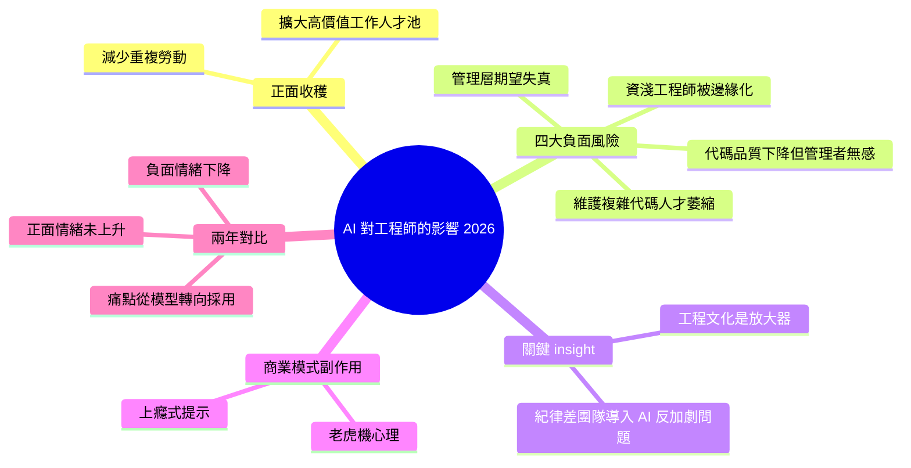

## AI’s impact on software engineers in 2026: key trends, Part 2

Pragmatic Engineer 對 900+ 工程師進行 AI 工具採用調查（第 2 部分），揭示企業級 AI 採用的核心困境。正面收穫：減少重複勞動、擴大高價值工作人才池；負面風險：(1) 管理層期望不切實際，(2) 代碼品質傾向下降但管理者多數無感，(3) 維護複雜代碼的工程師人數萎縮，(4) 資淺工程師被邊緣化（token 花費高、收益低）。調查發現 AI 收益高度依賴「既有的工程文化」——缺乏紀律的團隊採用 AI 反而加劇問題。另一現象：AI 工具定價設計導致「上癮式」提示行為（如老虎機般「再試一次」）。相比 2024，2026 年工程師對 AI 的負面情緒減少但正面情緒未顯著增加，模型品質提升但採用困難依舊。

### 重點
- AI 採用的文化依賴性：benefits 不是「有 AI 就有」，而是取決於既有的代碼紀律、架構成熟度、審查文化（>900 人調查）
- 代碼品質惡化 + 人力集中化：少數理解複雜代碼的工程師承載維護負擔，技術債累積風險升高
- 成本與收益不對稱分佈：資淺工程師 token 花費最多，收益最小；設計不當的定價鼓勵過度提示

**原文：** [substack-pragmatic-engineer](https://newsletter.pragmaticengineer.com/p/ai-impact-on-software-engineers-part-2)

---

<!-- deep-analysis:begin -->
## 📌 摘要 (TL;DR)

- Pragmatic Engineer 對 900+ 工程師進行 AI 工具採用調查的**第 2 部分**，聚焦企業級導入 AI 的權衡與困境。
- 正面收穫：減少重複勞動、擴大「高價值工作」可勝任的人才池。
- 四大負面風險：管理層期望失真、代碼品質下降但管理者多無感、能維護複雜代碼的工程師人數萎縮、資淺工程師被邊緣化。
- 關鍵 insight：**AI 收益高度依賴既有工程文化**——紀律差的團隊導入 AI 反而放大問題。
- AI 工具定價設計引發類似老虎機的「上癮式提示」行為（再試一次心態）。
- 對比 2024，2026 年工程師對 AI 的負面情緒減少，但正面情緒**並未顯著上升**：模型變強，採用障礙依舊。

## 🎯 核心概念

- **既有工程文化（existing engineering culture）**：團隊在導入 AI 前的紀律水準（code review、測試覆蓋、規範一致性）是 AI 是否帶來淨收益的決定因子。
- **上癮式提示（addictive prompting）**：AI 工具按 token / 次數計費的設計，誘發使用者反覆「再試一次」的賭博式行為。
- **資淺工程師邊緣化（junior marginalization）**：資淺者用 AI 花費 token 高、產出收益低，被排擠出 AI-heavy 工作流。

## 📖 整理分析

### 1. 正面收穫：減重複、擴池子

AI 工具在組織內帶來兩個被普遍認可的價值。第一是減少重複性勞動——boilerplate、模板代碼、例行修改不再需要工程師逐字敲。第二是擴大「高價值工作」的可勝任人才池：原本需要資深者才能處理的任務，現在中階工程師借助 AI 也能切入。這兩點是調查中工程師最有共識的收益面。

### 2. 管理層期望失真

第一大負面風險是高層對 AI 產能的預期與現場落差過大。管理者看到 demo 與行銷材料，以為導入 AI 後產出可以倍增，實際工程師體感是「能省一些事，但離自動化交付還遠」。期望落差導致排程壓縮、估時被砍，反而傷害交付品質。

### 3. 代碼品質下降——但管理者沒感覺

第二個風險更隱蔽：工程師反映 AI 生成的代碼讓 codebase 品質**傾向下降**（一致性差、抽象不當、隱性 bug 增加），但管理層多數**沒有察覺**。原因是品質劣化往往延遲顯現於維護階段，而 dashboard 看到的是 PR 數、commit 數上升。短期指標好看，長期債務在累積。

### 4. 維護人才萎縮 + 資淺被邊緣

第三與第四個風險互相強化。能讀懂並維護複雜舊代碼的工程師人數正在縮小——年輕世代直接從 AI 輔助開始，缺少從零理解大型 codebase 的訓練。同時資淺工程師在 AI-heavy 流程裡處於劣勢：他們用 AI 消耗的 token 多、產出可信度低，主管傾向把任務交給更熟練的中高階。結果是資淺者得不到鍛鍊機會，未來能接手複雜維護的人更少，形成負循環。

### 5. 工程文化是放大器，不是平衡器

調查最重要的結論之一：AI 不會把弱團隊拉到強團隊水準，反而把既有差距放大。有 review 紀律、有測試覆蓋、有規範的團隊，導入 AI 後產出與品質同步提升；缺乏紀律的團隊導入 AI，垃圾代碼產出速度同步提升。AI 是放大器，不是平衡器。

### 6. 上癮式提示與兩年情緒對比

AI 工具的訂閱／用量計費設計，讓使用者陷入「再試一次說不定就對了」的老虎機心理。這不是 bug 而是商業模式的副作用。對比 2024 年第一次調查，2026 年模型能力顯著進步，工程師的**負面情緒下降**，但**正面情緒沒有對應上升**——意味著痛點換了位置（從「模型不夠強」變成「組織採用困難」），整體滿意度並未起飛。

## 🧠 Mindmap

<!-- deep-analysis:end -->
### 📄 原文內容

點此展開 / 收合

Tradeoffs of AI tooling, why adopting AI at company-level is hard, what&#8217;s changed in two years, and more. The third and final part of a series analyzing our 2026 AI survey results

