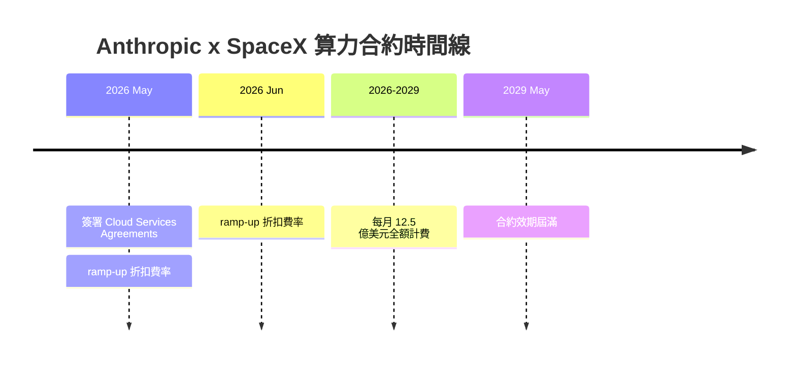
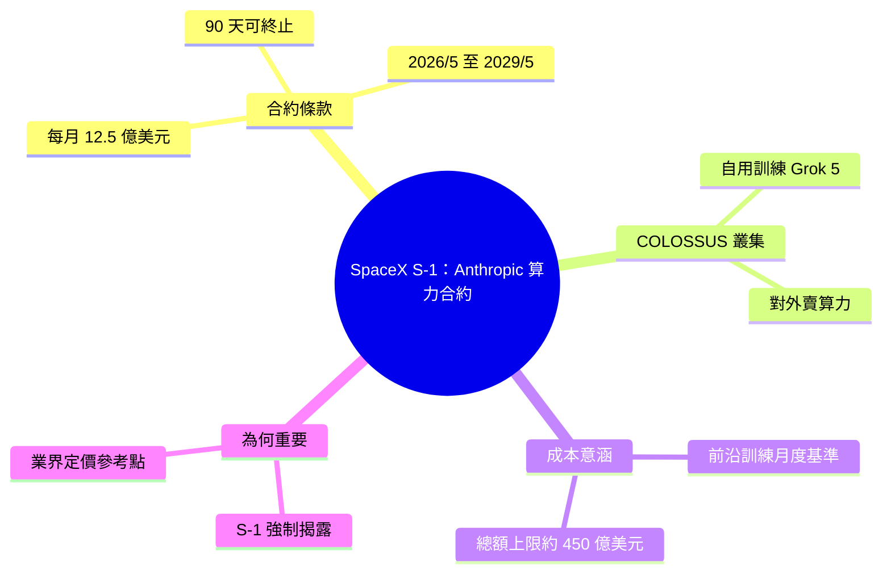

## Quoting SpaceX S-1

SpaceX S-1 IPO 申報書首度公開 Anthropic 與其雲端運算合作細節。Anthropic 租用 SpaceX COLOSSUS 與 COLOSSUS II 計算資源，月費 $1.25 億，自 2026 年 5 月起至 2029 年 5 月止（共 36 個月）；5–6 月 ramp-up 階段費率減免，任一方可 90 天內終止合約。SpaceX 同時用 COLOSSUS II 訓練 Grok 5，並向第三方客戶販售計算容量。此合約透露前沿 LLM 訓練的月度成本基準：$1.25 億可支撐 3.5 年規模訓練，為業界定價參考。Anthropic 計算需求已達業界頂級規模，超大規模模型訓練成本已成為融資與營運的決定性因素。

### 重點
- Anthropic × SpaceX 雲服務協議：$1.25 億/月，共 36 個月（2026/5–2029/5）
- SpaceX COLOSSUS II 並用於 Grok 5 訓練與對外商業租賃，展示基礎設施複用策略
- 月度 $1.25 億的成本數據點反映前沿 AI 訓練的經濟規模與資本密集度

**原文：** [simon-willison](https://simonwillison.net/2026/May/20/spacex-s1/#atom-everything)

---

<!-- deep-analysis:begin -->
## 📌 摘要 (TL;DR)

- SpaceX 在 IPO 用的公開說明書（S-1）中揭露：2026 年 5 月與 Anthropic PBC 簽署多份雲端服務協議（Cloud Services Agreement），租用 COLOSSUS 與 COLOSSUS II 運算容量。
- 金額為每月 12.5 億美元（$1.25 billion / month），效期至 2029 年 5 月，自 2026 年 5 月起算約 36 個月。
- 2026 年 5、6 月屬產能爬坡（ramp-up）期，採折扣費率；合約允許任一方提前 90 天通知終止。
- 同一份 S-1 也說明 SpaceX 用 COLOSSUS II 訓練自家 AI 應用 Grok 5，並對第三方客戶出售算力。
- Simon Willison 標註的重點：前沿大型語言模型（LLM）訓練成本幾乎從不公開，這份受法規強制揭露的 S-1 意外提供了月度算力定價基準。

## 🎯 核心概念

- **公開說明書（S-1）**：美國公司首次公開發行（IPO）前向 SEC 申報的註冊文件，必須揭露財務狀況與重大合約。
- **雲端服務協議（Cloud Services Agreement）**：此處指算力租賃合約，客戶付費換取運算容量。
- **COLOSSUS / COLOSSUS II**：S-1 中歸於 SpaceX 的運算叢集，COLOSSUS II 正用於訓練 Grok 5。
- **公益公司（public benefit corporation，PBC）**：Anthropic 的法人型態，S-1 中以全名「Anthropic PBC」指稱。
- **產能爬坡（ramp-up）**：新算力上線初期逐步擴張的階段，此合約在此期間給折扣費率。

## 📖 整理分析

### 1. S-1 揭露 SpaceX 的算力生意
文件原文寫明：SpaceX 既用運算資源支援自家 AI 應用（如正於 COLOSSUS II 訓練的 Grok 5），也把部分算力賣給第三方客戶。換言之，這份 S-1 把「對外出售算力」正式列為 SpaceX 的營收來源之一，而 Anthropic 合約就是引用的具體案例。

### 2. Anthropic 合約條款拆解
合約於 2026 年 5 月簽署，標的為 COLOSSUS 與 COLOSSUS II 的運算容量。客戶 Anthropic 同意每月支付 12.5 億美元，付到 2029 年 5 月。2026 年 5、6 兩個月因產能仍在 ramp-up，採折扣費率。合約附帶彈性條款：任一方提前 90 天通知即可終止。

### 3. 每月 12.5 億美元代表的成本量級
以 2026 年 5 月至 2029 年 5 月約 36 個月計，合約總額上限約 450 億美元（扣除 ramp-up 折扣後略低）。這是極罕見、可被外部驗證的前沿模型算力價格——過去這類數字多半藏在私募融資新聞稿裡，難以查證；這次因 SEC 申報義務而被動曝光。

### 4. 90 天終止條款的意義
對一份橫跨三年、金額達數百億美元的合約，90 天就能單方退出算相當短。（以下為推論）這反映算力市場仍在劇烈變動：雙方都不願被長約鎖死費率，保留隨硬體世代與模型需求調整的空間。

### 5. 為什麼這則引用值得讀
Simon Willison 以「Quoting」形式轉錄全段，並把 Anthropic 部分特別加粗。重點不在 SpaceX 本身，而在於：IPO 申報受 SEC 規範、必須據實揭露重大合約，於是一個平時被嚴密保密的數字——前沿 LLM 訓練的月度算力開銷——被動曝光，成為整個產業的定價參照點。

值得注意的是，這份 S-1 把 Grok 5 與 COLOSSUS 直接歸為 SpaceX 自家資產與產品（原文用 "our proprietary AI applications"），而 Grok 一般被視為 xAI 的產品；文件本身如此記載，背後的公司結構關係在這段引文中未進一步說明。

## 🧭 流程圖 / 架構圖

（任一時點：任一方皆可提前 90 天通知終止）

## 🧠 Mindmap

<!-- deep-analysis:end -->
### 📄 原文內容

點此展開 / 收合

We have the ability to use compute resources to support our proprietary AI applications (such as Grok 5, which is currently being trained at COLOSSUS II), while also providing access to select compute capacity to third-party customers. For example, in May 2026, we entered into Cloud Services Agreements with Anthropic PBC (“Anthropic”), an AI research and development public benefit corporation, with respect to access to compute capacity across COLOSSUS and COLOSSUS II . Pursuant to these agreements, the customer has agreed to pay us $1.25 billion per month through May 2029, with capacity ramping in May and June 2026 at a reduced fee. The agreements may be terminated by either party upon 90 days’ notice. 
 &mdash; SpaceX S-1 , highlights mine 

 Tags: anthropic , grok , generative-ai , ai , llms

