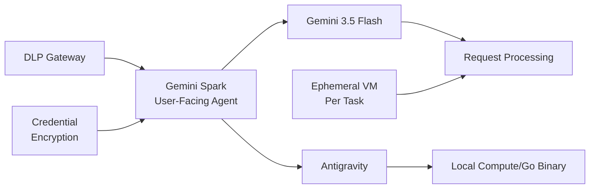

## Google I/O, Gemini Spark, Antigravity

Google I/O 2026 發表多項 AI 新功能，核心亮點為 Gemini Spark：個人 AI agent，可原生連接 Gmail、Calendar、Drive、Docs、Sheets、Slides、YouTube、Google Maps。Spark 運行在 Gemini 3.5 Flash 與 Antigravity 混合架構上，每次任務在獨立的 ephemeral VM 執行，所有流量經 DLP 網關篩選、用戶憑證全程加密、跨 session 數據隔離，實現企業級防護。重要變動為 Gemini CLI（Apache 2.0 開源 TypeScript）於 6 月 18 日停用，被閉源 Antigravity CLI（Go 實現）接替，標誌工具棧向更緊密整合轉變。Spark 尚未全量開放，安全性評估將成為企業採用的決定因素。

### 重點
- Gemini Spark：個人 AI agent，原生整合 Google Workspace + YouTube + Maps，混合 Gemini 3.5 Flash + Antigravity 架構
- 安全設計：per-task ephemeral VM、DLP 網關、憑證加密，防止跨 session 洩露
- CLI 遷移：Gemini CLI（TS, Apache 2.0）→ Antigravity CLI（Go, 閉源），6/18 截止日期

**原文：** [simon-willison](https://simonwillison.net/2026/May/20/google-io/#atom-everything)

---

### 📄 原文內容

點此展開 / 收合

It's hard to find much to write about Google I/O this year because I have a policy of not writing about anything that I can't try out myself, and a lot of the big announcements are "coming soon". 
 I actually prefer to write about things that are in general availability, because I've had instances in the past where the previews didn't match what was released to the general public later on. 
 Aside from Gemini 3.5 Flash the most interesting announcement looks to be Google's upcoming OpenClaw competitor Gemini Spark , described as "your personal AI agent" which can "connect natively with your favorite Google apps like Gmail, Calendar, Drive, Docs, Sheets, Slides, YouTube, and Google Maps". The FAQ for that also includes this confusing detail: 
 
 What Gemini model does Gemini Spark run on? 
 Gemini Spark runs on Gemini 3.5 Flash and Antigravity. 
 
 The antigravity.google website currently lists Antigravity as a desktop app, a CLI agent tool (written in Go), the Antigravity SDK (an open source Python wrapper around a bundled closed source Go binary), and the original Antigravity IDE (a VS Code fork). 
 I guess Gemini Spark, the user-facing hosted agent product, might be running on that Go binary, but I'm not sure why that's worth mentioning in the FAQ! 
 Naturally I went looking for notes on how Gemini Spark intends to handle the risk of prompt injection. The best information I could find on that was in the Everything Google Cloud customers need to know coming out of Google I/O post aimed at enterprise customers, which includes: 
 
 Spark operates in a fully managed, secure runtime on Google Cloud, meaning you get enterprise-grade security without ever having to manage the underlying infrastructure. Every task executes in a fresh, strictly isolated, ephemeral VM to help ensure data never overlaps between sessions. To protect your enterprise, all traffic routes through our secure Agent Gateway that enforces Data Loss Prevention (DLP) policies, while user credentials remain fully encrypted and are never exposed directly to the agent. 
 
 Given how many people are going to be piping very sensitive data through Gemini Spark in the near future I hope they've made this bullet-proof, or this could be a top candidate for the agent security challenger disaster that we still haven't seen. 
 Also of note: in Transitioning Gemini CLI to Antigravity CLI Google announce that the open source Gemini CLI tool (Apache 2.0 licensed TypeScript) will stop working with their AI subscription plans on June 18th, replaced by the new closed source Antigravity CLI . 

 Tags: gemini , google , generative-ai , ai , google-io , llms , prompt-injection

