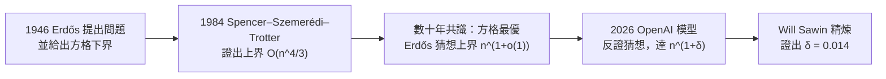
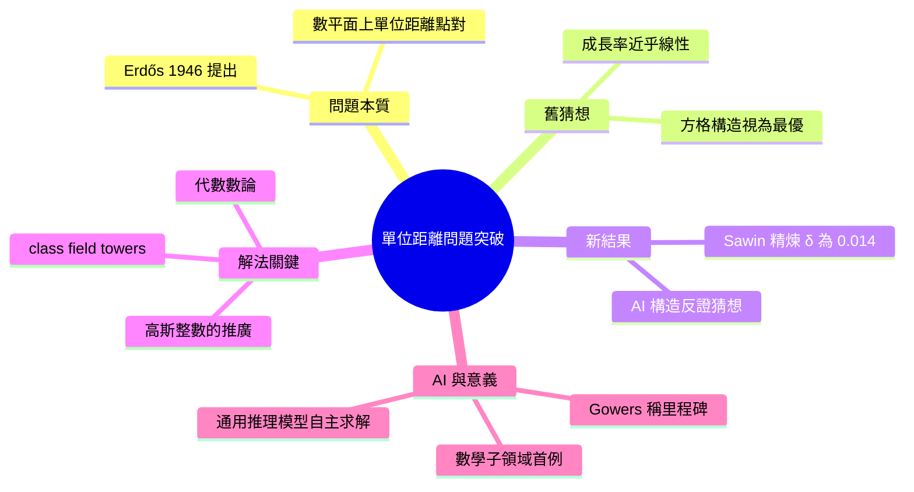

## An OpenAI model has disproved a central conjecture in discrete geometry

OpenAI 的模型成功解決了延續 80 年的單位距離問題（unit distance problem），一個離散幾何學領域的根本性難題；此解決推翻了該領域的中心猜想；這標誌著 AI 在理論數學研究中的重大里程碑，展示了大型模型在傳統人類難以突破的基礎研究領域的突破潛力；此成果可能激發 AI 在其他數學領域的應用探索；但公告未披露具體模型版本或解法技術細節，難以深入理解其突破機制。

### 重點
- 模型解決了 80 年懸而未決的單位距離問題
- 推翻離散幾何的中心猜想，標誌重大數學突破
- AI 在理論數學領域的突破能力里程碑

**原文：** [openai-blog](https://openai.com/index/model-disproves-discrete-geometry-conjecture)

---

<!-- deep-analysis:begin -->
## 📌 摘要 (TL;DR)

- OpenAI 一個內部模型反證了單位距離問題（unit distance problem）的中心猜想——此問題由 Paul Erdős 於 1946 年提出，懸而未決近 80 年，被 2005 年《Research Problems in Discrete Geometry》一書稱為「組合幾何中最知名、也最容易解釋的問題」。
- 數十年共識認為「縮放方格」構造（rescaled square grid，成長率 n^(1+C/log log n)）已接近最優，Erdős 因此猜想上界為 n^(1+o(1))；新證明建構出無窮多組點配置，單位距離點對達 n^(1+δ)（δ 為固定正數），直接推翻此猜想。
- 原始 AI 證明未給出明確的 δ；Princeton 數學教授 Will Sawin 後續精煉，證明可取 δ = 0.014。
- 解法出乎意料：用代數數論（algebraic number theory）——包含 infinite class field towers 與 Golod–Shafarevich theory——攻一個初等的歐氏平面幾何問題。
- 解題模型是通用推理模型（general-purpose reasoning model），並非數學專用系統、也未針對此問題做 scaffold；OpenAI 稱這是 AI 首次自主解決某數學子領域核心的著名開放問題。
- Fields 獎得主 Tim Gowers 在配套論文中稱此結果為「AI 數學的里程碑」。

## 🎯 核心概念

- **單位距離問題**（unit distance problem）：平面上放 n 個點，問相距恰好為 1 的點對最多有幾組。
- **離散幾何 / 組合幾何**（discrete geometry / combinatorial geometry）：研究點、線等離散物件組合性質的數學分支。
- **代數數論**（algebraic number theory）：研究整數在「代數數體」（algebraic number fields）中如何分解的領域。
- **高斯整數**（Gaussian integers）：形如 a+bi 的數，是 Erdős 原始下界的基礎，新證明以其更複雜的推廣取代它。
- **測試時計算**（test-time compute）：模型在推理階段投入的運算量；OpenAI 測量了解題成功率隨其增加的變化。

## 📖 整理分析

### 1. 一個 80 年的簡單難題

設 u(n) 為平面上 n 個點能產生的單位距離點對最大數量。簡單構造只能達到接近線性的成長：n 點排成一線給出 n−1 對，方格給出約 2n 對。最好的已知構造來自縮放方格，給出 n^(1+C/log log n)；由於 log log n 隨 n 趨於無窮，指數上的附加項趨近 0，成長率僅略快於線性。Erdős 甚至為此問題設了獎金，Noga Alon 形容它是「Erdős 最愛的問題之一」。

### 2. 被推翻的猜想

幾十年來學界相信縮放方格本質上已是最優，Erdős 據此猜想上界為 n^(1+o(1))，o(1) 表示隨 n 趨於 0 的項。OpenAI 的模型反證了它：對無窮多個 n，新證明能構造出至少有 n^(1+δ) 個單位距離點對的配置，δ 是固定的正數。對照之下，下界自 Erdős 1946 年的構造起幾乎沒動過，上界 O(n^(4/3)) 也自 Spencer、Szemerédi、Trotter 1984 年的工作以來基本不變——這讓突破格外令人意外。

### 3. 解法：代數數論進入幾何

證明從一個熟悉的幾何想法出發，再推往意想不到的方向。Erdős 的原始下界可透過高斯整數理解；新論證以代數數論中更複雜、對稱性更豐富的數體推廣取代高斯整數，藉此製造出更多單位長度的差。為了證明所需數體確實存在，證明動用了 infinite class field towers 與 Golod–Shafarevich theory。這些概念對代數數論學者並不陌生，但它們竟對歐氏平面的幾何問題有意義，令人驚訝。

### 4. 它是怎麼被找到的

OpenAI 強調這個結果的「發現方式」同樣值得注意：證明來自一個全新的通用推理模型，而非為數學特訓、為搜尋證明策略而 scaffold、或專門針對單位距離問題的系統。OpenAI 在一組 Erdős 問題上評估該模型，模型在此題上產出了解決開放問題的證明，團隊並測量了模型在不同 test-time compute 下的成功率。證明由一組外部數學家檢查，他們另寫了配套論文補充背景與意義。

### 5. 對數學與 AI 的意義

數論學者 Arul Shankar 認為，這篇論文顯示當前 AI 模型「已不只是人類數學家的助手——它們能產生原創而巧妙的想法，並貫徹到底」。Thomas Bloom 在配套筆記中給出「有保留的肯定」：這顯示數論構造對這類問題的貢獻遠比預期多，且所需數論可以非常深，他預期未來數月會有代數數論學者重新審視離散幾何的其他開放問題。OpenAI 則把意義延伸到數學之外——能維持長串連貫推理、跨領域連結概念的能力，對生物、物理、材料及 AI 研究本身同樣有用。

## 🧭 進展時間線

原文附有一張「縮放方格構造」示意圖與一張「成功率 vs test-time compute」曲線圖，但網頁未提供可直接引用的圖片網址。問題的下界與上界進展可整理如下：

## 🧠 Mindmap

<!-- deep-analysis:end -->
### 📄 原文內容

點此展開 / 收合

An OpenAI model solved the 80-year-old unit distance problem, disproving a major conjecture in discrete geometry and marking a milestone in AI-driven mathematics.

