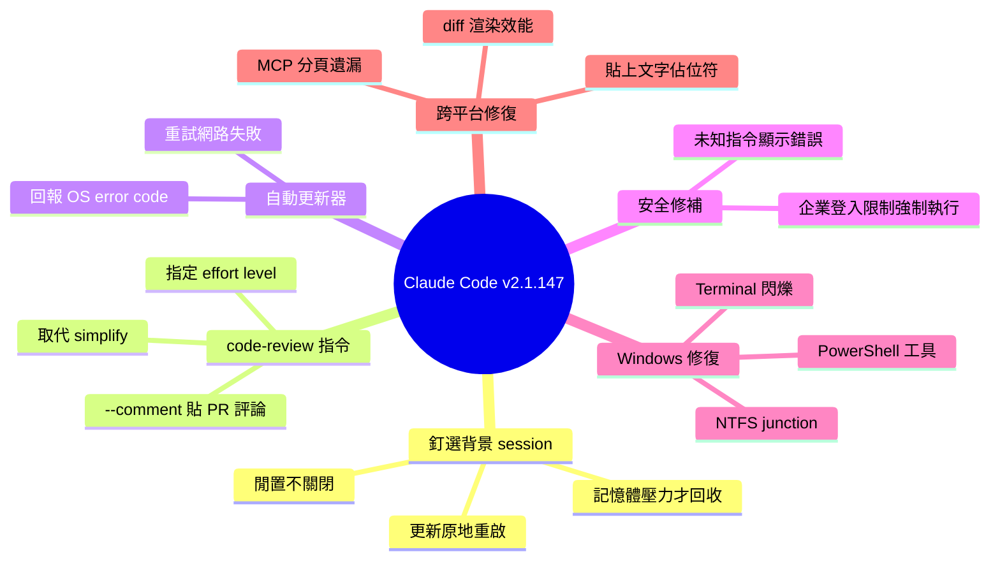

## v2.1.147

Claude Code v2.1.147 發布，帶來大量改進和修復。釘選背景 sessions 現保持存活並在更新時原地重啟，只在記憶體壓力下移除。/simplify 改名為 /code-review，可指定 effort level 報告正確性 bug，支持直接貼 GitHub PR 評論。自動更新器增強了重試邏輯和錯誤報告。修復範圍廣泛超過二十項，涵蓋 enterprise login restrictions、Shell snapshot、PowerShell 工具、UI 佈局、粘貼文本、MCP servers、Windows Terminal strobing 等跨平台相容性問題。

### 重點
- /code-review 新命令（取代 /simplify）支援 effort level 和 GitHub PR inline comments，可直接整合代碼審查工作流
- 釘選背景 sessions 持久化邏輯優化，優先保護用戶交互會話，降低記憶體壓力下上下文遺失風險
- 二十多項修復涵蓋跨平台（Windows/Linux/macOS）terminal 相容性、shell scripting、plugin 系統和 MCP 伺服器

**原文：** [claude-code-releases](https://github.com/anthropics/claude-code/releases/tag/v2.1.147)

---

<!-- deep-analysis:begin -->
## 📌 摘要 (TL;DR)

- Claude Code v2.1.147 發布，含三項主要改進與超過 25 項跨平台修復，是一次以穩定性為主的維護更新。
- 釘選背景 session（pinned background session，在 claude agents 介面按 Ctrl+T）現在閒置時不會被關閉，套用更新時原地重啟，僅在記憶體壓力下、且優先回收非釘選 session 後才被移除。
- `/simplify` 改名為 `/code-review`，行為改為依指定 effort level 回報正確性 bug（例：`/code-review high`），加 `--comment` 可把發現直接貼成 GitHub PR inline 評論；舊的 cleanup-and-fix 行為已移除。
- 自動更新器（auto-updater）強化：重試暫時性網路失敗、失敗時回報具體錯誤類別與 OS error code，並顯示目前版本。
- 修補一個企業安全漏洞：企業登入限制（forceLoginOrgUUID、forceLoginMethod）先前未對第三方供應商與 API-key session 強制執行。
- Windows 是本次修復重災區：PowerShell 工具、Windows Terminal 閃爍、NTFS junction、CJK 字元顯示等問題一併處理。

## 🎯 核心概念

- **釘選背景 session**（pinned background session）：在 claude agents 介面用 Ctrl+T 釘住的背景工作，生命週期受保護，不再因閒置或更新被中斷。
- **effort level**：`/code-review` 的力度參數，控制檢查的深入程度（如 `high`）。
- **managed-settings**：企業端強制套用的設定，本次涉及 `forceLoginOrgUUID`（限定登入組織）與 `forceLoginMethod`（限定登入方式）。
- **shell snapshot**：Claude Code 啟動時擷取使用者 shell 環境（函式、alias）的快照，供工具呼叫沿用。
- **NTFS junction**：Windows 檔案系統的目錄連結，類似 symlink，本次修復清理背景工作 worktree 時誤穿越 junction 進入主 repo 的問題。

## 📖 整理分析

### 1. 釘選背景 session 生命週期改寫
本版改寫了釘選背景 session 的生命週期規則。先前釘選的背景工作可能因閒置或更新而中斷；現在它們閒置時保持存活，套用 Claude Code 更新時以「原地重啟」方式延續，並且只有在記憶體壓力下、系統已先回收完所有非釘選 session 之後，才會被移除。等於把使用者明確釘選的工作視為最高優先級資源。

### 2. /simplify 退場、/code-review 上場
`/simplify` 指令更名為 `/code-review`，且功能定位整個換掉。舊版的「清理並修正」（cleanup-and-fix）行為已移除；新指令專注於回報正確性 bug，可帶 effort level 參數調整檢查深度（例：`/code-review high`）。加上 `--comment` 旗標時，檢查發現會以 inline 評論形式直接貼回 GitHub PR。此外現在也支援直接貼上 GitHub PR 評論作為輸入。

### 3. 自動更新器與互動體驗改進
自動更新器加入重試邏輯，會重試暫時性網路失敗；失敗時不再只給籠統訊息，而是回報具體錯誤類別與作業系統 error code，並顯示目前所在版本，方便診斷。其他體驗面：大型檔案編輯的 diff 渲染效能提升；prompt 歷史不再記錄連續重複項目——用方向鍵叫回一個 prompt 再送出，不會再多存一份副本。

### 4. 企業登入限制漏洞修補（安全相關）
本版修補一個企業安全缺口：managed-settings 中的 `forceLoginOrgUUID` 與 `forceLoginMethod` 兩項登入限制，先前未對第三方供應商（third-party-provider）session 與 API-key session 強制執行。修補後這些限制會對所有 session 類型生效，避免企業政策被繞過。同類修補還包括：headless/SDK 模式下未知 slash command 先前靜默無作用，現在會顯示錯誤訊息。

### 5. Windows 與跨平台密集修復
Windows 修復數量最多：PowerShell 工具在 `pwsh` 經 winget 或 Microsoft Store 安裝時以 exit code 1 失敗、丟失依賴預設格式器的指令輸出、hook 的 `PowerShell(git push*)` 條件永遠不匹配（先前只有 `PowerShell(*)` 有效）、「Yes, and don't ask again」寫出的規則實際不匹配後續執行——皆已修正。另外修復 Windows Terminal 串流時的全螢幕閃爍、移除背景工作 worktree 時誤穿越 NTFS junction、agent 清單因 CJK 寬字元出現重複/殘留列。跨平台修復還涵蓋：`!` 指令輸出中的 `&` 被誤顯示為 `&amp;`（破壞 `gcloud auth login` 等 URL 複製貼上）、MCP server 分頁時第 1 頁之後遺失 resources/templates/prompts、貼上的文字被當成 `[Pasted text #N]` 佔位符而非實際內容、`/help` 在小終端機的破版、GNOME Terminal 右鍵與中鍵貼上失效等。

## 🧠 Mindmap

<!-- deep-analysis:end -->
### 📄 原文內容

點此展開 / 收合

What's changed 
 
 Pinned background sessions ( Ctrl+T in claude agents ) now stay alive when idle, are restarted in place to apply Claude Code updates, and are shed under memory pressure only after non-pinned sessions 
 Renamed /simplify to /code-review . It now reports correctness bugs at a chosen effort level (e.g., /code-review high ); pass --comment to post findings as inline GitHub PR comments. The old cleanup-and-fix behavior has been removed 
 Improved auto-updater: retries transient network failures, reports specific error categories and OS error codes on failure, and shows the current version when an update fails 
 Improved diff rendering performance for large file edits 
 Prompt history no longer records consecutive duplicate entries — recalling a prompt with arrow-up and submitting it again won't add another copy 
 Fixed enterprise login restrictions ( forceLoginOrgUUID and forceLoginMethod managed-settings) not being enforced against third-party-provider and API-key sessions 
 Fixed &amp; in ! command output displaying as &amp;amp; , which broke copy-pasting URLs from commands like gcloud auth login on headless machines 
 Fixed unknown slash commands silently doing nothing in headless/SDK mode — they now show an error message 
 Fixed /help rendering a broken tab header and showing only one command per page on small terminals when not in fullscreen mode 
 Fixed shell snapshot dropping user functions whose names start with a single underscore, which broke aliases referencing them 
 Fixed plugin agents that declare multiple Agent(...) types in tools: frontmatter dropping all but the last entry 
 Fixed hook if conditions like PowerShell(git push*) never matching — only PowerShell(*) worked 
 Fixed PowerShell tool dropping output for commands that rely on the default formatter 
 Fixed: on Windows, "Yes, and don't ask again" for a PowerShell script invocation now writes a rule that actually matches on subsequent runs 
 Fixed PowerShell tool failing on Windows with exit code 1 when pwsh is installed via winget or the Microsoft Store 
 Fixed /effort opening with the slider on the wrong level — it now starts at your current effort 
 Fixed paginating MCP servers dropping resources, templates, and prompts past page 1 
 Fixed full-screen strobing in attached background sessions on Windows Terminal while Claude is streaming 
 Fixed: on Windows, removing a background-job worktree no longer follows NTFS junctions into the main repo 
 Fixed /background refusing sessions whose only typed input was a skill or custom slash command 
 Fixed auto mode suppressing AskUserQuestion when the user or a skill explicitly relies on it; the auto-mode classifier now sees the user's answers as intent signal 
 Fixed /theme "New custom theme" and color editor dialogs not responding to Esc 
 Fixed an uncaught exception at the end of streaming sessions when running via the Agent SDK 
 Fixed a rare hang when waiting for scroll to settle on Windows 
 Fixed stale and doubled rows in the agent view list on Windows when background session results contain wide (CJK) characters 
 Fixed pasted text being delivered to agents as an unreadable [Pasted text #N] placeholder instead of the actual content 
 Fixed plugin component counts in claude plugin details and /plugin being doubled when a plugin's manifest listed paths overlapping its default directories 
 Fixed backgrounded sessions re-prompting for tool permissions you already granted with "don't ask again" 
 Fixed GNOME Terminal right-click and middle-click paste not inserting text 
 Fixed CLAUDE_CODE_SUBAGENT_MODEL not applying to teammate processes spawned by agent teams 
 Fixed slash commands followed by a tab or newline being treated as an unknown command 
 Fixed several spacing and layout glitches in the /plugin , /status , /mobile , /sandbox , and /permissions menus 
 Fixed stripped images prompting the model to repeatedly re-read media that was no longer present

