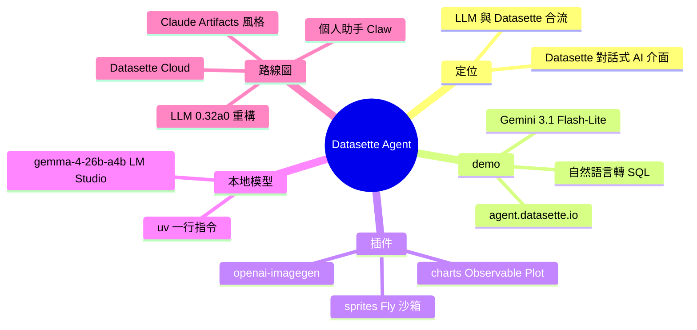

## Datasette Agent

Simon Willison 宣佈 Datasette Agent 首個版本發布，為 Datasette 提供 AI 對話式查詢介面。demo 在 agent.datasette.io 運行，採用 Gemini 3.1 Flash-Lite 後端。用戶可用自然語言提問（如「when did Simon most recently see a pelican?」），系統自動生成 SQLite 查詢執行並返回結構化答案。已發布三個初始插件：datasette-agent-charts（Observable Plot 圖表）、datasette-agent-openai-imagegen（ChatGPT 圖像生成）、datasette-agent-sprites（Fly Sprites sandbox）。支持本地模型部署（示例用 gemma-4-26b-a4b），計畫擴展至 LLM library refactor、Claude Artifacts 風格功能、個人 AI 助手（Claw）和 Datasette Cloud 整合。

### 重點
- Agent 架構強調可擴展性，用 plugin 系統實現功能模組化（圖表、圖像、沙箱），降低核心複雜度且開放第三方貢獻
- 自然語言 SQL 生成成為核心能力，Gemini 3.1 Flash-Lite 和開源模型（如 gemma-4-26b）近六個月已證明可靠生成複雜查詢，成本低廉
- 示範跨 LLM 生態相容性（Gemini、本地模型、Claude Code 寫插件），展示 foundation models 成熟度足以替換人工 SQL 編寫工作

**原文：** [simon-willison](https://simonwillison.net/2026/May/21/datasette-agent/#atom-everything)

---

<!-- deep-analysis:begin -->
## 📌 摘要 (TL;DR)

- Simon Willison 發布 Datasette Agent 首個版本，為 Datasette 加上對話式 AI 查詢介面；他形容這是耕耘三年多的 LLM Python library 與 Datasette 終於合流的時刻。
- 線上 demo 在 agent.datasette.io 運行，後端用 Gemini 3.1 Flash-Lite — 便宜、快、寫 SQLite 查詢無壓力。
- 使用者用自然語言提問（如「when did Simon most recently see a pelican?」），系統自動生成 SQLite SQL、執行並回傳結構化答案。
- 首發三個插件：datasette-agent-charts（Observable Plot 圖表）、datasette-agent-openai-imagegen（ChatGPT Images 2.0 圖像生成）、datasette-agent-sprites（Fly Sprites 沙箱執行程式碼）。
- 可用一行 uv 指令在 LM Studio 跑本地模型（範例 gemma-4-26b-a4b）；下一步含 LLM 0.32a0 重構、Claude Artifacts 風格插件、個人助手 Claw、Datasette Cloud 整合。

## 🎯 核心概念

- **Datasette**：Simon Willison 開發的開源工具，用於探索與發布 SQLite 資料庫。
- **Datasette Agent**：架在 Datasette 上的可擴充 AI 助理（extensible AI assistant），提供對話式資料查詢。
- **插件架構**（plugin architecture）：Datasette Agent 沿用 Datasette 的可擴充設計，功能全靠插件加掛。
- **Fly Sprites**：Fly.io 的持久化沙箱（persistent sandbox），可在隔離環境執行程式碼。
- **Observable Plot**：JavaScript 視覺化函式庫，datasette-agent-charts 用它畫圖。

## 📖 整理分析

### 1. LLM 與 Datasette 終於合流

Simon Willison 開發 LLM Python library 已三年多，他視 Datasette Agent 為兩者結合的關鍵點。它替 Datasette 內儲存的資料提供對話式查詢介面；再掛上 datasette-agent-charts，就能直接生成資料圖表。

### 2. demo 怎麼運作

線上 demo agent.datasette.io 跑在範例資料庫上，包括 WRI 的 global-power-plants 與他部落格的 Datasette backup，後端用 Gemini 3.1 Flash-Lite。demo 問題「when did Simon most recently see a pelican?」被翻成一段 SQL：對 `blog_beat` 表篩 `beat_type='sighting'` 且 `title`／`commentary` LIKE `%pelican%`，依 `created` 倒序取 5 筆。回答：最近一次是 2026 年 5 月 20 日，看到 California Brown Pelican，同場還有 Common Loon、Canada Goose、Striped Shore Crab、California Sea Lion。

### 3. 三個首發插件

- **datasette-agent-charts**：用 Observable Plot 加圖表能力（demo 影片展示）。
- **datasette-agent-openai-imagegen**：用 ChatGPT Images 2.0 加圖像生成工具。
- **datasette-agent-sprites**：提供在 Fly Sprites 持久沙箱執行程式碼的工具。

Simon 說寫插件很有趣，手上還有一堆未到 alpha 品質的原型。他指出 Claude Code 與 OpenAI Codex 都很擅長寫插件 — 只要指向 datasette-agent repo 的 checkout 當參考、再說明要做什麼即可。

### 4. 本地模型也能跑

他提供一行 uv 指令，在 Mac 的 LM Studio 跑 gemma-4-26b-a4b。Datasette Agent 對模型的硬需求是：可靠的工具呼叫（tool calls），以及能產生可對 SQLite 實際執行的 SQL。Simon 觀察到過去六個月釋出的開放權重模型（open weight models）越來越能勝任這兩件事。

### 5. 下一步路線圖

這次發布已影響即將定版的 LLM 0.32a0 重構，可能從 Datasette Agent 本身抽出「LLM agent」抽象層。Simon 也在做 Claude Artifacts 風格的插件、想用它打造個人 AI 助手 Claw（藉機重訪舊的 Dogsheep 工具系列），並會將 Datasette Agent 推給 Datasette Cloud 用戶。專案討論在 #datasette-agent Discord 頻道。

## 🧭 流程圖

## 🧠 Mindmap

<!-- deep-analysis:end -->
### 📄 原文內容

點此展開 / 收合

We just announced the first release of Datasette Agent , a new extensible AI assistant for Datasette. I've been working on my LLM Python library for just over three years now, and Datasette Agent represents the moment that LLM and Datasette finally come together. I'm really excited about it! 
 Datasette Agent provides a conversational interface for asking questions of the data you have stored in Datasette. Add the datasette-agent-charts plugin and it can generate charts of your data as well. 
 The demo 
 The announcement post (on the new Datasette project blog) includes this demo video : 

 

 I recorded the video against the new agent.datasette.io live demo instance, which runs Datasette Agent against example databases including the classic global-power-plants by WRI , and a copy of the Datasette backup of my blog. 
 The live demo runs on Gemini 3.1 Flash-Lite - it's cheap, fast and has no trouble writing SQLite queries. 
 A question I asked in the demo was: 
 
 when did Simon most recently see a pelican? 
 
 Which ran this SQL query : 
 SELECT 
 title, commentary, created
 FROM 
 blog_beat
 WHERE 
 beat_type = ' sighting ' 
 AND (title LIKE ' %pelican% ' OR commentary LIKE ' %pelican% ' )
 ORDER BY 
 created DESC 
 LIMIT 
 5 
 And replied: 
 
 The most recent sighting of a pelican by Simon was recorded on May 20, 2026 . 
 The observation included a California Brown Pelican, along with a Common Loon, Canada Goose, Striped Shore Crab, and a California Sea Lion. 
 
 Here's that sighting on my blog , and the Markdown export of the full conversation transcript. 
 The plugins 
 My favorite feature of Datasette Agent is that, like the rest of Datasette, it's extensible using plugins. 
 We've shipped three plugins so far: 
 
 
 datasette-agent-charts , shown in the video, adds charts to Datasette Agent, powered by Observable Plot . 
 
 datasette-agent-openai-imagegen adds an image generation tool to Datasette Agent using ChatGPT Images 2.0 . 
 
 datasette-agent-sprites provides tools for executing code in a Fly Sprites persistent sandbox. 
 
 Building plugins is really fun . I have a bunch more prototypes that aren't quite alpha-quality yet. 
 Claude Code and OpenAI Codex are both proving excellent at writing plugins - just point them at a checkout of the datasette-agent repo for reference and tell them what you want to build! 
 Running it against local models 
 I've also been having fun running the new plugin against local models. Here's a uv one-liner to run the plugin against gemma-4-26b-a4b in LM Studio on a Mac: 
 uvx --prerelease=allow \
 --with datasette-agent --with llm-lmstudio \
 datasette --internal internal.db --root \
 -s plugins.datasette-llm.default_model lmstudio/google/gemma-4-26b-a4b \
 data.db 
 Datasette Agent needs reliable tool calls and the ability for a model to produce SQL queries that run against SQLite. The open weight models released in the past six months are increasingly able to handle that. 
 What's next 
 Datasette Agent opens up so many opportunities for the LLM and Datasette ecosystem in general. 
 It's already informed the major LLM 0.32a0 refactor which I'm nearly ready to roll into a stable release, maybe with some additional "LLM agent" abstractions extracte from Datasette Agent itself. 
 I've been exploring my own take on the Claude Artifacts, which is shaping up nicely as a plugin. 
 I'm excited to use Datasette Agent to build my own Claw - a personal AI assistant built around data imported from different parts of my digital life, which is a neat excuse to revisit my older Dogsheep family of tools. 
 We'll also be rolling out Datasette Agent for users of Datasette Cloud . 
 Join our #datasette-agent Discord channel if you'd like to talk about the project. 
 
 Tags: projects , sqlite , ai , datasette , generative-ai , llms , llm , uv , datasette-agent

