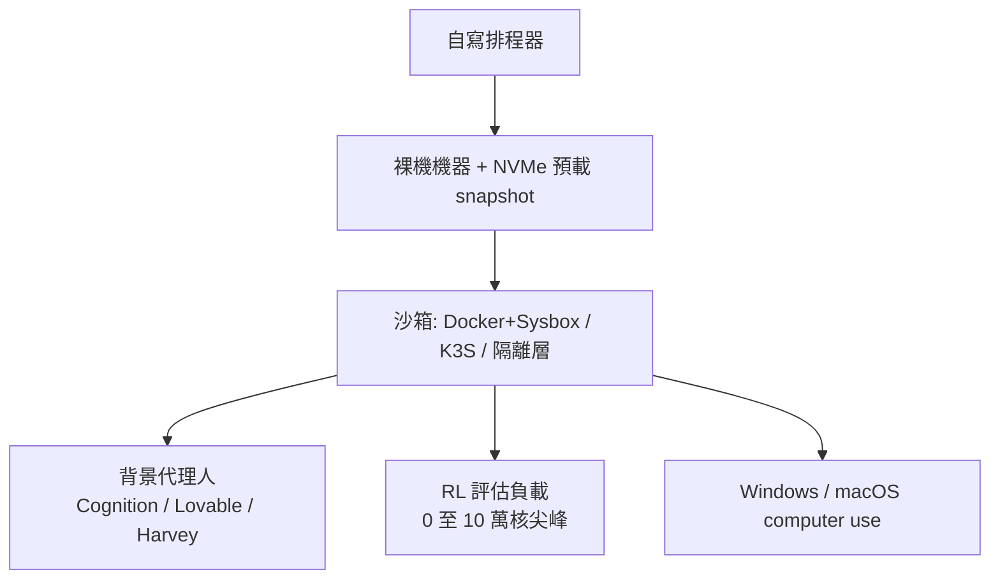
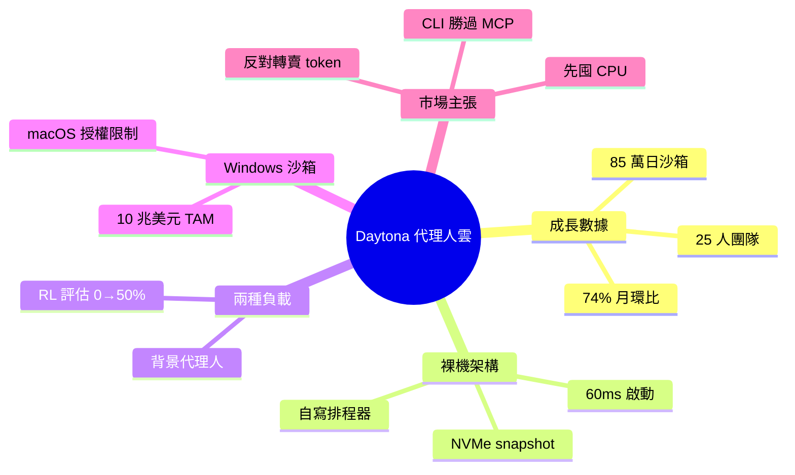

## Giving Agents Computers — Ivan Burazin, Daytona

Daytona 公司 CEO Ivan Burazin 分享代理人雲基礎設施進展。月環比增長 74%，日均執行 85 萬次任務，採用 Bare Metal Sandboxes 架構，支援強化學習評估。Daytona 正構建新代理人雲層，讓 AI 代理執行真實計算任務，標誌著 agent infrastructure 市場的快速成熟。

### 重點
- 月環比增長 74%，日均 850K 任務執行量，市場需求強勁
- Bare Metal Sandboxes 架構支援完整計算環境而非容器化沙箱
- 集成 RL Evals (強化學習評估)，支援代理行為自動化評估與優化

**原文：** [latent-space](https://www.latent.space/p/daytona)

---

<!-- deep-analysis:begin -->
## 📌 摘要 (TL;DR)

- Daytona（CEO Ivan Burazin）做「給 AI 代理人用的雲端電腦」基礎設施，月環比成長 74%，最大客戶單日執行 85 萬次沙箱（sandbox）。
- 採裸機沙箱（bare metal sandbox）架構：單一沙箱 60 毫秒啟動、75 秒可拉起 5 萬個並發沙箱；公開 benchmark 的 time-to-interactive 約 0.10–0.11 秒，領先競品。
- 兩種工作負載並存——背景代理人（background agent，客戶含 Cognition、Lovable、Harvey）與強化學習評估（RL eval）；後者數月內從 0% 衝到約 50% 用量。
- 團隊僅 25 人，靠 1,000+ 條 Slack Connect 頻道貼身服務；大型企業採購週期從 2–3 個月壓縮到 5 天。
- Ivan 主張 SaaS 公司不該靠「轉賣 token」加價，應把資料用 API 暴露、按代理人消耗收費；並預言「先囤 CPU」會成為基礎設施商的 go-to-market 戰術。

## 🎯 核心概念

- **沙箱（sandbox）**：隔離、可拋棄的運算環境，讓 AI 代理人安全執行程式碼與指令。
- **裸機沙箱（bare metal sandbox）**：直接跑在實體機器上、不經虛擬化網路層，snapshot 預載於 NVMe 達成即時啟動。
- **強化學習評估（RL eval）**：訓練／評測模型時的尖峰運算負載，用量可瞬間從 0 飆到十萬核 CPU。
- **代理人雲（agent cloud）**：Daytona 提出的新雲層，專為 AI 代理人（而非人類開發者）設計的運算供給。
- **背景代理人（background agent）**：長時間在背景替使用者執行任務的代理人，用量呈日／週週期。

## 📖 整理分析

### 1. 從 CodeAnywhere 到 Daytona 的轉向
Ivan 與共同創辦人早年做 CodeAnywhere——VS Code、Kubernetes 之前的瀏覽器 IDE，累積 300 萬使用者卻撐不起創投規模回報。2024 年 1 月，他們拿 Devin 與 OpenDevin 試做後發現：代理人需要的基礎設施跟人類開發環境根本不同。跨年夜趕出的粗糙 MVP 一推出，「每一通客戶電話都回來問：我的 API key 在哪？」需求瞬間被驗證。

### 2. 裸機架構：為何放棄 Kubernetes
Daytona 跑在裸機機器上、配自寫排程器（scheduler），消除儲存與運算間的網路延遲；snapshot 預載 NVMe 達成 60 毫秒啟動、75 秒拉起 5 萬並發沙箱。相對 EKS／GKE，差異在 API/SDK 優先的人因體驗、可動態調整記憶體、啟動更快——客戶用過後說「再也回不去了」。產品把 Docker 容器（以 Sysbox 加固）、K3S 能力與隔離層打包成單一沙箱。

### 3. 兩種工作負載：背景代理人 vs RL 評估
一類是背景代理人（Cognition、Lovable、Harvey），用量跟著人類作息呈日／週起伏、follow-the-sun；另一類是 RL／評估負載，極度尖峰、零到十萬核 CPU 瞬間爆量。後者因 Harbor 採用與研究實驗室需求，數月內從 0% 漲到約 50% 用量。整體平均使用率僅 15%、尖峰 90%，反映負載高度不均。

### 4. Windows 沙箱與 10 兆美元知識工作 TAM
Ivan 重押 computer use 環境，尤其 Windows 沙箱：數秒啟動 vs EC2 的 3–5 分鐘。其 TAM 論證為：全美 1 億、全球 10 億知識工作者，薪資總額美國 10 兆、全球 50 兆美元；假設 40% 工作由代理人自動化，約值每年 10 兆美元機會，而多數老舊企業應用仍鎖在 Windows。macOS 則受 Apple 授權限制——每台機器只准 2 個並行 VM、授權 24 小時重置——難以規模化。

### 5. 代理人雲的市場觀察
Ivan 批評市場給「轉賣 token 的 SaaS」估值溢價是錯的：token 轉賣毛利與營收續航都差，公司應把資料以 API 暴露、直接對代理人消耗收費（他讚許 Salesforce 把每個產品 API 化的方向）。他也認為 CLI 給代理人的能力大於 MCP——CLI 能真的執行腳本、對系統做分析。GTM 上 Daytona 更像 Twilio／Stripe 的按秒計費，而非 AWS；並預言在 CPU/GPU 供給吃緊下，「先囤 CPU」會成為基礎設施商的競爭戰術。

## 🧭 架構圖

## 🧠 Mindmap

<!-- deep-analysis:end -->
### 📄 原文內容

點此展開 / 收合

We chat with Daytona's CEO about their insane 74% MoM Growth, 850K Daily Runs, Bare Metal Sandboxes, RL Evals, and the New Agent Cloud

